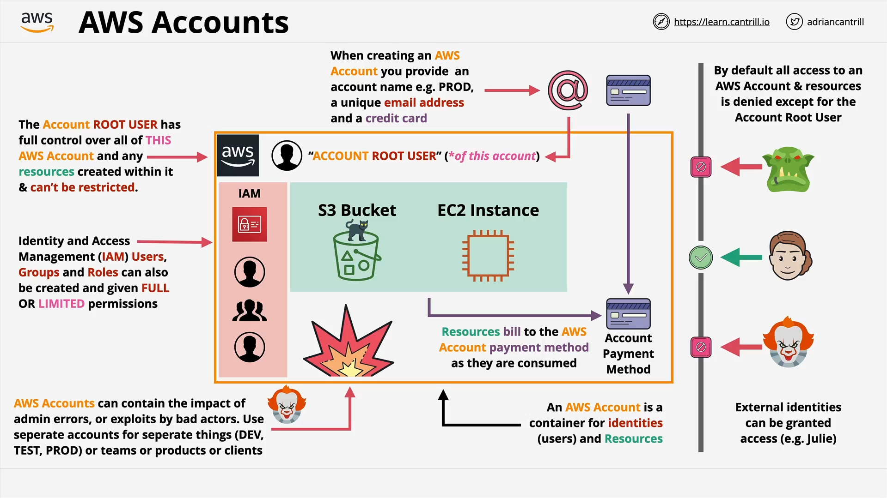

# AWS Accounts

## Overview

This lesson introduces **AWS Accounts**, a foundational concept in AWS architecture. Understanding how AWS accounts work, especially in enterprise environments, is critical for Solutions Architects, Developers, System Administrators, and DevOps Engineers.

## What Is an AWS Account?

An **AWS Account** is a **container** for:

- **Identities** (e.g., users, roles)
- **Resources** (e.g., EC2 instances, S3 buckets)

### Key Points:

- An AWS account is **not the same as a user** inside that account.
- Think of the account as a **boundary** or **isolation unit**.
- Enterprises often use **multiple accounts** to manage complexity, isolate environments, or segregate teams/products.

## AWS Account Components

### 1. **Account Name**

- Typically reflects its purpose: e.g., `prod`, `dev`, `test`.

### 2. **Unique Email Address**

- Required per AWS account.
- **Cannot be reused** across accounts.
- The email address is tied to the **account root user**.

### 3. **Payment Method**

- Usually a **credit card**.
- Can be shared across multiple AWS accounts.

## The Account Root User

- Created automatically using the email address when an AWS account is created.
- **Has full, unrestricted access** to everything within the account.
- **Cannot be restricted** by IAM policies.
- **Must be protected** carefully — credential leaks can lead to full account compromise.

## Billing & Usage

- AWS uses a **pay-as-you-go** model.
- Some services are covered under a **free tier** (monthly limits).
- Any billable usage is charged to the payment method on file.

## Identity and Access Management (IAM)

### IAM Service Overview

IAM allows you to create **additional, manageable identities**:

| Identity Type | Description                                 |
| ------------- | ------------------------------------------- |
| IAM Users     | Individual named users.                     |
| IAM Groups    | Collections of users sharing policies.      |
| IAM Roles     | Assumable identities for users or services. |

### IAM Permissions

- **Start with no access** by default.
- Permissions must be **explicitly granted** using IAM policies.
- IAM is scoped **per account** — identities are **not shared** across accounts unless explicitly configured.

## Account Boundary

Visualize the account as having an **invisible boundary or wall**:

- **Prevents data leakage** out of the account.
- **Isolates damage** from accidents or malicious actions.
- By default, **no external access is allowed** to account resources.

### Boundary Behavior

| Scenario                 | Behavior                                     |
| ------------------------ | -------------------------------------------- |
| Internal identity access | Allowed if permissions exist.                |
| External identity access | Denied by default unless explicitly allowed. |
| IAM permissions          | Must be configured explicitly.               |

## Best Practices for AWS Account Usage

- Use **multiple AWS accounts** for different environments:

  - Development
  - Testing
  - Production

- Separate accounts help **contain risk** and **organize billing**.
- Always **limit usage of the root user** — use IAM identities for daily operations.
- Protect root user credentials using **multi-factor authentication (MFA)**.

## Creating AWS Accounts for the Course

- It is strongly recommended to **create new AWS accounts** for this course:

  - Avoid using existing accounts as they may be misconfigured.
  - Fresh accounts ensure a **clean slate** and adherence to **best practices**.

### Tip:

You can use a trick to generate **unique email addresses** from one base email using Gmail or other services with `+` aliases (e.g., `yourname+dev@example.com`).

## Summary

- AWS accounts are **core units** of security, billing, and resource management.
- Each account has **one root user** (full control) and can have many **IAM identities** (restricted by policy).
- Treat each account as a **sandboxed environment**.
- Always follow **least privilege principles** and use **separate accounts** for different purposes.
