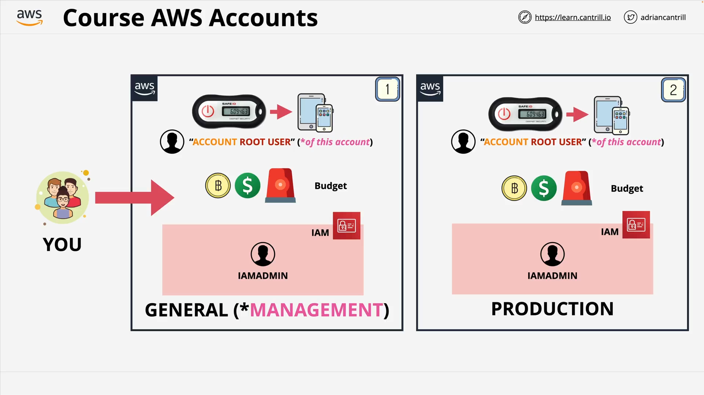

# AWS Account Creation Overview

## Introduction

This section guides learners through the **creation of AWS accounts** — a foundational step in preparing for the AWS Certified Solutions Architect Associate exam. Emphasis is placed on **best practices** and **real-world scenarios**.

## Why Create Multiple AWS Accounts?



- In real-world scenarios, organizations use **multiple AWS accounts** for isolation, billing separation, and security.
- Instead of using **sandbox accounts** or **employer-provided accounts**, learners are encouraged to **create fresh AWS accounts** for training purposes.
- This course uses a **multi-account structure**:

  - **General AWS Account**: Referred to later as the **Management Account**.
  - **Production AWS Account**: Second account with its own identity setup.

## General AWS Account Setup

### Step-by-Step Summary

1. **Create General AWS Account**:

   - Start by signing up at [https://aws.amazon.com](https://aws.amazon.com).
   - Use a **unique email address** (explained below).
   - Choose an identifiable **AWS account name**.
   - Set a **strong password** using a password manager.

2. **Email Format Trick with Gmail**:

   - AWS requires a **unique email** per account.
   - Gmail users can use `+` symbol to create **dynamic aliases**.

     - Example:

       ```
       catguy@gmail.com
       catguy+aws-account-1@gmail.com
       catguy+aws-account-2@gmail.com
       ```

   - All variations point to the same inbox — no need for multiple email setups.

3. **Secure the Root User**:

   - Enable **Multi-Factor Authentication (MFA)**.

     - Use an app like Google Authenticator or Authy.
     - MFA adds a one-time code on top of username/password.

4. **Set a Budget**:

   - AWS Budgets can help prevent **unexpected charges**.
   - Alerts can be configured to notify when costs go beyond thresholds.

5. **Avoid Root User for Daily Use**:

   - Root user has full privileges and **cannot be restricted**.
   - Best practice: **Create an IAM user** with admin rights.

     - Name: `IAMAdmin`

6. **Create IAM User with Admin Rights**:

   - Use the IAM console to create a user:

     - Username: `IAMAdmin`
     - Attach `AdministratorAccess` policy.

## Repeat for Production AWS Account

- Create a **second AWS account** for production use.
- Follow the same steps as the General account:

  - Unique email with dynamic alias.
  - IAM user: `IAMAdmin`
  - Enable MFA, set budget, etc.

## AWS Account Creation: Console Walkthrough

### Requirements

To create a new AWS account, you'll need:

- **Unique email address** (e.g., Gmail with `+`)
- **Account name** (e.g., `AC-Training-AWS-General`)
- **Password** for the root user
- **Billing information**:

  - Credit/debit card
  - May show a small **pending verification charge**

- **Phone number** for identity verification (SMS or voice)
- **Support plan selection**:

  - Choose **Basic Support Plan** (free)

## Troubleshooting Billing Issues

If you see an error after billing step:

1. **Log in as Root User**

   - Use the email used to sign up.
   - Navigate to [AWS Billing Console](https://console.aws.amazon.com/billing/home).

2. **Correct or Update Payment Info**

   - Fix any typos or call your card issuer if blocked.

3. **Trigger Account Verification**

   - Open the **EC2 Console** in a new tab.

     - If not activated, you'll be prompted to **complete account setup**.

   - Select the **Basic Support Plan** to proceed.
   - Revisit EC2 — the account should now be active.

## Account Activation

- After support plan selection, AWS will **activate the account**.
- You may receive a confirmation email.
- Activation may take from **a few minutes to an hour**.
- Once active, you can start using AWS services.

## Code Explanation (Email Formatting Tip)

```plaintext
catguy@gmail.com
catguy+aws-account-1@gmail.com
catguy+aws-account-2@gmail.com
```

### Line-by-Line Explanation

1. `catguy@gmail.com`

   - The base Gmail account.

2. `catguy+aws-account-1@gmail.com`

   - Uses `+aws-account-1` to **create a unique email**.
   - Gmail ignores the `+` suffix, so mail is delivered to `catguy@gmail.com`.

3. `catguy+aws-account-2@gmail.com`

   - A second unique alias for a second AWS account.

### Why It Matters

- AWS requires unique emails for each account.
- This trick avoids managing multiple inboxes.
- **Simplifies account setup** for testing and training.

## Final Recommendations

- Use a **new AWS account** for each course to stay within the **free tier**.
- **Enable MFA** and **set budgets** early in each account.
- **Document** each account's purpose and email used.
- Use a **password manager** to store credentials safely.
