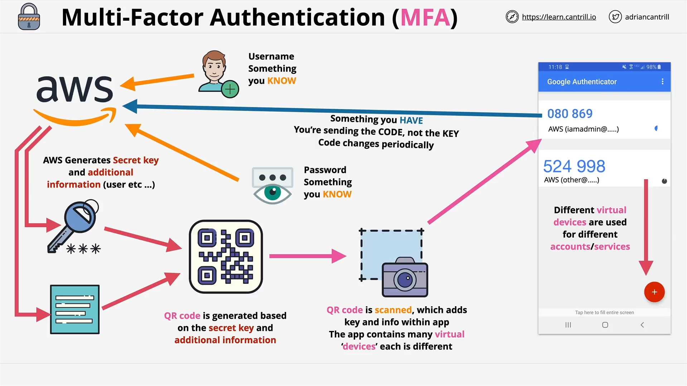

# Multi-Factor Authentication (MFA) in AWS

## Overview

This lesson covers **Multi-Factor Authentication (MFA)**—a foundational security feature used across AWS and other platforms. You’ll frequently encounter MFA both during this course and in real-world AWS use. This lesson explains **why MFA is critical**, the **different types of authentication factors**, and **how AWS implements MFA for identity protection**.

## Why MFA is Needed

### Single-Factor Vulnerability

- Traditional login systems rely on **username and password** (something you know).
- If this information leaks (e.g., via phishing or malware), **anyone can impersonate you**.

### MFA to the Rescue

- MFA enhances security by requiring **multiple proofs of identity**, known as **factors**.
- **Multi-Factor Authentication** means using **two or more types** of these factors.

## Types of Authentication Factors

| Factor Type    | Description                           | Examples                                     |
| -------------- | ------------------------------------- | -------------------------------------------- |
| **Knowledge**  | Something you know                    | Username, Password, PIN                      |
| **Possession** | Something you have                    | Bank card, Security Token, MFA device or app |
| **Inherent**   | Something you are                     | Fingerprint, Face Scan, Voice, Iris          |
| **Location**   | Where you are (physically or network) | GPS Location, Corporate Network, Home Wi-Fi  |

> **Example**: ATM transactions are MFA – require card (possession) + PIN (knowledge).

## Security vs. Convenience

- More factors = More secure
- But also **less convenient** (e.g., requiring a fingerprint _and_ a corporate VPN connection).
- The goal is to find a **balanced trade-off** between convenience and security.

## MFA in AWS

### Default AWS Login

- You start with a **username and password** (single-factor: knowledge).

### Risk: Credential Leak

- If credentials are leaked, the account is compromised.

### Adding a Second Factor

AWS allows you to **enable MFA** for an identity (e.g., root user or IAM user):

1. **Activate MFA** in AWS account.
2. AWS generates a **secret key** and related metadata (e.g., user, service).
3. This information is used to create a **QR Code**.
4. You scan this QR Code with an **MFA application** (e.g., Google Authenticator).
5. This creates a **Virtual MFA Device** inside the app.

## Virtual vs. Physical MFA Devices

| Type         | Description                                    |
| ------------ | ---------------------------------------------- |
| **Physical** | Hardware key fob that displays rotating codes  |
| **Virtual**  | Software-based, installed on phone (e.g., app) |

> Virtual MFA is more flexible – can support multiple accounts and services.

## MFA App Behavior

- Once scanned, the app stores a **virtual MFA entry**.
- The app generates a **time-based code**, which changes periodically.
- This code must be entered during login along with username/password.

## MFA Login Flow (Step-by-Step)

1. User opens AWS login page.
2. Enters **username and password**.
3. Prompted to enter **current MFA code** (from authenticator app).
4. Access is granted only if **both credentials and MFA code** are valid.

## Security Implications

- Even if credentials are leaked, access is blocked without the MFA device.
- Even if MFA device is compromised, access is blocked without credentials.
- MFA apps themselves are often protected by **PIN, fingerprint, or facial recognition**.

## Summary

- MFA dramatically improves login security.
- AWS supports both **physical** and **virtual** MFA devices.
- It is recommended and often required for **root accounts**, **IAM users**, and **sensitive roles**.
- This process is **core to AWS operations** and will be used throughout the course and in production environments.

## No Code in This Lesson

This lesson is conceptual. While there are no code samples to break down, the lesson focuses on security architecture and AWS interface configuration.
