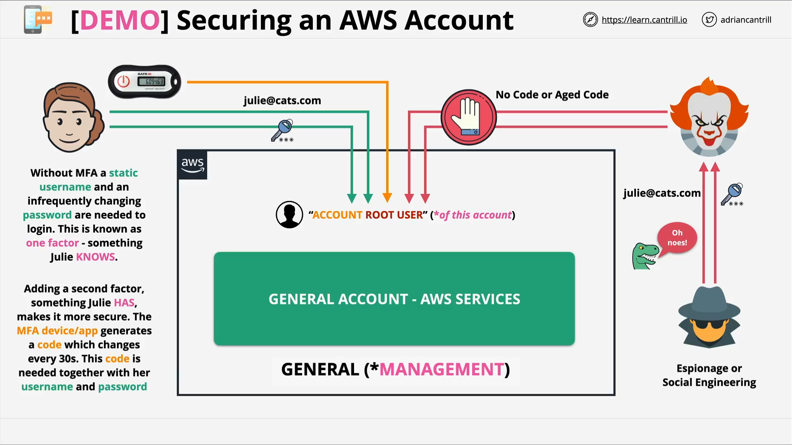

# Securing the Root User with MFA

## Overview

This lesson walks through how to **secure an AWS account's root user** by enabling **Multi-Factor Authentication (MFA)** using a virtual MFA device. This adds an essential layer of protection against credential compromise, a critical step for both personal and professional AWS environments.

## Why Secure the Root User?

### Single Factor Authentication (SFA)

- AWS root account access typically starts with **email + password**.
- This is a **Single Factor Authentication**: something the user _knows_.
- If compromised, attackers can:

  - Delete existing AWS resources
  - Spin up new resources for malicious activity (e.g., Bitcoin mining)

### Multi-Factor Authentication (MFA)

- Adds an extra layer: **something the user _has_** (e.g., a mobile device).
- Commonly implemented via **TOTP (Time-based One-Time Password)**.
- Prevents unauthorized access even if email and password are leaked.

## MFA Factors Explained

| Factor Type        | Description                    |
| ------------------ | ------------------------------ |
| Something You Know | Password                       |
| Something You Have | Virtual or physical MFA device |
| Something You Are  | Biometrics (e.g., fingerprint) |

**Note:** AWS supports MFA using **TOTP tokens**, typically via apps like:

- Google Authenticator
- Authy
- 1Password
- Microsoft Authenticator

## Step-by-Step Guide: Setting Up MFA

### 1. Navigate to Security Credentials

- Log into the AWS Console as **root user**
- Click the account dropdown in the top right
- Select **"My Security Credentials"**

### 2. Activate MFA

- Scroll to **Multi-Factor Authentication (MFA)**
- Click **Activate MFA**

### 3. Choose MFA Type

Options include:

- **Virtual MFA device** (Recommended for training/dev environments)
- **Hardware MFA device** (e.g., YubiKey – recommended for production)
- **Other MFA devices** (FIPS-compliant, AWS-sold)

For this lesson, select: **Virtual MFA Device** → Click **Continue**

### 4. Configure Virtual MFA

- Click **Show QR Code**
- Use your MFA app to scan the QR code

Once scanned:

- App generates a **time-based 6-digit code** that changes every 30 seconds
- Enter **two consecutive MFA codes**:

  - `Code 1` in the first input box
  - Wait for new code, then enter `Code 2` in the second input box

- Click **Assign MFA**

### 5. Verify MFA

- After successful setup, click **Close**
- Sign out of the AWS Console

## Testing MFA Login

1. Go to the [AWS Console Login](https://aws.amazon.com/console/)
2. Select **Root user** and input your **account root email**
3. Enter your **password**
4. When prompted, enter the **MFA code from your app**

> If MFA code is missing or expired, login will be **denied**, even with the correct email/password.

## Best Practices

### Use Different MFA Entries

For every identity across AWS accounts:

- **Do NOT reuse** the same MFA device entry
- Instead, **add a new entry** for each user/account pair

### You’ll Need 4 MFA Entries By End of Course:

| User           | Account            |
| -------------- | ------------------ |
| Root User      | General Account    |
| Root User      | Production Account |
| IAM Admin User | General Account    |
| IAM Admin User | Production Account |

## Security Recommendations

- For **production environments**, prefer **hardware MFA devices**
- For **training or personal accounts**, virtual MFA apps are acceptable
- Always test MFA after configuration to ensure access continuity
- Back up MFA entries securely (e.g., backup phone or encrypted vault)

## Summary

Enabling MFA on the AWS account root user is a **critical security step**. By using a virtual MFA device and following the outlined steps, you significantly **reduce the risk of unauthorized access**, protecting both your resources and billing account from misuse.
