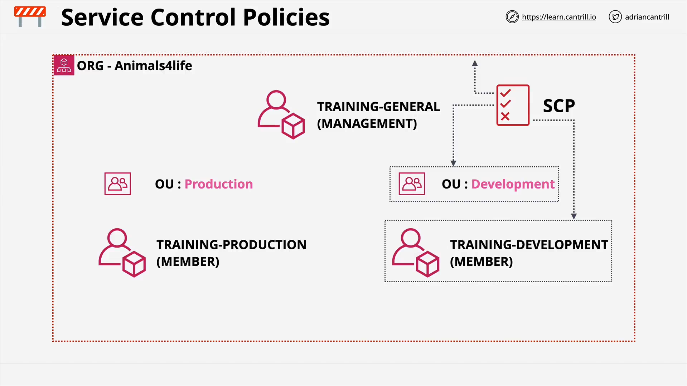
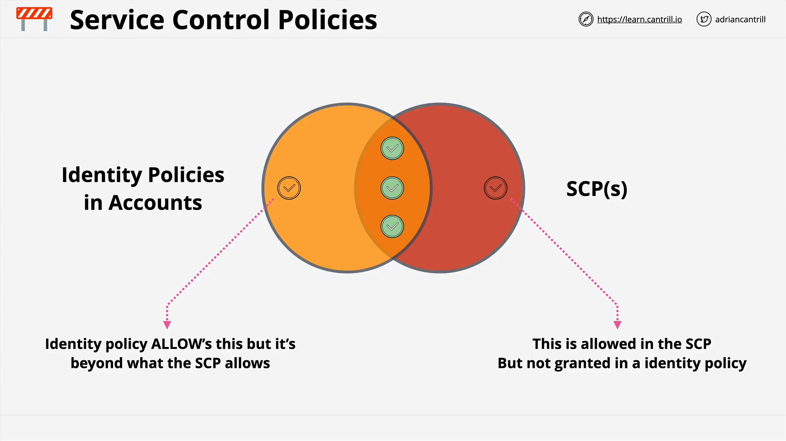

# Service Control Policies (SCPs)

## Overview

This lesson from **Adrian Cantrill's SAP-C02 course** covers **Service Control Policies (SCPs)**—a key feature of **AWS Organizations**. SCPs allow administrators to define permission **boundaries** across multiple AWS accounts in an organization.

If you're designing secure, multi-account AWS environments at scale, **understanding SCPs is essential**.

## Organizational Setup (Before SCP Implementation)



### Accounts:

| Role       | Name                |
| ---------- | ------------------- |
| Management | `general`           |
| Member     | `prod` (Production) |
| Member     | `dev` (Development) |

- All accounts currently reside **under the root container**.
- No Organizational Units (OUs) yet.
- OUs will be added in the upcoming demo lesson.

## What Are Service Control Policies (SCPs)?

- SCPs are **JSON policy documents** used in AWS Organizations.
- They **do not grant permissions** — they define **what permissions can potentially be granted**.
- Think of them as **account-level permission boundaries**.

### Where SCPs Can Be Attached

| Attached To         | Affects                                     |
| ------------------- | ------------------------------------------- |
| Root container      | All accounts in the entire AWS Organization |
| Organizational Unit | All accounts in that OU and nested OUs      |
| Individual Account  | That account only                           |

SCPs are **inherited down** the hierarchy.

## Special Case: Management Account

- SCPs **do not apply** to the **Management Account**, even if attached:

  - Directly to the account
  - Via an OU
  - At the root container

**Implication:**

- The Management Account is **exempt** from SCP restrictions.
- **Best practice:** Do **not** run any workloads in the management account for security reasons.

## SCPs Act as Account Permission Boundaries

- SCPs restrict what the **account itself** can do.
- They apply to **all IAM identities** in the account (users, roles).
- They even **indirectly** restrict the **root user** by limiting the account's allowed actions.

**Important distinction:**

- The root user always has full permissions _within the account_.
- But SCPs **reduce what the account can do overall**, thus _indirectly restricting_ the root user.

## Example Use Cases of SCPs

- Restrict account access to specific AWS regions (e.g., only `us-east-1`)
- Restrict instance types (e.g., only allow `t3.medium` and below)
- Prevent usage of certain services like S3 or IAM

## SCPs Do NOT Grant Permissions

| SCP Role | Explanation                                          |
| -------- | ---------------------------------------------------- |
| ❌ Grant | SCPs **do not grant** permissions.                   |
| ✅ Limit | SCPs **limit what can be granted** via IAM policies. |

You must still create **IAM policies** that explicitly allow access. The **effective permissions** are determined by:

```plaintext
Effective Permissions = IAM Policy ∩ SCP
```

Only actions that are allowed by **both** will be permitted.

## SCP Strategy: Deny Lists vs Allow Lists

### 1. Deny List (Default Architecture)

- **Default AWS behavior** when SCPs are enabled.
- AWS applies `FullAWSAccess` SCP to all entities.
- This allows **all actions by default**, unless explicitly denied.

**Example:**

```json
{
  "Effect": "Deny",
  "Action": "s3:*",
  "Resource": "*"
}
```

- This `DenyS3` SCP **blocks all S3 actions**, even if IAM allows them.

**Benefits:**

- Low administrative overhead
- Automatically includes new services released by AWS
- Easy to manage in larger orgs

### 2. Allow List (Restrictive Architecture)

- **Remove** the default `FullAWSAccess`.
- Explicitly define allowed services only.

**Example:**

```json
{
  "Effect": "Allow",
  "Action": ["s3:*", "ec2:*"],
  "Resource": "*"
}
```

**Effect:**

- Only S3 and EC2 services can be accessed — nothing else.
- Regardless of IAM permissions, services not listed here are denied.

**Trade-offs:**

- **More secure**, but
- **Higher admin overhead**
- Easy to accidentally block required services

**Best Practice:** Use this only when strong control is required. Otherwise, prefer **deny list** for simplicity.

## SCP Permission Evaluation (Visual Model)

The **effective permissions** in an AWS account are the **overlap** between:

- **Identity policies** (IAM)
- **Applicable SCPs**

### Visual Representation



### Important Cases

| Case                     | Allowed? |
| ------------------------ | -------- |
| In IAM but not in SCP    | ❌       |
| In SCP but not in IAM    | ❌       |
| In both SCP and IAM      | ✅       |
| Explicitly denied in SCP | ❌       |

## SCPs: Summary of Key Concepts

| Concept                              | Explanation                                    |
| ------------------------------------ | ---------------------------------------------- |
| SCPs restrict accounts               | Act as permission boundaries                   |
| Not applicable to Management Account | Cannot restrict management account             |
| Indirectly restrict root user        | By limiting account’s overall permissions      |
| SCPs do not grant access             | They only **bound what IAM can allow**         |
| Deny list is default                 | Using `FullAWSAccess`, block what’s not needed |
| Allow list is more secure            | But higher overhead, easier to misconfigure    |
| Explicit deny always wins            | Just like IAM – deny overrides allow           |

## What’s Next?

- You’ll create Organizational Units (OUs) for `prod` and `dev`
- Apply SCPs at different levels (root, OU, account)
- Demonstrate the inheritance and restriction effects

> Proceed to the **demo lesson** to see these concepts applied in practice.
