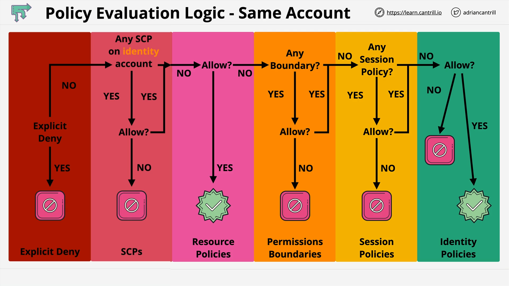
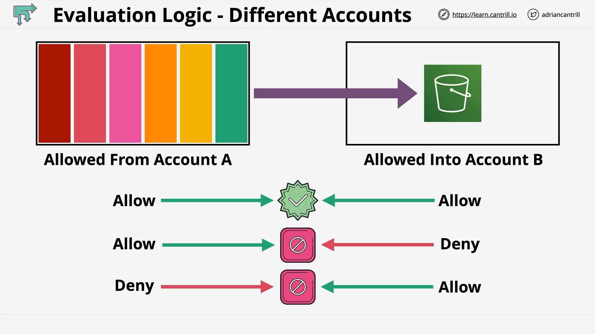

# AWS Permissions Evaluation

## Overview

When working with AWS, especially in complex security architectures involving multiple accounts, service control policies (SCPs), resource policies, permission boundaries, and identity policies, it’s crucial to understand **how AWS determines the final effective permissions** for an identity accessing a resource.

This process applies both to **same-account** and **cross-account** access scenarios.

## Key Concepts in Permission Evaluation

AWS evaluates permissions using several policy types and rules in a specific order:

1. **Explicit Denies**
2. **Service Control Policies (SCPs)**
3. **Resource Policies**
4. **Permission Boundaries**
5. **Session Policies**
6. **Identity Policies**

## Step-by-Step Evaluation Flow (Same Account)

### 1. Collect All Applicable Policies

AWS gathers all policies relevant to the identity and the resource.
This includes identity-based policies, resource-based policies, SCPs, boundaries, and session policies.

### 2. Check for Explicit Deny

- If **any policy** contains an explicit `Deny` for the action, **access is immediately denied**.
- Explicit deny overrides any allow.

### 3. Evaluate Service Control Policies (SCPs)

- SCPs are part of AWS Organizations.
- Only SCPs in the **account containing the identity** are evaluated.
- If SCPs do not allow the action → **implicit deny**.
- If no SCPs exist or SCPs allow the action → continue.

### 4. Evaluate Resource Policies

- Check if the resource’s own policy (`resource-based policy`) allows the action.
- If allowed → **access granted** (processing stops here).
- If not → continue.

### 5. Evaluate Permission Boundaries

- Boundaries define the **maximum permissions** an identity can have.
- If the boundary does not allow the action → **implicit deny**.
- If it allows or no boundary exists → continue.

### 6. Evaluate Session Policies

- Applies only if the identity is an **assumed IAM role**.
- Session policies **restrict** role permissions further.
- If the session policy does not allow the action → **implicit deny**.
- If it allows or no session policy exists → continue.

### 7. Evaluate Identity Policies

- Identity policies are **directly attached** to users, groups, or roles.
- If there’s an explicit `Allow` matching the request → **access granted**.
- If not → **implicit deny**.

### Summary of Same Account Logic

The process always follows:

1. **Explicit Deny** → immediate block.
2. If not denied, evaluate SCP → Resource Policy → Boundary → Session Policy → Identity Policy.
3. If no explicit allow by the end → **implicit deny**.

## Cross-Account Access Evaluation

When accessing a resource in another account, **two separate permission checks** must pass:

1. **Source Account (Account A)**

   - Identity must have an allow policy permitting outbound access to the resource in Account B.

2. **Destination Account (Account B)**

   - Resource policy must allow inbound access from the identity in Account A.

### Possible Outcomes:

| Account A Decision | Account B Decision | Result         |
| ------------------ | ------------------ | -------------- |
| Allow              | Allow              | Access Granted |
| Allow              | Deny               | Denied         |
| Deny               | Allow              | Denied         |
| Deny               | Deny               | Denied         |

Conceptually:

- Account A = "Can you leave?"
- Account B = "Can you enter?"
  Both must say **yes** for access to work.

## Important Takeaways

- **Explicit Deny** always overrides everything else.
- In **same-account** scenarios, evaluation goes through all policy layers in a fixed order.
- In **cross-account** scenarios, **both accounts** must allow the action.
- Understanding the same-account process makes cross-account evaluation simple.
