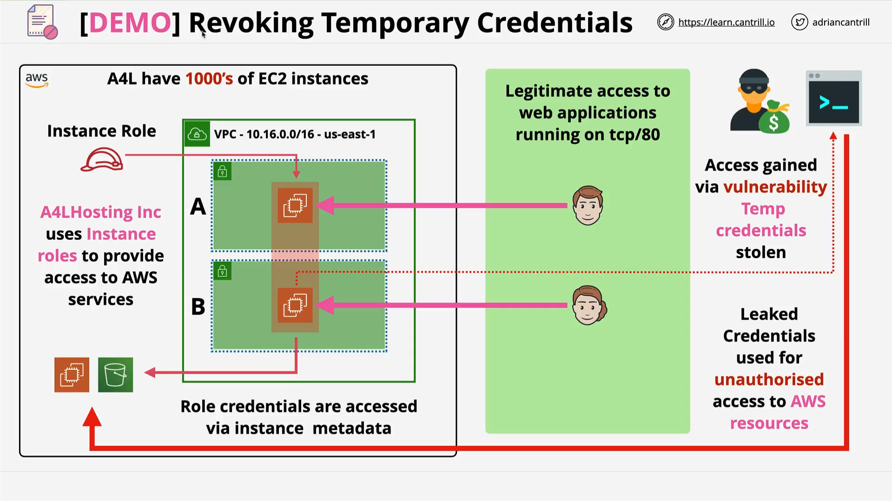

# Revoking Temporary Credentials - PART2

## Overview

This part continues directly from **Part 1**, focusing on **how to invalidate stolen temporary AWS credentials** without disrupting legitimate workloads.
It demonstrates:



- The **impact of deleting or modifying an IAM role**.
- The **"Revoke Active Sessions"** feature to invalidate compromised credentials.
- How to **regenerate credentials for legitimate EC2 instances**.
- Proper **cleanup** after the demo.

## Step 1: Reviewing Options to Stop the Attacker

1. **Delete the IAM Role**

   - Role: `A4L-instance-role` (used by all EC2 instances in the environment).
   - Pros: Prevents any future use of stolen credentials.
   - Cons: Impacts _all_ instances; requires recreating the role and reconfiguring thousands of EC2 instances.

2. **Modify Role Permissions**

   - Reduce or remove permissions from the role.
   - Pros: Limits attacker access.
   - Cons: Also limits legitimate EC2 instances using this role.

3. **Revoke Active Sessions (Preferred)**

   - Invalidate only **existing** temporary credentials while keeping the role usable for future sessions.
   - Ideal for stopping the attacker without impacting legitimate workloads (after regeneration of credentials).

## Step 2: Revoking Sessions

1. Navigate to **IAM Console → Roles → `A4L-instance-role`**.
2. Click **Revoke Active Sessions**.
3. Acknowledge the prompt and confirm.

**What Happens Internally:**

- AWS attaches an **additional deny-all policy** to the role.
- This policy applies to **any credentials issued before the revoke timestamp**.
- Effectively invalidates stolen temporary credentials without deleting the role.

## Step 3: The Revoke Policy (JSON)

```json
{
  "Version": "2012-10-17",
  "Statement": [
    {
      "Effect": "Deny", // Explicit deny always overrides allow
      "Action": ["*"], // Deny all actions
      "Resource": ["*"], // On all resources
      "Condition": {
        "DateLessThan": {
          "aws:TokenIssueTime": "2025-08-11T15:40:28.560Z"
        }
      }
    }
  ]
}
```

**Line-by-Line Explanation:**

- `"Version": "2012-10-17"` → IAM policy language version.
- `"Effect": "Deny"` → Explicitly denies requests (overrides any "Allow").
- `"Action": ["*"]` → Denies **all possible AWS actions**.
- `"Resource": ["*"]` → Applies to **all AWS resources**.
- `"Condition": { "DateLessThan": { "aws:TokenIssueTime": ... } }` →
  Only applies if the request's temporary credentials were issued **before** the revoke timestamp.

**Practical Meaning:**
Any session using credentials **created before** `"2025-08-11T15:40:28.560Z"` is blocked entirely.

## Step 4: Effect of Revocation

- Attacker’s local CLI commands now return `AccessDenied` errors.
- Attacker cannot assume the role again (no valid path to STS).
- EC2 instances that assumed the role **before** the revoke also lose access.

## Step 5: Restoring Access for Legitimate EC2 Instances

To restore access for EC2 instances:

1. Stop and Start each instance:

   ```plaintext
   EC2 Console → Right-click Instance A → Stop Instance
   EC2 Console → Right-click Instance B → Stop Instance
   Wait until both show "stopped".
   Right-click each → Start Instance
   ```

2. Stopping/Starting forces the EC2 service to **re-assume the IAM role**, generating **new temporary credentials** that bypass the revoke policy.

**Verification:**

- Inside the restarted EC2 instance:

  ```bash
  aws s3 ls
  ```

  Should list S3 buckets (access restored).

- On attacker’s local machine:

  ```bash
  aws s3 ls
  ```

  Still returns `AccessDenied` (old credentials remain blocked).

## Step 6: Cleaning Up

1. **Delete CloudFormation Stack**

   - Go to **CloudFormation → Select `A4L` stack → Delete**.

2. **If deletion fails due to role changes:**

   - Go to **IAM Console → Roles → Delete `A4L-instance-role` manually**.
   - Retry CloudFormation deletion.

## Key Takeaways

- Temporary credentials **cannot be directly expired**, but **"Revoke Active Sessions"** can invalidate them by date.
- Explicit deny policies override any allow rules.
- Legitimate workloads can regain access by regenerating credentials (e.g., stop/start EC2 instances).
- Always patch the original vulnerability to prevent re-compromise.
