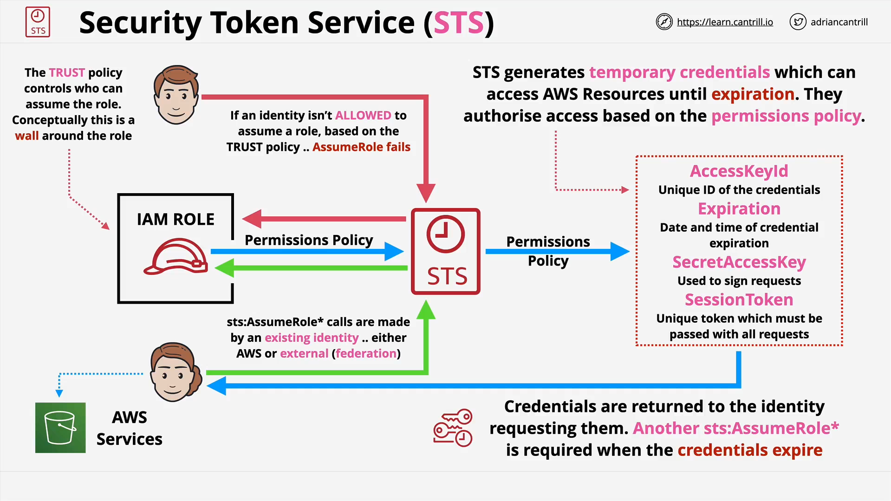

# AWS STS (Security Token Service)

## Overview

**AWS STS (Security Token Service)** is a fundamental service that powers temporary credential generation and **role assumption** in AWS. It is extensively used under the hood in various AWS identity use cases and is crucial to understand at the **professional certification level**.

If you’ve ever **assumed a role**—whether via CLI, SDK, or Console UI—you’ve already used STS.

## What STS Does

- **Generates temporary credentials** through `AssumeRole` API calls.
- Used whenever a role is assumed (manually or programmatically).
- Temporary credentials are returned and used to access AWS services.

## Temporary vs Long-Term Credentials

| Type          | Ownership           | Duration             | Example             |
| ------------- | ------------------- | -------------------- | ------------------- |
| **Long-term** | Belongs to IAM User | Persistent           | IAM User Access Key |
| **Temporary** | Issued via STS      | Expires (time-bound) | Role Assumption     |

### Key Properties of Temporary Credentials

- **Access Key ID**: Public identifier
- **Secret Access Key**: Private key used to sign requests
- **Session Token**: Must be passed in each request
- **Expiration**: Automatically invalid after a set duration

## Trust Policy & Permissions Policy: Key Differences

| **Trust Policy**                     | **Permissions Policy**                   |
| ------------------------------------ | ---------------------------------------- |
| Controls _who can assume_ the role   | Controls _what they can do_ once assumed |
| Evaluated **by STS**                 | Used to generate temporary credentials   |
| Acts like a **wall around the role** | Grants access to AWS resources           |

### Visual



- **Bob** is **not** in the role's trust policy → **Access denied**
- **Julie** is in the trust policy → **AssumeRole call allowed**
- STS checks both policies:

  - First: **Trust Policy** (authorization to assume role)
  - Then: **Permissions Policy** (authorization to access services)

## Role Assumption Flow with STS

1. **Identity initiates assume role** (e.g., IAM User or federated identity like Google).
2. **STS checks Trust Policy** of the role.
3. If permitted, STS:

   - Reads **Permissions Policy**
   - Generates **temporary credentials** based on it

4. **Temporary credentials returned**

   - Valid for a defined time
   - Include: Access Key ID, Secret Access Key, Session Token

5. **Used to access AWS services**

If the **permissions policy changes**, the access granted by future temporary credentials **also changes**.

## Use Cases of STS

- Role assumption **within a single account**
- **Cross-account access** (using OrganizationAccountAccessRole or custom roles)
- **Console role switch**
- **Federation**:

  - Web Identity Federation (Google, Facebook, etc.)
  - SAML Federation (Active Directory or other IdPs)

## Code-Free but Architecturally Critical

Although this lesson does **not include code**, the `AssumeRole` API is central:

```plaintext
AssumeRole(identity, roleArn)
```

Internally:

- Validates caller via **Trust Policy**
- Applies **Permissions Policy**
- Issues time-limited credentials

> **Important**: You don’t typically see this when using the Console UI—it’s abstracted. But it happens **behind the scenes**.

## STS is a Building Block

You will encounter STS indirectly when using:

- AWS Organizations (Switch role between accounts)
- Identity Federation setups
- CI/CD pipelines using temporary credentials
- Cross-account service integrations

> For the **SAP-C02 exam**, what matters more is how **other services use STS**, not the STS service itself.

## Key Takeaways

- **STS is used anytime roles are assumed.**
- It issues **temporary credentials** with controlled permissions and expiry.
- **Trust policy** controls _who_ can assume the role.
- **Permissions policy** controls _what_ they can do.
- Used in **IAM roles, federation, cross-account access**, and more.
- You must understand STS conceptually to grasp **advanced identity scenarios** in AWS.
