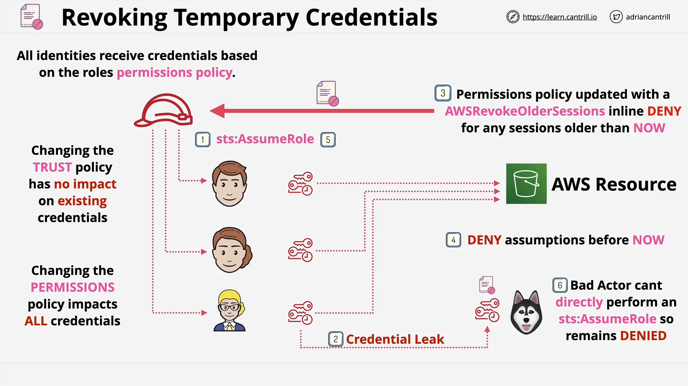

# Revoking IAM Role Temporary Credentials

## Overview

This lesson covers a **niche but exam-relevant** topic: how to **revoke IAM role temporary credentials** when they are compromised (e.g., leaked on GitHub). Since AWS **Security Token Service (STS)** credentials **cannot be manually invalidated**, a workaround is required to limit access for compromised credentials **without affecting valid users**.

## Key Concepts Refresher

### IAM Roles and Temporary Credentials

- **IAM Role**: Grants a set of permissions to identities defined in the **trust policy**.
- **Temporary Credentials**: Generated by **STS AssumeRole**, these contain:

  - `Access Key ID`
  - `Secret Access Key`
  - `Session Token`
  - **Expiration time** (cannot be canceled manually)

All users assuming the same role get **identical permissions** from the attached **permissions policy**.

## Problem Scenario: Credential Leak



### Scenario Setup

- Three staff members assume a role to access an S3 bucket.
- One user's temporary credentials are **leaked to GitHub**.
- An attacker ("Wolfie the Dog") gains access to those credentials.

### Key Points

- **Wolfie now has access** to the S3 bucket using the leaked credentials.
- He **did not assume the role** himself — he’s using stolen credentials.
- **Modifying the trust policy** will have no effect — because Wolfie is already past the AssumeRole step.
- **Changing the permissions policy** would revoke access from **all users**, including valid ones — undesirable.

## The Solution: Conditional Inline Deny Policy

To revoke access **only for the compromised credentials**, AWS allows you to:

### Step-by-Step:

1. **Add an inline policy** to the role that contains an **explicit deny** for all actions.
2. **Make this deny conditional**: it applies **only to sessions that assumed the role before a specific date/time** (e.g., the current time when revoking).
3. **Valid users can re-assume the role**, generating **new temporary credentials** that do **not** match the deny condition.
4. **Wolfie cannot re-assume the role** (not in the trust policy), so the deny condition applies to him **indefinitely**.

## Example Policy Explanation

Here’s an example of the kind of policy added inline to the role:
git p

```json
{
  "Version": "2012-10-17",
  "Statement": [
    {
      "Sid": "DenyOldSessions",
      "Effect": "Deny",
      "Action": "*",
      "Resource": "*",
      "Condition": {
        "DateLessThan": {
          "aws:TokenIssueTime": "2025-08-06T10:00:00Z"
        }
      }
    }
  ]
}
```

### Line-by-Line Explanation

- `"Effect": "Deny"`: Explicitly denies actions.
- `"Action": "*"`: Applies to all AWS actions.
- `"Resource": "*"`: Applies to all AWS resources.
- `"Condition": { "DateLessThan": ... }"`:

  - This is the **key part**.
  - Deny applies **only** to tokens issued **before** the timestamp.
  - This is what **invalidates old credentials** without affecting new ones.

### Why It Works

- **Old credentials (Wolfie's)**: Issued before the date, so **explicit deny applies**.
- **New credentials (valid users)**: Issued after the date, so **deny doesn’t apply**.
- **Explicit deny always overrides allow**, so even if the permissions policy allows access, the inline deny blocks it.

## Important Notes

- You **cannot cancel** temporary credentials — only **wait for them to expire** or **invalidate them indirectly** using policy conditions.
- Always remember: **Explicit Deny > Allow > Implicit Deny**.
- This method gives **granular control** without disrupting valid services or users.

## Summary

| Concept               | Details                                                                                 |
| --------------------- | --------------------------------------------------------------------------------------- |
| Temporary Credentials | Issued by STS when assuming a role; expire after time; cannot be manually invalidated   |
| Credential Leak       | If compromised, attacker can use credentials until they expire                          |
| Ineffective Fixes     | Modifying trust policy or deleting the role affects all users or is ineffective         |
| Effective Fix         | Add a **conditional deny** policy based on `TokenIssueTime`                             |
| Benefit               | Blocks the attacker while allowing legitimate users to continue by re-assuming the role |

## Exam Tip

This scenario **often appears on the AWS SAP-C02 exam**. Focus on:

- Understanding **why trust policy changes don’t help** in leak scenarios.
- The use of `aws:TokenIssueTime` in policy conditions.
- How **inline policies with conditional deny** can surgically revoke access.
