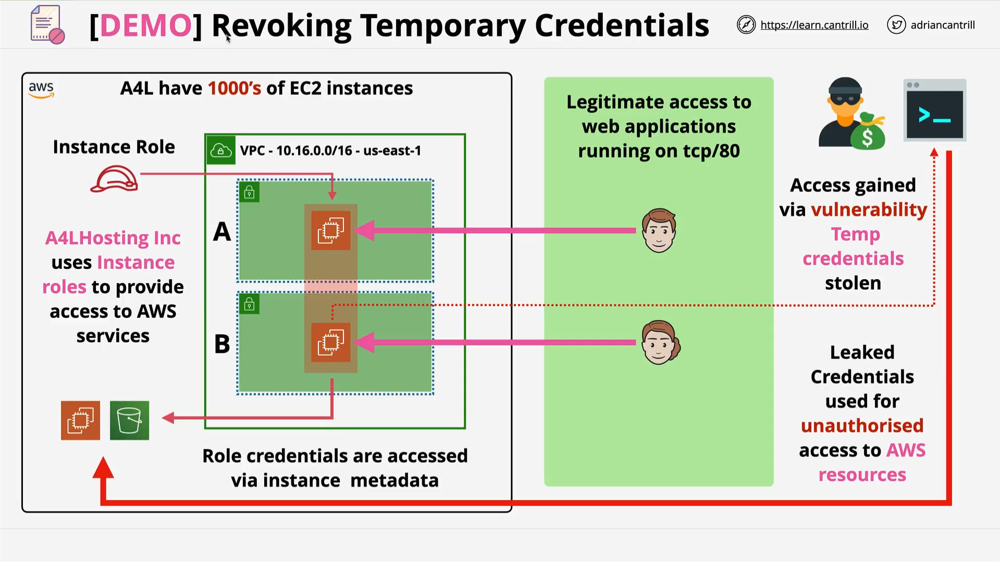

# Revoking Temporary Credentials - PART1

## Overview

This lesson is a **hands-on demo** showing how to respond to a realistic AWS security event.
You will:

- Understand **IAM role architecture**.
- See how **EC2 instance roles** provide temporary credentials via instance metadata.
- Simulate a **credential leak exploit**.
- Test the ability to use stolen credentials **outside AWS**.
- Learn why simply stopping the attacker on EC2 is **not enough**.

Scenario context:



- The simulated environment belongs to **Animals for Life (A4L)**.
- In reality, the organization has thousands of EC2 instances hosting cat, dog, and chicken image blogs.
- For the demo, only **two EC2 instances** are deployed.
- Access to instances is public (IPv4 + IPv6) and allowed via **HTTP (port 80)**.
- EC2 instances access AWS resources **via IAM roles**.

## Part 1: Deploying the Demo Infrastructure

### Steps

1. **Login** as IAM admin in the **management account**.
2. Select **us-east-1 (N. Virginia)** region.
3. Click the **one-click deployment link** attached to the lesson.
4. Stack name: `A4L`.
5. Scroll to bottom, check acknowledgment, click **Create Stack**.
6. Open the **Lesson Commands document** in a new tab (contains all commands used in the demo).
7. Wait until the stack reaches **CREATE_COMPLETE**.
8. Verify the two EC2 instances by:

   - Navigating to the EC2 console.
   - Copying the **public DNS** of instance A and B into a browser.
   - Confirm:

     - Instance A shows a **Top Chickens ranking** website.
     - Instance B shows a **Best Dog Treats 2020 Grudge Match** site.

## Part 2: Simulating the Exploit

### Attacker’s Actions Inside EC2 Instance A

#### Step 1: Connect via Session Manager

1. Right-click **Instance A** → **Connect** → **Session Manager** → **Connect**.

#### Step 2: Retrieve Role Name from Instance Metadata

```bash
curl http://169.254.169.254/latest/meta-data/iam/security-credentials/
```

**Explanation**:

- `curl` fetches the content at the **instance metadata service** (IMDS) endpoint.
- `/latest/meta-data/iam/security-credentials/` returns the **IAM role name** attached to this instance.

#### Step 3: Retrieve Temporary Security Credentials

```bash
curl http://169.254.169.254/latest/meta-data/iam/security-credentials/<ROLE_NAME>
```

**Explanation**:

- Replace `<ROLE_NAME>` with the exact IAM role name obtained from the previous step.
- This returns a JSON block containing:

  - `AccessKeyId`
  - `SecretAccessKey`
  - `Token` (Session Token)
  - `Expiration` timestamp

#### Step 4: Attacker Copies the Credentials

- These credentials are valid until the expiration time.
- They cannot be manually revoked before expiry.
- Under normal circumstances, these **must be guarded**.

#### Step 5: Proving EC2-Local Exploitation

```bash
aws s3 ls
aws ec2 describe-instances --region us-east-1
```

**Explanation**:

- With the temporary credentials in place, these commands list **S3 buckets** and **EC2 instances** within the account.

## Part 3: Using Leaked Credentials Outside AWS

### Step 1: Verify No Local Credentials

```bash
aws s3 ls
```

- This should fail, proving no credentials are configured locally.

### Step 2: Configure Environment Variables with Stolen Credentials (Linux/macOS)

```bash
export AWS_ACCESS_KEY_ID=<AccessKeyId>
export AWS_SECRET_ACCESS_KEY=<SecretAccessKey>
export AWS_SESSION_TOKEN=<Token>
```

**Explanation**:

- `AWS_ACCESS_KEY_ID` → temporary **Access Key ID**.
- `AWS_SECRET_ACCESS_KEY` → temporary **Secret Access Key**.
- `AWS_SESSION_TOKEN` → required for temporary credentials (unlike long-term access keys).

### Step 3: Verify Access Locally

```bash
aws s3 ls
aws ec2 describe-instances --region us-east-1
```

- Now the attacker can interact with AWS from their **own local machine**, not just the EC2 instance.

## Key Lessons Learned

- **Temporary credentials** obtained via EC2 metadata can be used anywhere until they expire.
- You **cannot revoke** a specific set of temporary credentials before expiry.
- Stopping an attack **inside EC2** is insufficient — credentials might still be used elsewhere.
- Secure instance metadata and prevent vulnerabilities that allow **metadata access**.
