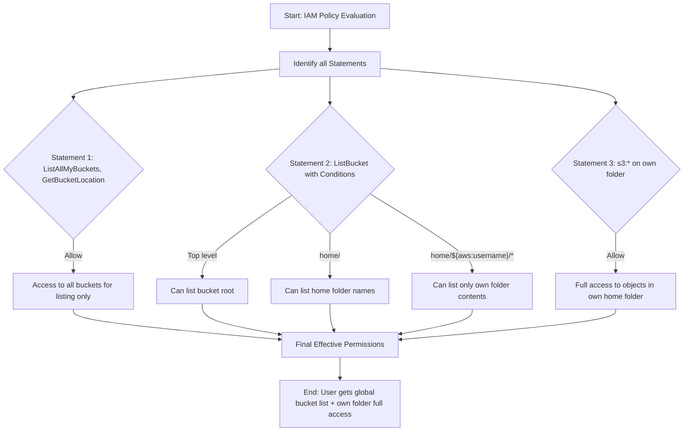

# AWS IAM Policy Analysis – Part 3 - Home Folder Analysis Example

## Overview

This lesson covers how to read and interpret a more complex AWS IAM policy document containing **three separate statements**, all of which have the `Effect` set to `Allow`. The focus is on:

- Identifying the number of statements.
- Understanding each statement’s specific permissions.
- Recognizing how IAM policy variables (e.g., `${aws:username}`) can be used to create scalable and dynamic permissions.
- Avoiding common mistakes in AWS exam questions involving **implicit deny**, **explicit deny**, and tricky condition logic.

## Step 1: Identifying Statements

- The policy document contains **three statements**:
  1. First statement – allows certain global S3 actions.
  2. Second statement – allows restricted bucket listing with conditions.
  3. Third statement – allows object operations within the user’s own folder.

## Step 2: Analyzing Each Statement

### **Statement 1 – Global Bucket-Level Actions**

```json
{
  "Effect": "Allow",
  "Action": ["s3:ListAllMyBuckets", "s3:GetBucketLocation"],
  "Resource": "*"
}
```

#### **Line-by-line breakdown**

- `"Effect": "Allow"` → Grants permission.
- `"Action"` →

  - `s3:ListAllMyBuckets` → Lists all S3 buckets in the account.
  - `s3:GetBucketLocation` → Gets the region a bucket is in.

- `"Resource": "*"` → Applies to **all S3 buckets**.

**Key points:**

- For certain S3 actions (`ListAllMyBuckets`, `GetBucketLocation`, `CreateBucket`), the resource must be `"*"`.
- This statement **only lists buckets**, it does not allow viewing their contents.

### **Statement 2 – Conditional Bucket Listing**

```json
{
  "Effect": "Allow",
  "Action": "s3:ListBucket",
  "Resource": "arn:aws:s3:::cl-animals-for-life",
  "Condition": {
    "StringLike": {
      "s3:prefix": ["", "home/", "home/${aws:username}/*"]
    }
  }
}
```

#### **Line-by-line breakdown**

- `"Action": "s3:ListBucket"` → Lists objects **within a specific bucket**.
- `"Resource"` → Restricts this permission to the `cl-animals-for-life` bucket.
- `"Condition"`:

  - `""` → Allows listing at the top level of the bucket.
  - `"home/"` → Allows listing the `home` folder (shows all users’ home folders without access to their contents).
  - `"home/${aws:username}/*"` → Allows listing only the folder that matches the requesting IAM user’s username.

**Key points:**

- `${aws:username}` dynamically maps to the user’s IAM name.
- Ensures each user can only list objects in **their own folder**.
- Avoids creating separate policies for each user.

### **Statement 3 – Object-Level Actions in User’s Folder**

```json
{
  "Effect": "Allow",
  "Action": "s3:*",
  "Resource": "arn:aws:s3:::cl-animals-for-life/home/${aws:username}/*"
}
```

#### **Line-by-line breakdown**

- `"Action": "s3:*"` → Grants **all** S3 actions (GetObject, PutObject, DeleteObject, etc.).
- `"Resource"` → Limits access to the user’s **own folder** under `home/`.

**Key points:**

- Allows full control over a user’s home folder only.
- Works for any number of IAM users using one single policy.

## IAM Variables

- Example: `${aws:username}`
- Resolves at evaluation time to the name of the IAM user making the request.
- Great for **scalable** and **low-maintenance** permission policies.

## Exam Tips from the Lesson

1. **Explicit Deny overrides everything**.
2. If no explicit Allow exists, default is **Implicit Deny**.
3. A Deny-only policy **has no effect** unless combined with other policies.
4. Watch for **"Not"** conditions in exam questions — they reverse expected logic.
5. Read carefully; some AWS exam questions are intentionally tricky.

## Visual Flow Diagram


