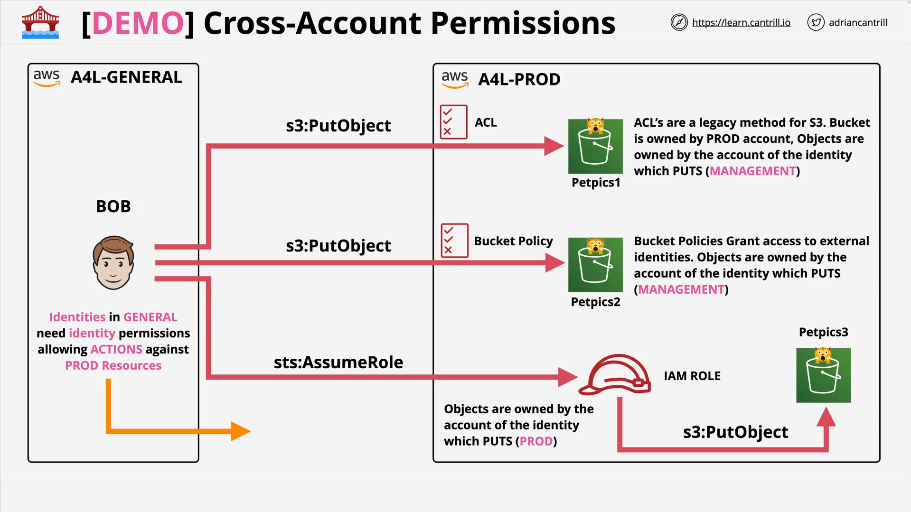

# Cross Account Access to S3 - SETUP - STAGE1

## Lesson Overview

This demo focuses on **cross-account permissions** in Amazon S3, demonstrating three methods to grant access between AWS accounts.
You will simulate an identity called **Bob** in the **Animals For Life Management account** accessing three S3 buckets in the **Animals For Life Production account**.

**Buckets Involved:**



1. `petpics1` – Uses **Access Control Lists (ACLs)**
2. `petpics2` – Uses a **Bucket Policy**
3. `petpics3` – Uses **Cross-Account Role Assumption** with an IAM Role in the Production account

## Resources Provided

- **CloudFormation One-Click Deployment (Production Account)**
  [Deploy Link](https://console.aws.amazon.com/cloudformation/home?region=us-east-1#/stacks/create/review?templateURL=https://learn-cantrill-labs.s3.amazonaws.com/awscoursedemos/0039-aws-mixed-cross-account-s3/prod_bucketsandrole.yaml&stackName=buckets)
- **Bucket Images**
  [Download ZIP](https://learn-cantrill-labs.s3.amazonaws.com/awscoursedemos/0039-aws-mixed-cross-account-s3/bucket_images.zip)
- **Bucket Policy Template**
  [View JSON](https://learn-cantrill-labs.s3.amazonaws.com/awscoursedemos/0039-aws-mixed-cross-account-s3/petpics_policy.json)

## CloudFormation Template (Production Account)

### Code

```yaml
AWSTemplateFormatVersion: "2010-09-09"
Description: >
  petpics1, 2 and 3
  IAM Role

Parameters:
  AccountToTrust:
    Description: "A4LManagement (General) AccountID"
    Type: String

Resources:
  petpics1:
    Type: AWS::S3::Bucket
  petpics2:
    Type: AWS::S3::Bucket
  petpics3:
    Type: AWS::S3::Bucket
  CrossAccountS3Role:
    Type: "AWS::IAM::Role"
    Properties:
      AssumeRolePolicyDocument:
        Version: 2012-10-17
        Statement:
          - Effect: Allow
            Principal:
              AWS:
                - !Join ["", ["arn:aws:iam::", !Ref AccountToTrust, ":root"]]
            Action:
              - "sts:AssumeRole"
      Path: /
      Policies:
        - PolicyName: root
          PolicyDocument:
            Version: 2012-10-17
            Statement:
              - Effect: Allow
                Action: "s3:ListAllMyBuckets"
                Resource: "arn:aws:s3:::*"
              - Effect: Allow
                Action: ["s3:ListBucket", "s3:GetBucketLocation"]
                Resource: !GetAtt petpics3.Arn
              - Effect: Allow
                Action: ["s3:GetObject", "s3:PutObject"]
                Resource: !Join ["", [!GetAtt petpics3.Arn, "/*"]]

Outputs:
  Bucket1URL:
    Value: !Join ["", ["https://us-east-1.console.aws.amazon.com/s3/buckets/", !Ref petpics1, "?region=us-east-1&tab=objects"]]
  Bucket2URL:
    Value: !Join ["", ["https://us-east-1.console.aws.amazon.com/s3/buckets/", !Ref petpics2, "?region=us-east-1&tab=objects"]]
  Bucket3URL:
    Value: !Join ["", ["https://us-east-1.console.aws.amazon.com/s3/buckets/", !Ref petpics3, "?region=us-east-1&tab=objects"]]
  Role:
    Value: !Ref CrossAccountS3Role
```

### Line-by-Line Explanation (Technical)

1. **AWSTemplateFormatVersion** – Defines the CloudFormation template syntax version.
2. **Description** – Metadata describing the resources: three buckets and an IAM role.
3. **Parameters > AccountToTrust** – Parameter to input the **Management Account ID**.
4. **Resources > petpics1/2/3** – Creates three S3 buckets.
5. **Resources > CrossAccountS3Role** – IAM role that can be assumed by another account.
6. **AssumeRolePolicyDocument** – Grants the **Management account root** permission to assume this role.
7. **Policies** – Attached inline policy for this role:

   - **ListAllMyBuckets** – Allows listing all buckets in the account.
   - **ListBucket & GetBucketLocation** – Grants bucket listing and location retrieval for `petpics3`.
   - **GetObject & PutObject** – Grants object read/write for all objects in `petpics3`.

8. **Outputs** – Provides console URLs for each bucket and the role name.

### Conceptual Explanation

This template:

- Creates **three buckets** for different cross-account access methods.
- Sets up a **role in Production account** that the **Management account** can assume to access `petpics3`.
- Outputs the **bucket URLs** and **role name** for quick access.

## S3 Bucket Policy Example (For petpics2)

### Code

```json
{
  "Version": "2012-10-17",
  "Statement": [
    {
      "Effect": "Allow",
      "Principal": {
        "AWS": "arn:aws:iam::REPLACEMEMANAGEMENTACCOUNTID:user/iamadmin"
      },
      "Action": ["s3:GetObject", "s3:PutObject", "s3:PutObjectAcl", "s3:ListBucket"],
      "Resource": ["arn:aws:s3:::REPLACEME_BUCKETNAME/*", "arn:aws:s3:::REPLACEME_BUCKETNAME"]
    }
  ]
}
```

### Line-by-Line Explanation (Technical)

- **Version** – Policy language version.
- **Statement > Effect: Allow** – Grants permissions.
- **Principal** – Specifies the **IAM admin user** from the Management account as the allowed entity.
- **Action** – Permissions granted:

  - `GetObject` – Download objects
  - `PutObject` – Upload objects
  - `PutObjectAcl` – Modify object ACL
  - `ListBucket` – View object list

- **Resource** – Specifies both:

  - All objects inside the bucket
  - The bucket itself (for listing)

### Conceptual Explanation

This policy allows a **specific IAM user** from another AWS account to **read, upload, and modify ACLs** for objects in a bucket, as well as list bucket contents.

## Demo Steps Summary

1. **Identify Management Account ID**

   - In AWS console, copy the account ID from the top-right corner.
   - Store for use in CloudFormation.

2. **Switch to Production Account**

   - Use role switching to access the Production account.

3. **Download Required Files**

   - `petpics_policy.json`
   - `bucket_images.zip`
   - CloudFormation stack link.

4. **Deploy CloudFormation Stack in Production**

   - Fill in the **Management Account ID**.
   - Accept capabilities checkbox.
   - Create stack and wait for **CREATE_COMPLETE**.

5. **Record Outputs**

   - Save:

     - `Bucket1URL`
     - `Bucket2URL`
     - `Bucket3URL`
     - IAM Role name (`CrossAccountS3Role`)
