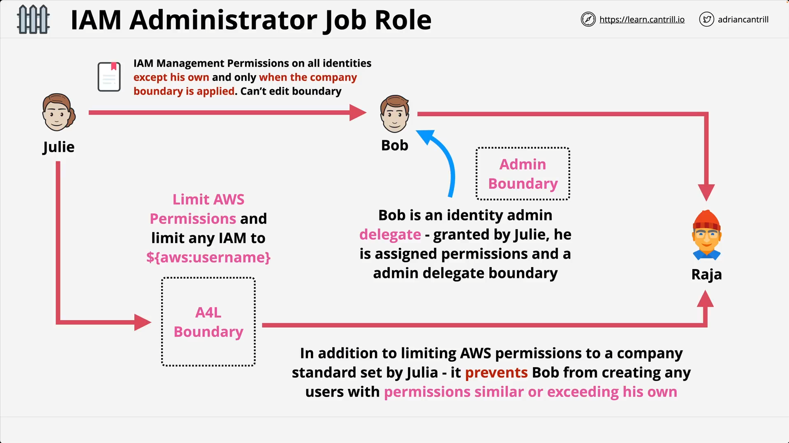

# Permissions Boundaries & Use-cases

## Overview

This lesson explains **AWS IAM Permissions Boundaries**, focusing on their theory, use cases, and practical demonstration for delegating IAM management rights safely.
It uses a case study of **Julie (Admin)** delegating IAM tasks to **Bob** without allowing privilege escalation.

## Key Concepts

### What is a Permissions Boundary?

- A **permissions boundary** is a special kind of IAM policy that **limits the maximum permissions** an identity (user or role) can have.
- They **do not grant permissions** themselves.
- They work in conjunction with identity policies:
  **Final permissions = intersection of identity policy permissions and boundary permissions**.
- They only apply to **identity-based permissions** (IAM policies) — not to resource policies.

### Visual Concept


- Imagine a list of permissions: some inside the boundary (effective) and some outside (ineffective).
- If an action is not allowed by the boundary, it will not be granted, even if the identity policy says "Allow".
- Denies inside a boundary still work and override allows.

## Why Use Permissions Boundaries?

- Useful in **delegation scenarios** where you want someone to manage IAM but not escalate their privileges.
- Without boundaries, a delegated admin could:

  1. Modify their own permissions to gain more access.
  2. Create another user with full admin rights.

## Delegation Use Case: Julie and Bob



1. **Julie** is the AWS account admin.
2. She wants **Bob** to manage IAM users/groups/roles.
3. Bob should not:

   - Change his own permissions.
   - Create new users with more permissions than allowed.

4. Julie achieves this by:

   - Giving Bob an **IAM admin identity policy**.
   - Applying an **Admin Boundary** to limit Bob’s actions.
   - Forcing Bob to only create users with a **User Boundary** applied.

## Policy 1: User Boundary (`a4luserboundary`)

```json
{
  "Version": "2012-10-17",
  "Statement": [
    {
      "Sid": "ServicesLimitViaBoundaries",
      "Effect": "Allow",
      "Action": ["s3:*", "cloudwatch:*", "ec2:*"],
      "Resource": "*"
    },
    {
      "Sid": "AllowIAMConsoleForCredentials",
      "Effect": "Allow",
      "Action": ["iam:ListUsers", "iam:GetAccountPasswordPolicy"],
      "Resource": "*"
    },
    {
      "Sid": "AllowManageOwnPasswordAndAccessKeys",
      "Effect": "Allow",
      "Action": ["iam:*AccessKey*", "iam:ChangePassword", "iam:GetUser", "iam:*ServiceSpecificCredential*", "iam:*SigningCertificate*"],
      "Resource": ["arn:aws:iam::*:user/${aws:username}"]
    }
  ]
}
```

### Line-by-Line Comments

- `"Version": "2012-10-17"` – Standard IAM policy version date.
- `ServicesLimitViaBoundaries` – Allows **full** access to `S3`, `CloudWatch`, and `EC2`.
- `AllowIAMConsoleForCredentials` – Lets users view IAM user lists and password policies (read-only).
- `AllowManageOwnPasswordAndAccessKeys` – Allows the user to manage **only their own** password, access keys, service-specific credentials, and signing certificates.

  - `${aws:username}` dynamically maps to the current IAM username.

### Purpose

This boundary limits any new users Bob creates to:

- Full access only to `S3`, `EC2`, and `CloudWatch`.
- Basic IAM access for managing **their own** credentials.

## Policy 2: Admin Boundary for Bob (`a4ladminboundary`)

```json
{
  "Version": "2012-10-17",
  "Statement": [
    {
      "Sid": "CreateOrChangeOnlyWithBoundary",
      "Effect": "Allow",
      "Action": ["iam:CreateUser", "iam:DeleteUserPolicy", "iam:AttachUserPolicy", "iam:DetachUserPolicy", "iam:PutUserPermissionsBoundary", "iam:PutUserPolicy"],
      "Resource": "*",
      "Condition": { "StringEquals": { "iam:PermissionsBoundary": "arn:aws:iam::329599627644:policy/a4luserboundary" } }
    },
    {
      "Sid": "CloudWatchAndOtherIAMTasks",
      "Effect": "Allow",
      "Action": [
        "cloudwatch:*",
        "iam:GetUser",
        "iam:ListUsers",
        "iam:DeleteUser",
        "iam:UpdateUser",
        "iam:CreateAccessKey",
        "iam:CreateLoginProfile",
        "iam:GetAccountPasswordPolicy",
        "iam:GetLoginProfile",
        "iam:ListGroups",
        "iam:ListGroupsForUser",
        "iam:CreateGroup",
        "iam:GetGroup",
        "iam:DeleteGroup",
        "iam:UpdateGroup",
        "iam:CreatePolicy",
        "iam:DeletePolicy",
        "iam:DeletePolicyVersion",
        "iam:GetPolicy",
        "iam:GetPolicyVersion",
        "iam:GetUserPolicy",
        "iam:GetRolePolicy",
        "iam:ListPolicies",
        "iam:ListPolicyVersions",
        "iam:ListEntitiesForPolicy",
        "iam:ListUserPolicies",
        "iam:ListAttachedUserPolicies",
        "iam:ListRolePolicies",
        "iam:ListAttachedRolePolicies",
        "iam:SetDefaultPolicyVersion",
        "iam:SimulatePrincipalPolicy",
        "iam:SimulateCustomPolicy"
      ],
      "NotResource": "arn:aws:iam::329599627644:user/bob"
    },
    {
      "Sid": "NoBoundaryPolicyEdit",
      "Effect": "Deny",
      "Action": ["iam:CreatePolicyVersion", "iam:DeletePolicy", "iam:DeletePolicyVersion", "iam:SetDefaultPolicyVersion"],
      "Resource": ["arn:aws:iam::329599627644:policy/a4luserboundary", "arn:aws:iam::329599627644:policy/a4ladminboundary"]
    },
    {
      "Sid": "NoBoundaryUserDelete",
      "Effect": "Deny",
      "Action": "iam:DeleteUserPermissionsBoundary",
      "Resource": "*"
    }
  ]
}
```

### Line-by-Line Comments

- `CreateOrChangeOnlyWithBoundary` – Bob can only create/change IAM users **if** they have the `a4luserboundary` applied.
- `CloudWatchAndOtherIAMTasks` – Allows IAM and CloudWatch actions, **except** on Bob’s own IAM user.
- `NoBoundaryPolicyEdit` – Denies Bob the ability to edit/delete the boundary policies.
- `NoBoundaryUserDelete` – Denies Bob the ability to remove permissions boundaries from any user.

### Purpose

This boundary ensures:

- Bob can’t create users without the user boundary.
- Bob can’t modify his own permissions.
- Bob can’t tamper with the boundary policies.

## Policy 3: Bob's Identity Policy (`a4ladminpermissions`)

```json
{
  "Version": "2012-10-17",
  "Statement": [
    {
      "Sid": "IAM",
      "Effect": "Allow",
      "Action": "iam:*",
      "Resource": "*"
    },
    {
      "Sid": "CloudWatchLimited",
      "Effect": "Allow",
      "Action": ["cloudwatch:GetDashboard", "cloudwatch:GetMetricData", "cloudwatch:ListDashboards", "cloudwatch:GetMetricStatistics", "cloudwatch:ListMetrics"],
      "Resource": "*"
    }
  ]
}
```

### Line-by-Line Comments

- `IAM` – Grants Bob full IAM administrative rights.
- `CloudWatchLimited` – Grants Bob read-only access to CloudWatch dashboards, metrics, and statistics.

### Purpose

This policy gives Bob **full IAM access**, but the Admin Boundary limits how that access is actually used.

## Demonstration Summary

1. **Without Boundary** – Bob could escalate privileges by creating an admin user.
2. **With Boundary**:

   - Bob tries to create an admin user **without** the `a4luserboundary` → **Action denied**.
   - Bob creates a user **with** `a4luserboundary` → Success, but that new user is limited.

3. Boundaries **force safe delegation**.

## Cleanup

- Remove:

  - Bob’s IAM user.
  - All created boundary and permission policies.

- Always clean up after testing to avoid unintended access.
