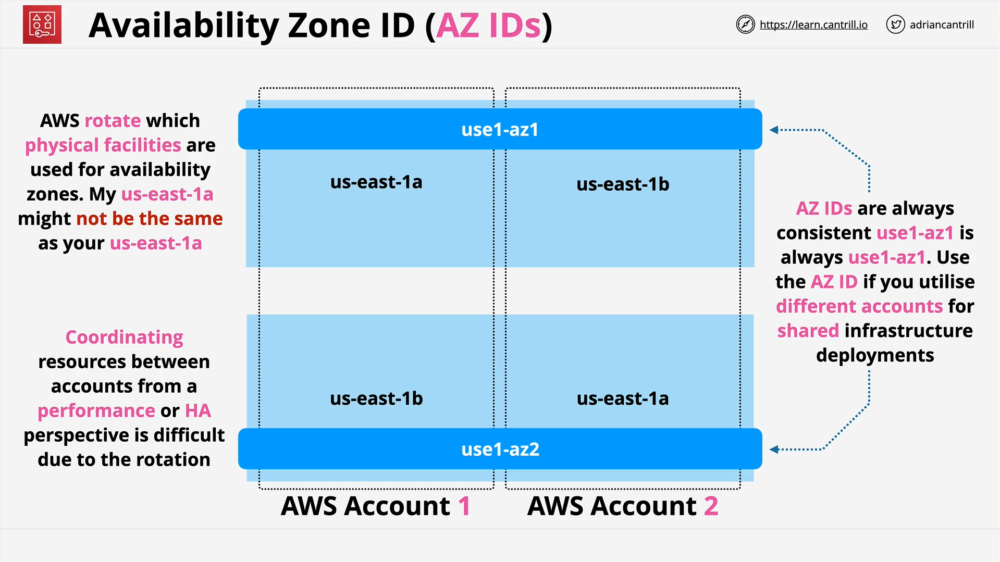
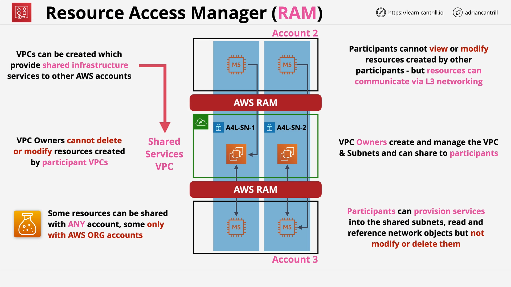

# AWS Resource Access Manager (RAM)

## Introduction to AWS Resource Access Manager

AWS **Resource Access Manager** (RAM) is a service that allows sharing AWS resources across accounts.
Before RAM, AWS accounts were fully isolated—VPCs and their resources could not be directly accessed from other accounts without **VPC peering** or a **transit gateway**.

Key changes brought by RAM:

- Enables **resource sharing** across AWS accounts.
- Some resources can be shared with **any AWS account**.
- Others can only be shared with accounts **in the same AWS Organization**.
- Only supported AWS resources can be shared.
- Resource access is controlled via **principals** (AWS account, OU, or Organization).

## Supported Resource Sharing

If a resource supports RAM (e.g., a **VPC Subnet**), it can be shared with:

- **A specific AWS account**
- **An Organizational Unit (OU)**
- **An entire AWS Organization**

When shared:

- Resources become **natively visible** in the receiving account's AWS Management Console and CLI.
- Example: A shared **VPC Subnet** appears as if it exists in the recipient account.

## Cost Model

- RAM itself is **free**.
- You only pay for the **underlying resource usage**.
- Example: Sharing a subnet incurs **no RAM cost**, but resources deployed in that subnet still incur normal AWS charges.

## Architectural Impact

Traditional architectures:

- Multiple AWS accounts connected with **VPC peering** or **transit gateways**.

With RAM:

- Shared resources (e.g., subnets, Route 53 zones) ca n replace some network peering setups.
- Enables **Shared Services VPC** patterns.

## Availability Zone Naming Challenge

**Problem:**

- AWS **rotates AZ names** per account.
- `us-east-1a` in one account might map to **different physical infrastructure** in another account.
- Causes coordination issues when deploying multi-account architectures.

**Solution:**

- Use **Availability Zone IDs** (e.g., `use1-az1`).
- AZ IDs are **consistent across all accounts**.
- Allows coordinated resource deployment in the **same physical AZ** across accounts.

## Key RAM Concepts

### Owner Account

- The account that **owns** the resource.
- Has **full read/write** permissions.
- Creates a **Resource Share** with:

  - Name
  - Resource to share
  - Principal(s) to share with

### Participant Account

- Receives shared resource access.
- Can **view** and **use** resources according to permissions.
- Cannot **modify** or **delete** the resource.

### Sharing Behavior

- If the principal is in the **same AWS Organization** and **organization-wide sharing** is enabled:

  - **Automatic acceptance** (no invite needed).

- If the principal is **outside the organization**:

  - An **invite must be accepted** manually.

## Example: Shared Services VPC Architecture

**Scenario:**

- A single AWS account hosts a **Shared Services VPC**.
- Contains subnets that provide common services (e.g., domain controllers, shared storage).
- Subnets are **shared** with other accounts using RAM.

**Flow:**

1. **Owner Account**:

   - Owns the VPC and subnets.
   - Can modify network settings.

2. **Participant Accounts**:

   - Can **see** subnets in their account.
   - Can **deploy resources** into shared subnets.
   - Own the resources they deploy.
   - Cannot modify or delete the shared subnets.

**Important Ownership Rules:**

- If Account 3 launches EC2 instances into a shared subnet:

  - **Account 3 owns those instances**.
  - The Owner Account **cannot see** those instances in its console.

- Networking works seamlessly since they’re in the same subnet.
- Management and visibility remain **account-specific**.

## Resource Sharing Limitations

- **Visibility:** Each account sees only resources **it owns**.
- **Control:** Owner account controls **network layer** resources; participants control **their own deployed resources**.
- **Supported Resources Only:** Not all AWS services can be shared via RAM.

## High-Level RAM Workflow

1. **Owner account** creates a **Resource Share**.
2. Selects a **resource** to share.
3. Chooses a **principal** (AWS account, OU, or Organization).
4. If **same organization + sharing enabled** → automatic share.
5. If **outside organization** → recipient must **accept invite**.

## Closing Notes

- RAM is **highly flexible** and supports complex architectures.
- It simplifies multi-account networking compared to older methods.
- Understanding **ownership boundaries** and **AZ IDs** is essential.
- This service will be demonstrated later in the **Animals for Life** AWS Organization lab exercises.
