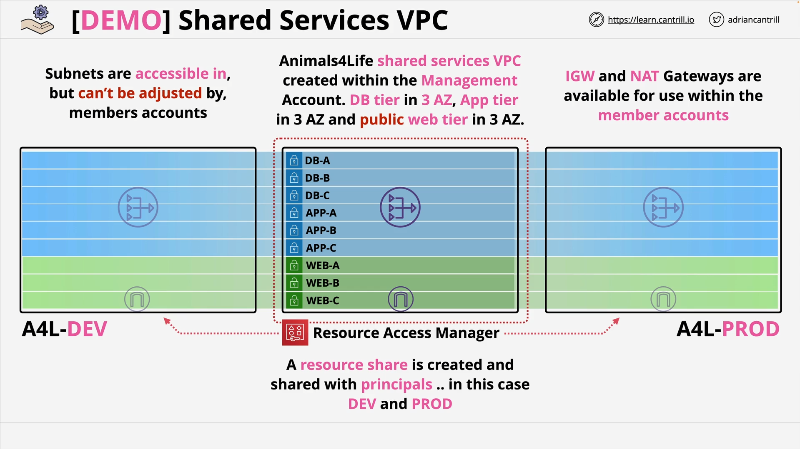

# Shared ORG VPC - PART1

This guide covers the implementation of a shared services VPC using AWS Resource Access Manager (RAM) for multi-account architecture.

## Overview



This demo implements a shared services VPC within an AWS organization structure containing multiple accounts:

- **Management/General Account**: Contains the shared VPC infrastructure
- **Development Account**: Receives shared subnet access
- **Production Account**: Receives shared subnet access

## VPC Architecture

The shared services VPC implements a three-tier architecture across three availability zones:

### Network Structure

- **CIDR Block**: 10.16.0.0/16 (IPv4) with IPv6 support
- **Availability Zones**: Three AZs (A, B, C)
- **Tiers**: Database, Application, Web, and Reserved subnets
- **Total Subnets**: 12 subnets (4 tiers × 3 AZs)

### Subnet Distribution

Each availability zone contains:

- Reserved subnet
- Database subnet
- Application subnet
- Web subnet (public with internet access)

## CloudFormation Template Analysis

### Template Header

```yaml
AWSTemplateFormatVersion: 2010-09-09
Description: Animals4Life base VPC Template v3 - DB, APP and WEB Tiers
Metadata:
  LICENSE: Apache License Version 2.0
```

**Explanation:**

- `AWSTemplateFormatVersion`: Specifies the CloudFormation template format version
- `Description`: Human-readable description of the template's purpose
- `Metadata`: Contains additional template information including licensing

### VPC Core Resources

#### Main VPC Resource

```yaml
VPC:
  Type: AWS::EC2::VPC
  Properties:
    CidrBlock: 10.16.0.0/16
    EnableDnsSupport: true
    EnableDnsHostnames: true
    Tags:
      - Key: Name
        Value: a4l-sharedvpc
```

**Line-by-line explanation:**

- `Type`: Creates an AWS VPC resource
- `CidrBlock`: Defines the IP address range for the VPC (65,536 IP addresses)
- `EnableDnsSupport`: Enables DNS resolution within the VPC
- `EnableDnsHostnames`: Enables DNS hostnames for instances
- `Tags`: Assigns a name tag for identification

#### IPv6 Support

```yaml
IPv6CidrBlock:
  Type: AWS::EC2::VPCCidrBlock
  Properties:
    VpcId: !Ref VPC
    AmazonProvidedIpv6CidrBlock: true
```

**Explanation:**

- Associates an Amazon-provided IPv6 CIDR block with the VPC
- `!Ref VPC`: References the VPC resource created above
- Enables dual-stack networking (IPv4 and IPv6)

### Internet Gateway Configuration

```yaml
InternetGateway:
  Type: "AWS::EC2::InternetGateway"
  Properties:
    Tags:
      - Key: Name
        Value: A4L-vpc1-igw

InternetGatewayAttachment:
  Type: "AWS::EC2::VPCGatewayAttachment"
  Properties:
    VpcId: !Ref VPC
    InternetGatewayId: !Ref InternetGateway
```

**Purpose:**

- Creates an Internet Gateway for public internet access
- Attaches the gateway to the VPC
- Enables bidirectional internet connectivity for public subnets

### Route Table Configuration

#### Web Tier Route Table (Public)

```yaml
RouteTableWeb:
  Type: "AWS::EC2::RouteTable"
  Properties:
    VpcId: !Ref VPC
    Tags:
      - Key: Name
        Value: A4L-vpc1-rt-web

RouteTableWebDefaultIPv4:
  Type: "AWS::EC2::Route"
  DependsOn: InternetGatewayAttachment
  Properties:
    RouteTableId: !Ref RouteTableWeb
    DestinationCidrBlock: "0.0.0.0/0"
    GatewayId: !Ref InternetGateway
```

**Configuration Details:**

- Creates a route table for web (public) subnets
- `DependsOn`: Ensures Internet Gateway is attached before creating routes
- `DestinationCidrBlock: '0.0.0.0/0'`: Routes all traffic to the Internet Gateway
- Provides direct internet access for public subnets

### Subnet Configuration Examples

#### Reserved Subnet (Private)

```yaml
SubnetReservedA:
  Type: AWS::EC2::Subnet
  DependsOn: IPv6CidrBlock
  Properties:
    VpcId: !Ref VPC
    AvailabilityZone: !Select [0, !GetAZs ""]
    CidrBlock: 10.16.0.0/20
    AssignIpv6AddressOnCreation: true
    Ipv6CidrBlock:
      Fn::Sub:
        - "${VpcPart}${SubnetPart}"
        - SubnetPart: "00::/64"
          VpcPart: !Select [0, !Split ["00::/56", !Select [0, !GetAtt VPC.Ipv6CidrBlocks]]]
```

**Detailed Analysis:**

- `!Select [ 0, !GetAZs '' ]`: Selects the first available AZ in the region
- `CidrBlock: 10.16.0.0/20`: Provides 4,096 IP addresses for this subnet
- `AssignIpv6AddressOnCreation: true`: Auto-assigns IPv6 addresses to instances
- `Fn::Sub` and `!Split`: Creates IPv6 subnet from the VPC's IPv6 block

#### Web Subnet (Public)

```yaml
SubnetWEBA:
  Type: AWS::EC2::Subnet
  DependsOn: IPv6CidrBlock
  Properties:
    VpcId: !Ref VPC
    AvailabilityZone: !Select [0, !GetAZs ""]
    CidrBlock: 10.16.48.0/20
    MapPublicIpOnLaunch: true
    Ipv6CidrBlock:
      Fn::Sub:
        - "${VpcPart}${SubnetPart}"
        - SubnetPart: "03::/64"
          VpcPart: !Select [0, !Split ["00::/56", !Select [0, !GetAtt VPC.Ipv6CidrBlocks]]]
```

**Key Difference:**

- `MapPublicIpOnLaunch: true`: Automatically assigns public IPv4 addresses to instances launched in this subnet

### NAT Gateway Implementation

#### Elastic IP Allocation

```yaml
EIPA:
  Type: "AWS::EC2::EIP"
  DependsOn: InternetGatewayAttachment
  Properties:
    Domain: vpc
```

**Purpose:**

- Creates a static public IP address for the NAT Gateway
- `Domain: vpc`: Specifies the EIP is for use within a VPC

#### NAT Gateway Creation

```yaml
NatGatewayA:
  Type: "AWS::EC2::NatGateway"
  Properties:
    AllocationId: !GetAtt EIPA.AllocationId
    SubnetId: !Ref SubnetWEBA
```

**Configuration:**

- Associates the Elastic IP with the NAT Gateway
- Places the NAT Gateway in the public web subnet
- Provides outbound internet access for private subnets

### Security Group Configuration

```yaml
DefaultInstanceSecurityGroup:
  Type: "AWS::EC2::SecurityGroup"
  Properties:
    VpcId: !Ref VPC
    GroupDescription: Enable SSH access via port 22 IPv4 & v6
    SecurityGroupIngress:
      - Description: "Allow SSH IPv4 IN"
        IpProtocol: tcp
        FromPort: "22"
        ToPort: "22"
        CidrIp: "0.0.0.0/0"
      - Description: "Allow HTTP IPv4 IN"
        IpProtocol: tcp
        FromPort: "80"
        ToPort: "80"
        CidrIp: "0.0.0.0/0"
      - Description: "Allow SSH IPv6 IN"
        IpProtocol: tcp
        FromPort: "22"
        ToPort: "22"
        CidrIpv6: ::/0
```

**Security Rules:**

- Allows SSH access (port 22) from any IPv4 and IPv6 address
- Allows HTTP access (port 80) from any IPv4 address
- Provides basic connectivity for demonstration purposes

### IPv6 Workaround Lambda Function

```python
import cfnresponse
import boto3

def lambda_handler(event, context):
    if event['RequestType'] is 'Delete':
      cfnresponse.send(event, context, cfnresponse.SUCCESS)
      return

    responseValue = event['ResourceProperties']['SubnetId']
    ec2 = boto3.client('ec2', region_name='${AWS::Region}')
    ec2.modify_subnet_attribute(AssignIpv6AddressOnCreation={
                                    'Value': True
                                  },
                                  SubnetId=responseValue)
    responseData = {}
    responseData['SubnetId'] = responseValue
    cfnresponse.send(event, context, cfnresponse.SUCCESS, responseData, "CustomResourcePhysicalID")
```

**Function Purpose:**

- `import cfnresponse`: CloudFormation response module for custom resources
- `import boto3`: AWS SDK for Python
- `if event['RequestType'] is 'Delete'`: Handles stack deletion gracefully
- `ec2.modify_subnet_attribute()`: Enables IPv6 address assignment on creation
- Workaround for CloudFormation limitations with IPv6 subnet configuration

## User Data Script Analysis

```bash
#!/bin/bash -xe

# System Updates
yum -y update
yum -y upgrade

yum -y install httpd wget
systemctl enable httpd
systemctl start httpd

# Install Wordpress
wget https://cl-sharedmedia.s3.amazonaws.com/genericcatpicwebsite/index.html -P /var/www/html
wget https://cl-sharedmedia.s3.amazonaws.com/genericcatpicwebsite/milky.jpeg -P /var/www/html
wget https://cl-sharedmedia.s3.amazonaws.com/genericcatpicwebsite/nori.jpeg -P /var/www/html
wget https://cl-sharedmedia.s3.amazonaws.com/genericcatpicwebsite/sushi.jpeg -P /var/www/html
cd /var/www/html

# permissions
usermod -a -G apache ec2-user
chown -R ec2-user:apache /var/www
chmod 2775 /var/www
find /var/www -type d -exec chmod 2775 {} \;
find /var/www -type f -exec chmod 0664 {} \;
```

**Script Breakdown:**

- `#!/bin/bash -xe`: Shebang with exit on error and command printing
- `yum -y update && yum -y upgrade`: Updates all system packages
- `yum -y install httpd wget`: Installs Apache web server and wget utility
- `systemctl enable httpd && systemctl start httpd`: Enables and starts Apache service
- `wget` commands: Downloads website content from S3 to web directory
- `usermod -a -G apache ec2-user`: Adds ec2-user to apache group
- `chown -R ec2-user:apache /var/www`: Sets ownership of web directory
- `chmod` commands: Sets appropriate permissions for web content

## Implementation Steps

### Step 1: Deploy Base Infrastructure

1. Access AWS Management Console in the Management/General account
2. Ensure Northern Virginia (us-east-1) region is selected
3. Deploy the CloudFormation template using the provided one-click deployment link
4. Wait for stack creation to complete (CREATE_COMPLETE status)

### Step 2: Configure Resource Access Manager

1. Navigate to Resource Access Manager console
2. Go to Settings and enable sharing within organization
3. This removes the invite/accept process for intra-organization sharing

### Step 3: Create Resource Share

1. Click "Create resource share" in RAM console
2. Name: "A4L-shared-services-VPC"
3. Select all 12 subnets from the shared services VPC
4. Configure permissions (EC2 instance creation, network interface management)
5. Share with Development and Production accounts within the organization

### Step 4: Verify Sharing

1. Confirm resource share status shows "Active"
2. Verify all 12 subnets are included in the share
3. Check that both target accounts are listed as principals

## Network Architecture Benefits

### High Availability

- Multi-AZ deployment across three availability zones
- Redundant NAT Gateways in each AZ for outbound connectivity
- Load distribution capabilities across zones

### Security Isolation

- Three-tier architecture separating database, application, and web layers
- Private subnets for sensitive workloads (database and application tiers)
- Public subnets only for web-facing resources

### Cost Optimization

- Centralized network infrastructure reduces duplication
- Shared NAT Gateways across multiple accounts
- Single Internet Gateway serving all accounts

### Scalability

- IPv4 and IPv6 dual-stack support
- Large address space (10.16.0.0/16) accommodating growth
- Flexible subnet sizing for different workload requirements

## Resource Access Manager Benefits

### Simplified Management

- Centralized network resource management
- Automatic sharing within AWS Organizations
- No manual invite/accept process required

### Enhanced Security

- Granular permissions control
- Organization-boundary enforcement
- Audit trail for resource access

### Cost Efficiency

- Eliminates duplicate network infrastructure
- Shared operational overhead
- Reduced complexity in multi-account environments

This architecture provides a robust foundation for multi-account AWS environments while maintaining security, scalability, and cost-effectiveness through centralized network resource sharing.
