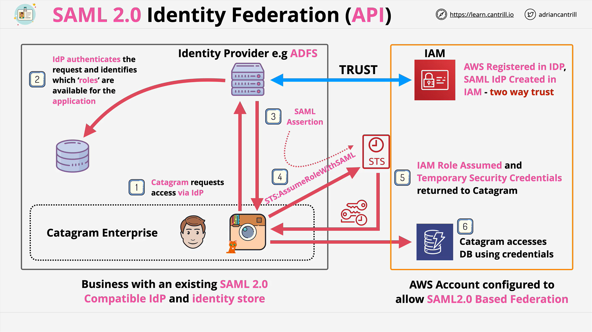
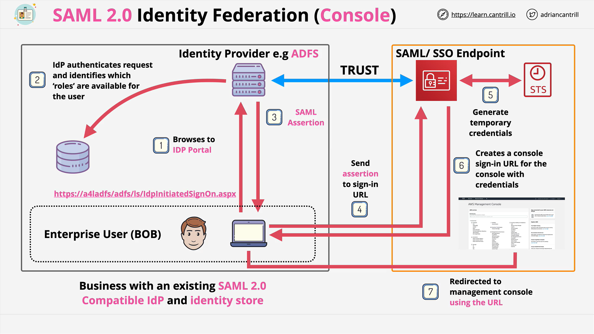

# SAML2.0 Identity Federation

## What This Lesson Covers

This lesson explains how **SAML 2.0 identity federation** lets you use an external enterprise identity (for example, from Microsoft ADFS or another on‑prem IdP) to access **AWS**. Because AWS only accepts AWS credentials, SAML assertions from the external IdP are **exchanged** for **temporary AWS credentials**. You need to know both the **architecture** and **when to choose SAML** over other federation options for the SAP‑C02 exam.

## Core Idea: Indirect Access Only

- You **cannot** access AWS resources directly with non‑AWS credentials.
- A **SAML assertion** from your external IdP is **trusted by AWS** and is **exchanged** via **AWS STS** for **temporary AWS credentials**.
- Those temporary credentials are what the app/user actually uses to call AWS APIs or load the AWS Management Console.

## When To Use SAML 2.0 Federation (Exam Selection Criteria)

Choose SAML 2.0 when most or all of the following are true:

- You already use an **enterprise identity provider** that is **SAML 2.0 compatible**.
- You want your existing **identity management team** to continue managing access, keeping a **single source of identity truth**.
- You have a **large user base** (the lesson cites “more than \~5,000 users” as a strong indicator).
- You need to grant access to **AWS Console** and/or **API/CLI** using enterprise identities.

Do **not** choose SAML 2.0 if the exam scenario mentions **Google, Facebook, Twitter, “web identity,”** or other **non‑SAML** providers. Those point to **OIDC/Web Identity Federation** or other services instead.

## Key AWS Pieces Involved

- **IAM SAML Provider**: A representation of your external IdP inside AWS IAM.
- **IAM Roles for SAML**: Roles that trusted SAML users can assume. Mappings from IdP groups/attributes determine which roles a user sees.
- **AWS STS** (**Security Token Service**): Performs the **AssumeRoleWithSAML** operation to exchange the SAML assertion for temporary AWS credentials.
- **AWS Sign‑In (SAML endpoint)**: For console federation, consumes the SAML assertion and issues a **console sign‑in URL** that embeds temporary credentials.

## Architecture: API/CLI (Application‑Initiated) Flow

> Think “backend service or custom enterprise app wants to call AWS APIs.”

1. **IdP & IAM Trust Set Up**

   - On‑prem IdP (e.g., ADFS) is configured.
   - In AWS, create an **IAM SAML provider** and **IAM roles** that trust that provider.

2. **App Requests Access**

   - An internal enterprise app initiates auth with the on‑prem **IdP**.

3. **User/Service Authentication & Role Discovery**

   - The IdP authenticates the identity against its store (e.g., Active Directory).
   - The IdP determines which **IAM roles** this identity is allowed to assume.
   - The app **selects a role**.

4. **SAML Assertion Issued**

   - The IdP returns a **SAML assertion** to the app as proof of authentication and role choice.

5. **Exchange Assertion for AWS Credentials**

   - The app calls **AWS STS** using **AssumeRoleWithSAML**, passing the SAML assertion.
   - **STS returns temporary AWS credentials** (Access Key, Secret Key, Session Token).

6. **Call AWS Services**

   - The app uses the temporary credentials to call AWS services (for example, DynamoDB).
   - All access is governed by the permissions of the **assumed role**.

**Key characteristic:** This is **application‑initiated**; the app talks to the IdP first, then to STS.

## Architecture: Console (User‑Initiated) Flow

> Think “employee logs into the AWS Management Console using corporate credentials.”

1. **IdP & AWS SAML Endpoint Trust**

   - The IdP trusts AWS as a service provider.
   - In AWS, the **IAM SAML provider** and **SAML‑enabled roles** already exist.

2. **User Browses to IdP Portal**

   - Example user “Bob” visits the corporate IdP portal (e.g., ADFS portal URL).

3. **Authentication & Role Selection**

   - Bob authenticates (via login or integrated Windows auth).
   - The portal shows the **list of allowed IAM roles** (admin, auditor, etc.).
   - Bob **selects a role**.

4. **SAML Assertion & AWS SAML Endpoint**

   - The portal issues a **SAML assertion** and instructs the client to post it to the **AWS SAML endpoint**.

5. **Behind the Scenes: STS and Sign‑In URL**

   - AWS receives the assertion, **assumes the selected IAM role** via STS on Bob’s behalf, and obtains **temporary credentials**.
   - AWS then constructs a **console sign‑in URL** that embeds those credentials.

6. **Console Access**

   - The client uses that URL to open the **AWS Management Console** with the selected role’s permissions.

**Key characteristic:** This is **user‑initiated**; the browser interacts with the IdP portal and then AWS Sign‑In.

## Session Duration and Credentials

- Temporary credentials obtained via **AssumeRoleWithSAML** can be valid for **up to 12 hours** (subject to role configuration).
- Remember this **“up to 12 hours”** figure as an exam data point.

## Configuration Overview (High Level)

- **On the IdP side**

  - Publish SAML metadata.
  - Map users/groups to **AWS IAM roles** (you’ll control which roles appear in the role picker).

- **On the AWS side**

  - Create an **IAM SAML provider** using the IdP’s metadata.
  - Create **IAM roles** that trust that SAML provider and define **permissions policies**.
  - Optionally adjust **MaxSessionDuration** (to allow longer sessions, within AWS limits).

## Exam Tips and Red Flags

- If the question mentions **Google/Facebook/Twitter/Web identity**, **do not** pick SAML 2.0 federation; that’s likely **OIDC** or **Cognito** scenarios.

- If the question emphasizes:

  - Existing enterprise **SAML‑compatible** IdP
  - **Centralized identity management**
  - **Single source of truth**
  - **Large user base** (e.g., >5,000)

  then SAML 2.0 federation is a strong choice.

- Always remember the **exchange**:

  - External identity → **SAML assertion** → **STS exchange** → **temporary AWS credentials**.

- **Two directions of trust** to configure:

  - AWS trusts the IdP (IAM SAML provider and role trust policy).
  - The IdP recognizes AWS as a service provider and knows which roles to present.

## Concepts and Glossary

- **SAML 2.0**: An open standard for exchanging authentication and authorization data between an identity provider (IdP) and a service provider (SP).
- **IdP (Identity Provider)**: Your enterprise authentication system (e.g., ADFS).
- **IAM SAML Provider**: An AWS IAM resource that represents and **trusts** the external IdP.
- **IAM Role**: Defines the **permissions** users get once federated. Users select among allowed roles.
- **SAML Assertion**: A signed token from the IdP proving identity and conveying authorization details.
- **STS (Security Token Service)**: Exchanges the SAML assertion for **temporary credentials** via **AssumeRoleWithSAML**.
- **AWS Sign‑In SAML Endpoint**: Consumes SAML assertions for console sign‑in and issues a **sign‑in URL** embedding temporary credentials.

## Quick Recap

- **Why SAML?** Use it when you have a **SAML‑compatible enterprise IdP** and want centralized identity control, especially at **enterprise scale**.

- **How it works:** The IdP authenticates, issues a **SAML assertion**, AWS **exchanges it** via **STS** for **temporary credentials**, and those credentials are used to access AWS (APIs or Console).

- **Flows:**

  - **Application‑initiated** for API/CLI.
  - **User‑initiated** for console.

- **Remember for exam:** **Up to 12‑hour** sessions, **role selection**, and **don’t pick SAML** if the scenario mentions **social/OIDC providers**.
