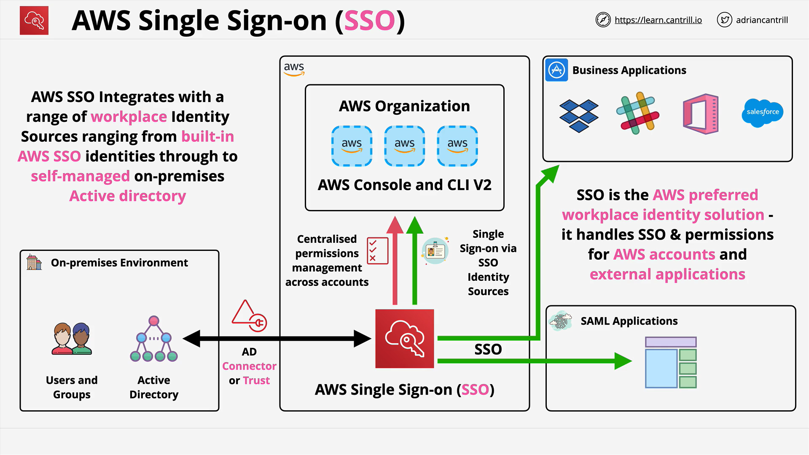

# IAM Identity Center (Successor to AWS Single Sign-On)

## What This Lesson Covers

- **Goal:** Explain what **AWS Single Sign‑On (SSO)** does, why AWS now recommends it for **workforce identity federation**, and how it fits architecturally.
- **Key message:** For new deployments that involve employees accessing AWS, **prefer AWS SSO** over building **manual SAML 2.0 federation**. Use SSO to centralize access and permissions across **multiple AWS accounts** and certain **external business applications**.

## Why AWS Recommends SSO Over Direct SAML 2.0

- **Centralized control:** One place to manage who can access which AWS accounts and with what permissions.
- **Abstraction:** You choose an **identity store** once; SSO abstracts the protocol and plumbing so the **user experience and admin model are consistent** regardless of the source.
- **Reduced overhead:** Replaces many bespoke/legacy federation setups; lowers configuration drift and operational toil.
- **Broader scope:** Covers not just AWS account access, but also **SSO to external business apps**.
- **Exam mindset:** If the scenario is **workplace/enterprise users** and SSO is an option, **pick SSO by default** unless the prompt gives a very specific reason you can’t.

## Identity Stores Supported

SSO supports several **identity sources**. After you pick one, the downstream SSO behavior is the same:

- **Built‑in identity store** inside SSO
  Even without an external IdP, you gain centralized multi‑account permission management.
- **AWS Managed Microsoft AD** (via AWS Directory Service)
- **Existing on‑prem Microsoft AD**
  Use a **two‑way trust** or **AD Connector** to integrate.
- **External SAML 2.0 IdP**
  Leverage an existing enterprise IdP while still gaining SSO’s centralized management.

## What SSO Manages

- **Access to every AWS account** in your **AWS Organizations** organization.
- **Both** the **AWS Management Console** and the **AWS CLI (v2)** for workforce users.
- **External business applications** such as **Dropbox, Slack, Office 365, Salesforce**, and **custom SAML‑based apps**.
- **Users and groups import/sync** from the chosen identity source, then **assign fine‑grained, role‑based permissions** across all accounts.

## Architectural View (High Level)

- **Runs within an AWS account** but governs **all accounts** in your AWS Organization.
- Relies on a single **identity source** (chosen from the list above) to provide the **authoritative users and groups**.
- **Centralizes permission assignments** for those users and groups across accounts, covering both **console** and **CLI v2** access.
- **Big idea:** Instead of wiring SAML 2.0 federation manually for each account/app, SSO **wraps and standardizes** the federation + permission experience.

## How It Compares to Manual SAML 2.0 Federation

- **Manual SAML:** You configure trust, roles, and mappings per account/app, and each IdP can differ in details.
- **SSO:** You configure **once** against your identity source; SSO then **normalizes** federation flows and **centralizes** permission assignments across accounts and selected third‑party apps.
- **Practical impact:** Less per‑account configuration, fewer moving parts, more consistent governance.

## Selection Guide for the Exam

- **Workforce identities** (employees, contractors accessing AWS accounts): **Choose AWS SSO** if available.
- **Customer identities** (end‑users of your web/mobile apps; mentions of **Twitter/Google/Facebook** or “web identity”): **Not SSO** — that’s usually **Amazon Cognito**.
- **Legacy/incompatibility edge cases:** You might still see **direct SAML 2.0**. Use it only when required by constraints the question makes explicit.

## Cost and Practicality

- **Service cost:** The lesson emphasizes **SSO is free** to use.
- **Default choice:** Given the breadth of features and lack of charges, SSO should be your **default** for managing workforce identities in AWS.

## What You’ll Do in the Follow‑On Demo (per the lesson)

- Implement SSO in a multi‑account organization (the course’s “Animals for Life” scenario).
- Create users in the product, then assign **granular, role‑based permissions** across accounts.
- See the end‑to‑end flow for both **console** and **CLI v2** access governed by SSO.

## Quick Checks and Takeaways

- If you read **“enterprise/workplace users”** and SSO is an option, **pick SSO**.
- If you read **“customers using social logins”**, **pick Cognito**, not SSO.
- If the prompt mentions **SAML 2.0 only**, consider whether it’s a legacy constraint; otherwise, SSO likely fits better.
- SSO consolidates **identity source selection**, **user/group import**, **permission governance**, **multi‑account access**, and **external app SSO**.

## Recap

AWS Single Sign‑On (IAM Identity Center) is AWS’s **preferred workforce identity** solution, replacing most **manual SAML 2.0** use cases by centralizing **who** can access **which** AWS accounts and **how**, while also extending SSO to **external business applications**. You pick an **identity source** (built‑in, AWS Managed Microsoft AD, on‑prem AD via trust/AD Connector, or external SAML 2.0 IdP), import or reference users and groups, and then grant them **fine‑grained, role‑based access** to the **console** and **CLI v2** across all accounts in your **AWS Organization**. For **SAP‑C02**, favor SSO for **workforce** scenarios, and choose **Cognito** for **customer** identity scenarios.
