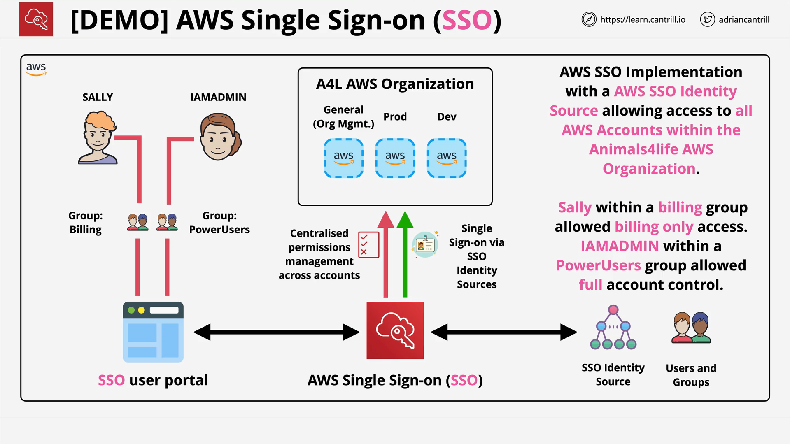

# AWS SSO (IAM Identity Center) Demo — Implementing Organization‑Wide Access (Part 1)

## Goal and Scenario

- **Objective:** Stand up a minimal, working **AWS SSO** setup in the **management account** that grants workforce users centralized access to **all accounts** in an AWS Organization, using role‑based permissions.
- **Key idea:** Users sign in via the **SSO portal** instead of logging in via IAM users in each account.

## Prerequisites

- You are signed in to the **management account** as an **IAM admin**.
- **Region:** **US East (N. Virginia)** is selected.
- An **AWS Organization** already exists.

## High‑Level Architecture

- **AWS SSO** is configured in the **management account**.
- The **SSO identity store** (in this demo, the **built‑in store**) holds users and groups.
- **Permission sets** define role‑based permissions.
- Users access the **SSO user portal** to choose an account and a permission set‑backed role to sign in—no per‑account manual IAM setup by the admin is required for each role.

## Step‑by‑Step Implementation

### 1) Enable AWS SSO

1. In the AWS Console, use **Find Services** and open **SSO**.
2. Click **Enable AWS SSO**.
3. Enabling may take \~30 seconds. If you see an error (e.g., “previous attempt failed”), try again or refresh; it typically succeeds on retry.
4. Enabling SSO performs **org‑wide changes**:

   - Creates necessary **IAM roles in all accounts** so SSO can manage access centrally.

### 2) Choose Identity Source and Customize the User Portal

- **Identity Source:**

  - By default, SSO uses its **internal identity store**—no external IdP required.
  - You can switch to **AWS Managed Microsoft AD**, **on‑prem AD via trust/AD Connector**, or an **external SAML 2.0 IdP** if you already have enterprise identity infrastructure. For this demo, stay with the **default internal** store.

- **Customize User Portal URL:**

  1. Click **Customize** and set a memorable, **unique** subdomain (e.g., `animals-for-life`).
  2. If the name is taken, try another. If you see “rate exceeded,” wait briefly and retry.
  3. A friendly URL is helpful for real users in production.

### 3) Create Permission Sets

- **Purpose:** Permission sets are reusable, role‑based permission definitions that you assign to users/groups **per account**.

- **Actions in the demo:**

  1. Go to **Permission sets** → **Create permission set**.
  2. Choose **Predefined permission set**.
  3. Create multiple sets; the demo explicitly mentions:

     - **AdministratorAccess** (predefined)
     - **ViewOnlyAccess** (predefined)
     - **Billing** (predefined)
     - The transcript implies a **fourth** set; the name is unclear due to transcription noise. The three clearly mentioned are above.

- **Session duration:**

  - For each set, the demo chooses **4 hours** (instead of the default 1 hour).
  - In production, pick durations appropriate for security and usability (1, 2, 4, 8, 12 hours, or custom).

### 4) Create the “Sally” User

1. Go to **Users** → **Add user**.
2. **Username:** `Sally`.
3. Enable **Generate a one‑time password** to share manually (simplifies the demo).
4. Provide an **email** (a real email is required if you choose the email provisioning flow; the demo uses a throwaway/dynamic alias since it’s non‑production).
5. **First name:** Sally; **Last name:** Jenkins. Optional fields (phone, job info, address, time zone) can be set but are not required here.
6. Click **Next**, then continue to creation.

> After creation, SSO shows **Sally’s one‑time credentials**. Copy and store them securely—you’ll need them for the sign‑in test.

### 5) Create a “billing” Group and Add Sally

1. During user creation, the demo wants to assign Sally to a group, but no groups exist yet.
2. Click **Create group**:

   - **Name:** `billing`
   - **Description:** `Animals for Life billing group`
   - Click **Create group**.

3. Return to the user creation tab, click **Refresh**, select the **billing** group, **Next**, then **Add user**.
4. **Result:** Sally is now a member of the **billing** group.

### 6) Assign Group Permissions Across All AWS Accounts

1. Open **AWS accounts** in the SSO console.
2. Select **all accounts** in the organization.
3. Click **Assign users or groups** → switch to the **Groups** tab.
4. Select the **billing** group → **Next**.
5. Choose the **Billing** permission set → **Next** → **Submit**.

- **Propagation:**

  - SSO now configures each account:

    - Sets up the necessary **SAML federation constructs**.
    - **Creates a role** (matching the **Billing** permission set).
    - Attaches the permissions.

### 7) Test Access as Sally

1. From the SSO **Dashboard**, copy the **User portal URL**.

2. Open a **separate browser** or **incognito/private window** to avoid interfering with your admin session.

3. Sign in as **Sally** using the one‑time password; you’ll be prompted to **set a new password**.

4. In the portal, you’ll see:

   - **Applications** Sally can access (in this demo, just **AWS Account** access).
   - A list of **AWS accounts** (e.g., Dev, General, Prod) with available **roles** based on assigned permission sets.

5. Click **Management Console** under, for example, the **Dev** account to perform a true **single sign‑on** (no extra credentials).

   - In the AWS console header/account menu, you’ll see a **federated** session that references **Sally**.

6. **Verify permissions:**

   - Open **Billing Dashboard** → **Bills**: should load without errors (Sally has **Billing** access).
   - Switch to another account (e.g., **General**), repeat the **Billing** checks—data differs per account but should still work.
   - Try a non‑billing service:

     - **Services** → **EC2** → **Running instances**: expect an **access denied** message (the **Billing** permission set doesn’t grant EC2 actions).

> The lesson ends **Part 1** here; Part 2 continues from this point.

## What SSO Does Behind the Scenes

- When you assign a permission set to a user/group for an account, SSO:

  - Ensures the **SAML trust** and necessary bindings exist.
  - **Creates an IAM role** in each target account that corresponds to the permission set.
  - Attaches the appropriate **policies/permissions**.
  - Presents the role choice to the user in the **SSO portal**, enabling **console** and **CLI v2** access.

## Troubleshooting and Tips

- **Enable SSO errors:** If the first enablement attempt fails, click **Enable** again or **Refresh**; it typically resolves.
- **Portal URL customization:**

  - The URL must be **globally unique**.
  - If you see **“rate exceeded”**, wait a bit and retry.

- **Browser sessions:** Always test end‑user access in a **separate browser/incognito** to avoid clashing with your admin session.
- **Identity source changes:** You can switch from the internal store to **AD** or an **external SAML IdP** later if enterprise requirements demand it.

## Security and Operations Considerations

- **Session duration:** Balance usability with risk. Shorter sessions reduce exposure; longer sessions reduce re‑authentication friction.
- **Least privilege:** Keep permission sets narrowly scoped (e.g., **Billing** only for finance staff).
- **Centralized groups:** Assign permissions to **groups**, not individual users—simplifies ongoing management.
- **No service cost:** SSO is **free**, making it a sensible default for workforce access.

## Exam‑Oriented Notes

- **Workforce identities (employees):** Prefer **AWS SSO (IAM Identity Center)** for new deployments.
- **Customer identities (app end‑users; Google/Twitter/Facebook):** That’s **Amazon Cognito**, not SSO.
- **Legacy SAML:** Use direct SAML 2.0 federation only when the scenario explicitly requires it.

## Quick Recap

- You enabled **AWS SSO** in the management account, kept the **internal identity store**, and customized the portal URL.
- You created **permission sets** (AdministratorAccess, ViewOnlyAccess, Billing; one more was implied but the name is unclear in the transcript) with **4‑hour sessions**.
- You created a user **Sally**, a **billing** group, added Sally to it, and assigned the **Billing** permission set to the **billing** group across **all accounts**.
- Testing as **Sally** confirmed:

  - **Billing** console access works.
  - **Non‑billing** services (e.g., EC2) are **denied**—as expected with least privilege.
