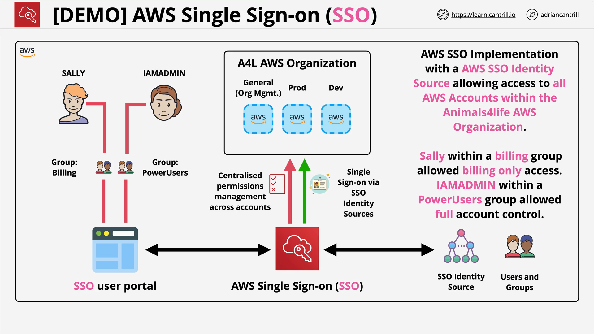

# AWS SSO (IAM Identity Center) Demo — Part 2 (Detailed Summary)

## Where This Lesson Picks Up

- Continues directly from **Part 1** where:

  - The SSO **internal identity store** was used.
  - **Permission sets** (e.g., Billing) were created.
  - A **Sally** user and a **billing** group were created and assigned **Billing** access across accounts.
  - Access was verified via the **SSO user portal**.

## Create and Grant “Power Users” Access

1. In the **SSO management console**, open **Groups** → **Create group**:

   - **Name:** `Power Users`
   - **Description:** e.g., `Senior IT Support Staff`

2. Open the new group → **Add users** → select **Sally** → **Add users**.

   - Sally now belongs to **billing** and **Power Users**.

3. Open **AWS accounts** → select **all accounts** → **Assign users or groups** → **Group** tab → choose **Power Users** → **Next**.
4. Select the **PowerUserAccess** permission set → **Next** → **Submit**.

   - SSO propagates the assignment to each account (creates/updates the corresponding IAM role and permissions behind the scenes).

## Verify New Access as Sally

- Switch to the browser session where **Sally** is signed in to the **SSO user portal**.
- **Refresh** may not show the new permission immediately; **sign out** and **sign back in** as Sally.
- Expand any account to see **PowerUserAccess** now available.
- Choose the **PowerUserAccess** row → **Management Console** to SSO into that account.
- Navigate to **EC2 → Running instances**:

  - With **PowerUserAccess**, Sally can now interact with EC2 (contrast with **Billing**‑only from Part 1, which could not).

## External App SSO (Dropbox) — How It Works

- In the **SSO console**, open **Applications** → **Add a new application**.
- Search for and select **Dropbox** → **Add application**.
- You’ll see two metadata sections:

  - **AWS SSO metadata** (to provide to Dropbox).
  - **Application metadata** (Dropbox‑specific fields to provide in SSO).

- Many common apps are **pre‑integrated**, so fields may be **pre‑populated**.
- The demo **does not complete** this integration; instead:

  - **Cancel**, return to **Applications**, select **Dropbox** → **Actions → Remove** → **Confirm**.

## Replace the Demo Setup with an SSO‑Based Admin

- Clean up the initial demo identities:

  - **Users** → select **Sally** → **Delete users** → confirm.
  - **Groups** → select **billing** and **Power Users** → **Delete groups** → confirm.

- Create a new **admin group**:

  - **Create group**:

    - **Name:** `A4L-Adminz`
    - **Description:** `Animals for Life, full admins`

- Create a new **admin user**:

  - **Users → Add user**
  - **Username:** `IAM-Admin`
  - **Generate a one‑time password**: enabled (for manual sharing).
  - **Email:** temporary/throwaway for the demo (use a real email in production).
  - **First name:** `IAM-Admin`; **Last name:** `IAM-Admin`
  - **Next** → select **A4L-Adminz** → **Next** → **Add user**.
  - Copy the displayed **sign‑in details** (username and temporary password) and store securely.

## Assign AdministratorAccess Across All Accounts

1. In **AWS accounts**, select **all accounts** → **Assign users or groups** → **Groups** tab.
2. Choose **A4L-Adminz** → **Next**.
3. Select the **AdministratorAccess** permission set → **Next** → **Submit**.

   - SSO propagates the **AdministratorAccess** role to each account.

## Log In as the New IAM‑Admin User

- Close Sally’s open AWS console tabs and sign out of the **SSO user portal**.
- Sign in to the portal as **IAM‑Admin** with the **one‑time password**, then set a **new password**.
- In the portal:

  - Open **AWS accounts** and expand any account to see **AdministratorAccess** available.
  - You can **Management Console** into any account with **administrator** permissions.

## Enforce and Register MFA in SSO

1. In the **SSO console** (admin side), open **Settings** → **Network and security** → **Configure**.
2. **MFA requirement options:**

   - **Disabled**
   - **Required when sign‑in context changes** (new device/location/unusual behavior)
   - **Required every time** (**selected in the demo**)

3. **Allowed MFA types:**

   - **Security keys / built‑in authenticators** (e.g., Apple Touch ID, Windows Hello, FIDO/U2F devices)
   - **Authenticator apps** (e.g., Google Authenticator, Microsoft Authenticator)
     The demo **enables both**.

4. **Behavior if no MFA device registered:**

   - The demo selects **Allow them to sign in** and **Allow user to add their own MFA device**.

5. **Save changes**.

**User self‑registration of MFA (IAM‑Admin):**

1. In the **SSO user portal** as **IAM‑Admin**, open **My devices** (top right).
2. **Register device** → choose **Authenticator app** → **Next**.
3. Scan the **QR code** in the authenticator app and enter the **generated code** → **Assign MFA** → **Done**.
4. Sign **out** and sign **in** again as **IAM‑Admin**.
   You’ll now need **username + password + MFA code**.

## End State and Key Takeaways

- The organization now uses **SSO for workforce access**:

  - Centralized **users/groups** and **permission sets** mapped across **all accounts**.
  - **Sally** demoed least‑privilege access (Billing) and later **PowerUserAccess**.
  - A new **IAM‑Admin** user (via SSO) has **AdministratorAccess** across accounts.

- **MFA** has been **enforced** and **registered** for the high‑privilege admin.
- **External app SSO** (e.g., Dropbox) is available through **pre‑integrations**; it requires exchanging **SSO metadata** and **app metadata**.
- **Service cost:** The lesson highlights that SSO **carries no additional charge**, making it a sensible default for multi‑account setups.

## Troubleshooting Notes

- **New permissions not visible after refresh:** **Sign out** and **sign back in** to refresh SSO assignments.
- **Propagation delay:** Assignments to many accounts can take a **short time** to complete.
- **Portal URL and sessions:** Test end‑user flows in a **separate browser/incognito** session so you don’t interfere with your admin login.

## Quick Recap

- Added a **Power Users** group, placed **Sally** in it, and assigned **PowerUserAccess** across all accounts.
- Verified that Sally’s access expanded from **Billing** only to include **EC2** interactions under **PowerUserAccess**.
- Previewed **external application SSO** (Dropbox) setup and removal.
- Replaced the demo identities with a production‑style **A4L‑Adminz** group and **IAM‑Admin** user.
- Granted **AdministratorAccess** across all accounts to that group and validated access.
- **Enforced MFA** org‑wide via SSO settings and **registered** an MFA device for **IAM‑Admin**.
