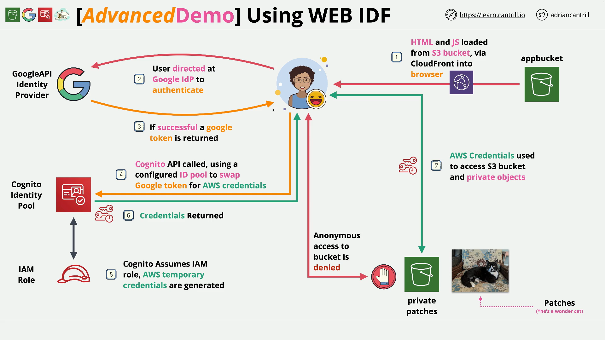

# Implementing Web Identity Federation (WEBIDF) - PART5

## Context and What You Built

Over Stages 1–4 you deployed a serverless, browser‑only application that:

- Hosts a static front‑end on **S3**, served via **CloudFront**.
- Uses **Google** as an **IdP** for sign‑in.
- Exchanges the Google ID token for **temporary AWS credentials** via a **Cognito Identity Pool**.
- Lists and renders private S3 images using **pre‑signed URLs**.

Now you’ll remove all of it.

## Stage 5 Objective

Cleanly remove every resource to avoid charges and leave your accounts tidy:

- **Google Cloud**: the demo **API Project** used for OAuth.
- **AWS Cognito**: the **Identity Pool** you created in Stage 3.
- **AWS IAM**: the **role** created for the pool (and attached managed policy).
- **AWS CloudFormation**: the **WEBIDF** stack (which removes S3 buckets, CloudFront distribution, Lambda, policies, etc.).

## What You Need Before You Start

- Access to the **Google Cloud Console** using the account you used in Stage 2.
- Access to the **AWS Console** (same region as the stack, **us‑east‑1** in the lab).
- The **Identity Pool name/ID** and the **role name** you created in Stage 3 (helps you find them quickly).

## Cleanup Steps (In the Correct Order)

### 1) Delete the Google API Project

- Open **Google Cloud Resource Manager**.
- Select the project you created (e.g., `pet-idf`).
- Click **Delete** (or **Shut down**), confirm by entering the project **ID**, and submit.
- Google schedules the project for deletion (often within days). You are not billed for a shut‑down project.

### 2) Delete the Cognito Identity Pool

- AWS Console → **Amazon Cognito** → **Identity pools**.
- Select your pool (e.g., `pet-idf-id-pool`) → **Delete**.
- Type the pool name to confirm and delete.
- This severs the Google‑to‑Cognito trust path and stops new exchanges for AWS credentials.

### 3) Delete the Identity Pool’s IAM Role

- AWS Console → **IAM** → **Roles**.
- Find the authenticated role for the pool (e.g., `Cognito_pet-idf-id-pool_auth_Role` or similar).
- Open it and **Delete** the role. Confirm if prompted.

  - If deletion is blocked because of attached policies, **detach** them first (e.g., `PrivatePatchesPermissions`) and retry.

### 4) Delete the CloudFormation Stack

- AWS Console → **CloudFormation**.
- Select the **WEBIDF** stack → **Delete**.
- Confirm deletion. CloudFormation will:

  - Run custom resource cleanup (empty buckets), then delete the **S3 app** and **private images** buckets.
  - Disable and remove the **CloudFront** distribution.
  - Remove the inline **Lambda**, its **IAM role**, bucket policies, and the **managed policy** created by the stack.

## Why This Order Matters

- The **managed policy** for the private bucket (created by the stack) can’t be deleted while attached to an **external role** (the pool’s role you created in Stage 3).
  Deleting the **Identity Pool role** first ensures CloudFormation can remove the policy cleanly.
- Deleting the **Identity Pool** before the **role** prevents fresh credentials from being issued while you’re tearing down.

## Validation Checklist

- [ ] Google project shows as **scheduled for deletion** (or removed) in **Resource Manager**.
- [ ] **Cognito Identity Pool** no longer exists in the region.
- [ ] The **IAM role** associated with the pool is gone.
- [ ] The **WEBIDF** CloudFormation stack is **DELETE_COMPLETE**.
- [ ] The S3 **app** and **private** buckets and the **CloudFront** distribution are gone.

## Common Issues and Fixes

- **CloudFormation can’t delete an S3 bucket**
  Buckets must be empty; this template’s custom resource empties them. If a manual upload slipped in or versioning was toggled, empty the bucket (and versions) and retry the stack deletion.

- **Managed policy deletion fails**
  It’s still attached to the pool role. Delete the **role** first (or detach the policy), then delete the stack.

- **CloudFront distribution deletion is slow**
  CloudFront must transition to a deletable state. CloudFormation will disable it and then remove it. This can take several minutes.

- **Wrong region**
  If you don’t see your stack or pool, switch to **us‑east‑1** (as used in the lab).

## Security Notes

- The app bucket in the lab is intentionally public for simplicity. If you adapted this to production, prefer using **CloudFront OAC/OAI** and blocking public S3 access.
- No client secrets should be embedded in front‑end code. The Google **Client ID** is public; the **Client Secret** is not used in this browser‑only flow.

## Demo Links

- **1-Click Deployment (CloudFormation, `us-east-1`)**  
  [Launch Stack](https://console.aws.amazon.com/cloudformation/home?region=us-east-1#/stacks/quickcreate?templateURL=https://learn-cantrill-labs.s3.amazonaws.com/aws-cognito-web-identity-federation/WEBIDF.yaml&stackName=WEBIDF)

- **Stage 1 Instructions**  
  [Instructions](https://github.com/acantril/learn-cantrill-io-labs/blob/master/aws-cognito-web-identity-federation/02_LABINSTRUCTIONS/STAGE1%20-%20Provision%20and%20Discuss%20Architecture.md)  
  **Stage 1 Diagram** – [View PDF](https://github.com/acantril/learn-cantrill-io-labs/blob/master/aws-cognito-web-identity-federation/02_LABINSTRUCTIONS/ARCHITECTURE-STAGE1.pdf)

- **Stage 2 Instructions**  
  [Instructions](https://github.com/acantril/learn-cantrill-io-labs/blob/master/aws-cognito-web-identity-federation/02_LABINSTRUCTIONS/STAGE2%20-%20Create%20Google%20APIProject%20and%20Client%20ID.md)

- **Stage 3 Instructions**  
  [Instructions](https://github.com/acantril/learn-cantril-io-labs/blob/master/aws-cognito-web-identity-federation/02_LABINSTRUCTIONS/STAGE3%20-%20Create%20Cognito%20Identity%20Pool.md)  
  **Stage 3 Diagram** – [View PDF](https://github.com/acantril/learn-cantrill-io-labs/blob/master/aws-cognito-web-identity-federation/02_LABINSTRUCTIONS/ARCHITECTURE-STAGE3.pdf)

- **Stage 4 Instructions**  
  [Instructions](https://github.com/acantril/learn-cantrill-io-labs/blob/master/aws-cognito-web-identity-federation/02_LABINSTRUCTIONS/STAGE4%20-%20Update%20App%20Bucket%20and%20Test%20Application.md)  
  **Stage 4 Diagram** – [View PDF](https://github.com/acantril/learn-cantrill-io-labs/blob/master/aws-cognito-web-identity-federation/02_LABINSTRUCTIONS/ARCHITECTURE-STAGE4.pdf)

- **Stage 5 Instructions (Cleanup)**  
  [Instructions](https://github.com/acantril/learn-cantrill-io-labs/blob/master/aws-cognito-web-identity-federation/02_LABINSTRUCTIONS/STAGE5%20-%20Cleanup.md)

## One‑Paragraph Recap

In Stage 5 you tear down the entire lab: delete the **Google API Project**, remove the **Cognito Identity Pool**, delete the **pool’s IAM role** (so CloudFormation can remove its managed policy), and then delete the **WEBIDF CloudFormation stack** which removes S3 buckets, CloudFront, Lambda, and related IAM artifacts. This order prevents dependency conflicts and ensures a clean, charge‑free exit from the lab.
