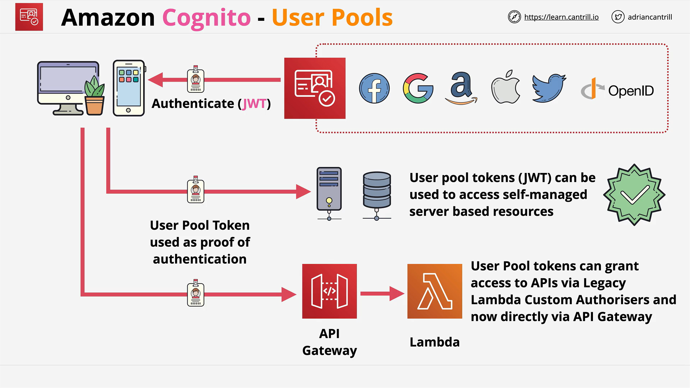

# User Pools vs. Identity Pools

## What This Lesson Covers

- **Goal:** Understand the two distinct parts of **Amazon Cognito** and how they work alone or together.
- **Scope:** Authentication, authorization, and user management for **web/mobile** apps; JWTs; temporary AWS credentials; architectures; exam‑worthy distinctions.

## Cognito at a Glance

- **Authentication**: Verifying user credentials (log in).
- **Authorization**: Enforcing what a user/app can access.
- **User management**: Hosting and administrating a user directory and profile data.

Cognito has **two separate components** with confusing names:

- **User Pools**: Sign‑up/sign‑in and user directory that issues **JWTs**.
- **Identity Pools** (a.k.a. Federated Identities): Exchanges identities/tokens for **temporary AWS credentials**.

Keep them conceptually separate.

## Part 1 — User Pools

**What they do**

- Provide **sign‑up/sign‑in** for users.
- Issue **JSON Web Tokens (JWTs)** on successful authentication.
- Offer a built‑in, customizable **hosted UI** for login.
- Security features: **MFA**, **compromised credential checks**, **account takeover protection**, **email/phone verification**.
- **Lambda triggers** for custom workflows and migration.

**Identity sources supported**

- **Internal** users in the pool.
- **Social** providers: Google, Facebook, Amazon, Apple.
- **Enterprise** IdPs via **SAML 2.0**.
- Regardless of source, after sign‑in the result is a **user pool identity** with **JWTs**.

**What they are not**

- User Pools **do not** grant direct access to most AWS services.
- JWTs from User Pools **can** authenticate to your own backends or **API Gateway** authorizers, but they are **not AWS credentials**.

**Mental model**

- Think of a **user directory** that returns a **JWT** after login. That’s it.

## Part 2 — Identity Pools (Federated Identities)

**Purpose**

- Exchange an **external identity token** for **temporary AWS credentials** via role assumption.
- Support both:

  - **Authenticated** identities (e.g., Google/Facebook/SAML tokens, and even **Cognito User Pool** tokens).
  - **Unauthenticated (guest)** identities (useful for limited features like read‑only leaderboards).

**How access is granted**

- You configure at least two IAM roles **in the Identity Pool**:

  - One for **authenticated** identities.
  - One for **unauthenticated** identities.

- Cognito **assumes** the appropriate role and returns **temporary credentials** to the app.
- The app uses these credentials to call AWS services.
- When credentials expire, the app **renews** them via Cognito.

**Key point**

- **Identity Pools provide AWS credentials; User Pools do not.**

## Architectures You Should Recognize

### A) User Pools Only (JWTs for your app/API)

1. App uses a **User Pool** for sign‑up/sign‑in (internal, social, or SAML).
2. Cognito returns **JWTs**.
3. App uses JWTs to call **your backend** or **API Gateway** (as authorizer).
4. App **cannot** call most AWS services directly with JWTs.

**Use when**

- You only need app‑level auth and don’t need to call AWS services directly from the client.

### B) Identity Pools Directly with External IdPs (No User Pool)

1. User clicks “Sign in with X” in your app.
2. User authenticates at the **external IdP** (e.g., Google). Your app never sees the user’s password.
3. App receives an **IdP token** (Google/Facebook/Amazon/Apple/SAML, etc.).
4. App passes that token to a **Cognito Identity Pool** configured to trust that provider.
5. Identity Pool **assumes a role** and returns **temporary AWS credentials**.
6. App uses those credentials to access AWS services and **renews** on expiry.

**Important**

- If you support five IdPs, you must configure **five** trust integrations in the Identity Pool.

### C) Combined: User Pools + Identity Pools (Simplified Multi‑IdP Handling)

1. App uses a **User Pool** to handle all identity sources (internal + social + SAML).
2. Regardless of identity type, the app gets **one type of token**: the **User Pool JWT**.
3. App passes the **User Pool JWT** to an **Identity Pool** configured to trust the **User Pool**.
4. Identity Pool **assumes a role** and returns **temporary AWS credentials** to the app.
5. App uses those credentials for AWS access; Identity Pool needs to trust only **one provider** (the User Pool), reducing admin overhead.

**Why this helps**

- Your app only deals with **one token format** (User Pool JWT), and your Identity Pool only trusts **one** external provider (the User Pool).

## Key Terms You’ll See (Exam and Real World)

- **JWT (JSON Web Token)**: Issued by Cognito **User Pools** after authentication. Good for app/API authentication, **not** for AWS service calls.
- **Temporary AWS credentials**: Access key, secret key, session token returned after Identity Pool role assumption. Used to call AWS services.
- **Web Identity Federation**: The process of exchanging an external identity token for AWS credentials (Identity Pools, or STS flows).
- **Assume Role**: The mechanism Identity Pools use behind the scenes to obtain temporary credentials tied to IAM policies.

## Selection Guidance for SAP‑C02

- **Customer identities (app users):** Think **Cognito**.

  - **User Pools** = sign‑up/sign‑in + JWTs.
  - **Identity Pools** = swap identity tokens for **AWS credentials**.

- **Workforce identities (employees to AWS accounts):** Think **AWS IAM Identity Center (SSO)**, not Cognito.
- If a scenario needs the client app to call AWS services (e.g., S3, DynamoDB) using end‑user identity, you’ll need an **Identity Pool** (possibly combined with a **User Pool**).
- Cognito supports **web scale**—you’re not limited by the \~5,000 IAM user cap because end users aren’t IAM users.

## Common Pitfalls and Gotchas

- **Name confusion**: “User Pools” ≠ “Identity Pools.” Keep separate mental models.
- **JWT limits**: JWTs are **not** AWS credentials; most AWS services won’t take them.
- **Multiple IdPs directly with Identity Pools**: Each IdP requires **explicit configuration**.
- **Least privilege**: Attach tight IAM policies to the **roles** used by Identity Pools.
- **Expiry handling**: Clients must refresh temporary credentials when they expire.

## Practical Use Cases

- **User Pools only**:

  - Authenticate users to your app.
  - Use JWTs with **API Gateway** authorizers or your own API.

- **Identity Pools only**:

  - Allow users to upload files to **S3** directly from the client after authenticating with a social IdP.
  - Provide **guest** read‑only access to a public leaderboard in **DynamoDB**.

- **Combined**:

  - Support many IdPs through a **User Pool**, then obtain AWS credentials via **Identity Pool** with a single trust integration.

## One‑Paragraph Recap

Amazon Cognito has two distinct parts: **User Pools** handle user registration and authentication (including social and SAML), returning **JWTs** for app/API use; **Identity Pools** exchange either external IdP tokens or User Pool tokens for **temporary AWS credentials** tied to IAM roles, enabling client apps to call AWS services securely. You can use them independently (JWT‑only flows or direct IdP‑to‑AWS flows) or **combine them** to simplify multi‑IdP setups while still obtaining AWS credentials. For **SAP‑C02**, map **customer identity** scenarios to **Cognito**, separate **User Pools** (auth/user management) from **Identity Pools** (AWS credentials), and reserve **AWS IAM Identity Center (SSO)** for **workforce** access to AWS accounts.
