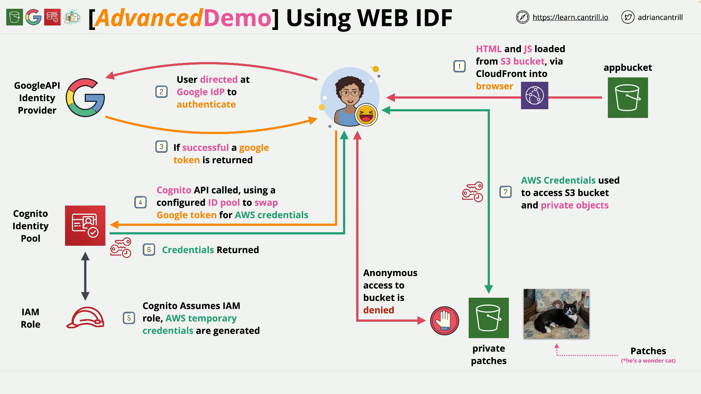
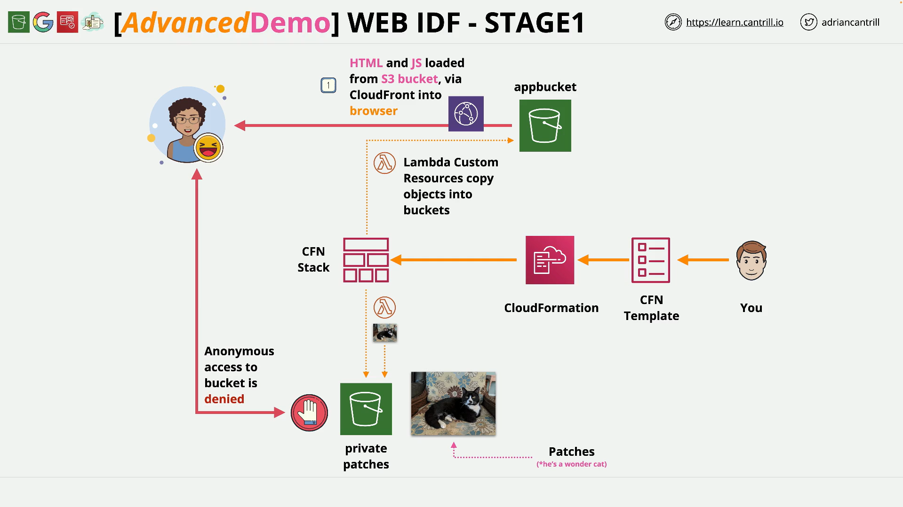

# Implementing Web Identity Federation (WEBIDF) - PART1

## What You’re Building

A **static front‑end** (HTML/JS) hosted on **S3** and served via **CloudFront** that lets a user sign in with **Google**. The app will then use **Cognito Identity Pools** to exchange the Google token for **temporary AWS credentials** and load images from a **private S3 bucket** via **pre‑signed URLs**—all from the browser, with no servers to manage.

## Technologies Used

- **Amazon S3** — App hosting (static website) and a separate **private** bucket for images.
- **Amazon CloudFront** — CDN distribution in front of the app bucket.
- **Google API Project** — Acts as the **Identity Provider (IdP)**.
- **Amazon Cognito (Identity Pools)** — Exchanges Google tokens for temporary AWS credentials.
- **AWS IAM Roles** — Assumed by Cognito to scope the temporary credentials.
- **Pre‑signed URLs** — Used by the browser to fetch private S3 objects.

## End‑to‑End Flow (High Level)



1. User opens the **app** (HTML/JS) from **CloudFront** → **S3 app bucket**.
2. App prompts **Google sign‑in**.
3. On success, the **Google ID token** is returned to the app.
4. App presents that token to **Cognito Identity Pool**, which **assumes an IAM role** and returns **temporary AWS credentials**.
5. App uses those credentials to obtain **pre‑signed URLs** and load images from the **private S3 bucket** in the browser.

## Stage 1 Goals

- **Provision** the base infrastructure using a 1‑click **CloudFormation** stack.
- **Understand** the architecture you’ll complete across stages.
- **Verify** that:

  - An **app bucket** contains `index.html` and `script.js`.
  - A **private images bucket** contains three photos (Patches the wonder‑cat).
  - A **CloudFront distribution** points to the app bucket.

- **Record** the CloudFront **domain name** (you’ll need it later).

## Prerequisites

- AWS account with **administrator** permissions.
- **Region:** **US East (N. Virginia) — `us‑east‑1`**.
- Comfortable using the AWS Console (S3, CloudFront, CloudFormation).

## Stage 1 — Step‑by‑Step

1. **Open the 1‑Click CloudFormation link** (see Demo Links below).
2. You’ll land on **Quick Create Stack** with fields pre‑populated.
3. Scroll to the bottom, **acknowledge capabilities**, and **Create stack**.
4. Wait for status **CREATE_COMPLETE** (a few minutes).

While it runs, review the architecture: the stack bootstraps your **app bucket**, **private images bucket**, and a **CloudFront distribution**. It also uses custom resources (Lambdas) to copy **app assets** (HTML/JS) and **sample images** into the buckets.

## What the CloudFormation Stack Creates



- **S3 (App) Bucket** — Hosts the static web app files:

  - `index.html`
  - `script.js`

- **S3 (Private Images) Bucket** — Stores **three** private images of **Patches** (not publicly readable).
- **CloudFront Distribution** — Origin set to the **app bucket** (used as your **web app URL**).
- **Custom resource Lambda(s)** — Copy the sample content into the buckets for you.

## CloudFormation Template — Annotated Line by Line

```yaml
# High-level description visible in the stack UI
Description: learn.cantrill.io WEBIDF Demo

Parameters:
  # S3 bucket that holds lab seed content (source objects to copy)
  labss3contentbucket:
    Description: Bucket for labs s3 content
    Type: String
    Default: cl-labs-s3content
  # Prefix (folder) within the source bucket for the app assets
  labss3contentprefix:
    Description: Bucket for labs s3 content
    Type: String
    Default: aws-cognito-web-identity-federation/appbucket

Resources:
  # CloudFront distribution in front of the S3 app bucket
  WebAppCDN:
    DependsOn: appbucket # Ensure appbucket exists before creating the distribution
    Type: AWS::CloudFront::Distribution
    Properties:
      DistributionConfig:
        Enabled: "true" # Turn the distribution on immediately
        DefaultCacheBehavior:
          ForwardedValues:
            QueryString: "true" # Cache varies by query string (useful for cache-busting)
          TargetOriginId: appbucket # Must match an origin Id below
          ViewerProtocolPolicy: https-only # Force HTTPS to the CDN
        DefaultRootObject: index.html # Serve index.html at the root path
        Origins:
          - DomainName: !GetAtt appbucket.DomainName # S3 bucket’s regional domain name
            Id: "appbucket" # Origin identifier referenced above
            S3OriginConfig:
              OriginAccessIdentity: "" # No OAI (bucket will be public for app objects)

  # Private S3 bucket that will hold cat images
  patchesprivatebucket:
    Type: AWS::S3::Bucket
    Properties:
      CorsConfiguration: # Allow browser access via CORS for presigned GET/HEAD
        CorsRules:
          - AllowedHeaders: ["*"]
            AllowedMethods: ["GET", "HEAD"]
            AllowedOrigins: ["*"]

  # Public S3 bucket that hosts the static web app
  appbucket:
    Type: AWS::S3::Bucket
    Properties:
      PublicAccessBlockConfiguration: # Deliberately allow public access for website hosting
        BlockPublicAcls: false
        BlockPublicPolicy: false
        IgnorePublicAcls: false
        RestrictPublicBuckets: false
      WebsiteConfiguration: # Enable S3 static website hosting metadata
        IndexDocument: index.html
        ErrorDocument: error.html

  # Bucket policy that grants public read of app objects
  BucketPolicy:
    Type: AWS::S3::BucketPolicy
    Properties:
      PolicyDocument:
        Id: MyPolicy
        Version: 2012-10-17
        Statement:
          - Sid: PublicReadForGetBucketObjects
            Effect: Allow
            Principal: "*"
            Action: "s3:GetObject"
            Resource: !Join # arn:aws:s3:::<appbucket>/*
              - ""
              - - "arn:aws:s3:::"
                - !Ref appbucket
                - /*
      Bucket: !Ref appbucket

  # Custom resource: copy app assets from the lab content bucket into the app bucket
  copyserverlessapp:
    Type: "Custom::S3Objects"
    Properties:
      ServiceToken: !GetAtt CopyS3ObjectsFunction.Arn # Points to the inline Lambda below
      SourceBucket: "cl-labs-s3content" # Source bucket (can override via parameter)
      SourcePrefix: "aws-cognito-web-identity-federation/appbucket" # Source prefix for app files
      Bucket: !Ref appbucket # Destination bucket (student’s app bucket)

  # Custom resource: copy image assets into the private images bucket
  copypatches:
    Type: "Custom::S3Objects"
    Properties:
      ServiceToken: !GetAtt CopyS3ObjectsFunction.Arn
      SourceBucket: "cl-labs-s3content"
      SourcePrefix: "aws-cognito-web-identity-federation/patches"
      Bucket: !Ref patchesprivatebucket

  # Inline Lambda that implements the copy/delete logic for the two custom resources
  CopyS3ObjectsFunction:
    Type: AWS::Lambda::Function
    Properties:
      Description: Copies objects into buckets
      Handler: index.handler # Module.function (for ZipFile, module is "index")
      Runtime: python3.9
      Role: !GetAtt S3CopyRole.Arn # Execution role defined below
      Timeout: 120 # Allow up to 2 minutes (large copy sets)
      Code:
        ZipFile: | # Inline Python code starts here
          import os 
          import json
          import cfnresponse
          import boto3
          import logging

          from botocore.exceptions import ClientError
          client = boto3.client('s3')
          logger = logging.getLogger()
          logger.setLevel(logging.INFO)

          def handler(event, context):
            logger.info("Received event: %s" % json.dumps(event))
            source_bucket = event['ResourceProperties']['SourceBucket']
            source_prefix = event['ResourceProperties'].get('SourcePrefix') or ''
            bucket = event['ResourceProperties']['Bucket']
            prefix = event['ResourceProperties'].get('Prefix') or ''

            result = cfnresponse.SUCCESS

            try:
              if event['RequestType'] == 'Create' or event['RequestType'] == 'Update':
                result = copy_objects(source_bucket, source_prefix, bucket, prefix)
              elif event['RequestType'] == 'Delete':
                result = delete_objects(bucket, prefix)
            except ClientError as e:
              logger.error('Error: %s', e)
              result = cfnresponse.FAILED

            cfnresponse.send(event, context, result, {})

          def copy_objects(source_bucket, source_prefix, bucket, prefix):
            paginator = client.get_paginator('list_objects_v2')
            page_iterator = paginator.paginate(Bucket=source_bucket, Prefix=source_prefix)
            for key in {x['Key'] for page in page_iterator for x in page['Contents']}:
              dest_key = os.path.join(prefix, os.path.relpath(key, source_prefix))
              if not key.endswith('/'):
                print ('copy {} to {}'.format(key, dest_key))
                client.copy_object(CopySource={'Bucket': source_bucket, 'Key': key}, Bucket=bucket, Key = dest_key)
            return cfnresponse.SUCCESS

          def delete_objects(bucket, prefix):
            paginator = client.get_paginator('list_objects_v2')
            page_iterator = paginator.paginate(Bucket=bucket, Prefix=prefix)
            objects = [{'Key': x['Key']} for page in page_iterator for x in page['Contents']]
            client.delete_objects(Bucket=bucket, Delete={'Objects': objects})
            return cfnresponse.SUCCESS

  # IAM role the Lambda uses to read seed content and write to your buckets
  S3CopyRole:
    Type: AWS::IAM::Role
    Properties:
      Path: /
      AssumeRolePolicyDocument: # Trust policy: allow Lambda service to assume this role
        Version: 2012-10-17
        Statement:
          - Effect: Allow
            Principal:
              Service: lambda.amazonaws.com
            Action: sts:AssumeRole
      Policies:
        - PolicyName: S3Access
          PolicyDocument:
            Version: 2012-10-17
            Statement:
              - # CloudWatch Logs permissions for function logging
                Sid: AllowLogging
                Effect: Allow
                Action:
                  - "logs:CreateLogGroup"
                  - "logs:CreateLogStream"
                  - "logs:PutLogEvents"
                Resource: "*"
              - # Read access to lab seed content bucket (list + get objects)
                Sid: ReadFromLCBucket
                Effect: Allow
                Action:
                  - "s3:ListBucket"
                  - "s3:GetObject"
                Resource:
                  - !Sub "arn:aws:s3:::${labss3contentbucket}"
                  - !Sub "arn:aws:s3:::${labss3contentbucket}/*"
              - # Full object‑level write to student buckets (app + private images)
                Sid: WriteToStudentBuckets
                Effect: Allow
                Action:
                  - "s3:ListBucket"
                  - "s3:GetObject"
                  - "s3:PutObject"
                  - "s3:PutObjectAcl"
                  - "s3:PutObjectVersionAcl"
                  - "s3:DeleteObject"
                  - "s3:DeleteObjectVersion"
                  - "s3:CopyObject"
                Resource:
                  - !Sub "arn:aws:s3:::${appbucket}"
                  - !Sub "arn:aws:s3:::${appbucket}/*"
                  - !Sub "arn:aws:s3:::${patchesprivatebucket}"
                  - !Sub "arn:aws:s3:::${patchesprivatebucket}/*"

  # Example managed policy to allow listing/reading from the private images bucket
  privatepatchespolicy:
    Type: AWS::IAM::ManagedPolicy
    Properties:
      Description: Permissions to List contents of the privatepatches bucket
      ManagedPolicyName: "PrivatePatchesPermissions"
      Path: /
      PolicyDocument:
        Version: 2012-10-17
        Statement:
          - Sid: ReadFromLCBucket
            Effect: Allow
            Action:
              - "s3:ListBucket"
              - "s3:GetObject"
            Resource:
              - !Sub "arn:aws:s3:::${patchesprivatebucket}"
              - !Sub "arn:aws:s3:::${patchesprivatebucket}/*"

Outputs:
  # S3 website endpoint URL (uses S3 website hosting)
  WebsiteURL:
    Value: !GetAtt
      - appbucket
      - WebsiteURL
    Description: URL for website hosted on S3

  # “Secure” S3 URL (regional S3 HTTPS hostname), not CloudFront
  S3BucketSecureURL:
    Value: !Join
      - ""
      - - "https://"
        - !GetAtt
          - appbucket
          - DomainName
    Description: app bucket URL
```

---

## Section‑by‑Section Explanation

### Description and Parameters

- **Description**
  Human‑readable label for the stack.

- **Parameters**

  - `labss3contentbucket`: Name of the shared **source bucket** that holds lab assets to copy.
  - `labss3contentprefix`: Default **prefix** for app assets within that bucket.
    You could expose these in the UI to override sources if needed.

### Resources

#### CloudFront Distribution (WebAppCDN)

- **Purpose:** Serve the app via CDN with HTTPS and caching.
- **Key points:**

  - `DependsOn: appbucket` ensures the bucket exists first.
  - `DefaultCacheBehavior.ForwardedValues.QueryString: true` means CloudFront cache keys include query strings (helpful for cache‑busting `?v=1`).
  - `ViewerProtocolPolicy: https-only` forces TLS for viewers.
  - `DefaultRootObject: index.html` treats `/` as `index.html`.
  - `Origins.DomainName: !GetAtt appbucket.DomainName` points at the S3 **bucket domain name** (not the website endpoint). Using `S3OriginConfig` with an empty `OriginAccessIdentity` means the bucket remains **public** for reads (see BucketPolicy).

#### Private Images Bucket (patchesprivatebucket)

- **Purpose:** Stores the **private** cat images.
- **CORS:** Allows browser GET/HEAD from any origin (`'*'`). This is typically required when using **presigned URLs** from a browser.

#### App Bucket (appbucket) + Bucket Policy

- **Purpose:** Host the **static site** (index.html, script.js).
- **PublicAccessBlockConfiguration:** All `false` to allow public reads (website hosting).
- **WebsiteConfiguration:** Specifies `IndexDocument` and `ErrorDocument`.
- **BucketPolicy:** Grants `s3:GetObject` to `Principal: '*'` for all keys in `appbucket`.
  This is what enables public access (and therefore CloudFront without OAI).

#### Custom Resources to Copy Content

- **copyserverlessapp:** Invokes the inline Lambda to copy **app** files from the **lab content** bucket/prefix into **appbucket**.
- **copypatches:** Invokes the same function to copy **image** files into **patchesprivatebucket**.
  Both resources specify `ServiceToken` as the Lambda’s ARN (how CloudFormation calls a custom resource).

#### Inline Lambda Function (CopyS3ObjectsFunction)

**What it does:**
Implements two operations on behalf of CloudFormation custom resources:

- **Create/Update:** Copy all objects from the specified **SourceBucket/SourcePrefix** into the destination **Bucket/Prefix**.
- **Delete:** Remove objects previously written (based on `Prefix`).

**Line‑by‑line (Python):**

```python
import os                 # Path/join helpers
import json               # For logging the event
import cfnresponse        # Helper to signal SUCCESS/FAILED back to CloudFormation
import boto3              # AWS SDK (S3 client)
import logging            # Structured logging

from botocore.exceptions import ClientError
client = boto3.client('s3')           # S3 client used for list/copy/delete
logger = logging.getLogger()
logger.setLevel(logging.INFO)

def handler(event, context):
  logger.info("Received event: %s" % json.dumps(event))  # Log full event for troubleshooting
  # Extract custom resource properties passed from the template
  source_bucket = event['ResourceProperties']['SourceBucket']
  source_prefix = event['ResourceProperties'].get('SourcePrefix') or ''
  bucket = event['ResourceProperties']['Bucket']
  prefix = event['ResourceProperties'].get('Prefix') or ''

  result = cfnresponse.SUCCESS        # Default assume success

  try:
    # On stack Create/Update -> copy; on Delete -> clean up
    if event['RequestType'] == 'Create' or event['RequestType'] == 'Update':
      result = copy_objects(source_bucket, source_prefix, bucket, prefix)
    elif event['RequestType'] == 'Delete':
      result = delete_objects(bucket, prefix)
  except ClientError as e:
    logger.error('Error: %s', e)      # Log AWS client errors
    result = cfnresponse.FAILED

  # Always respond to CloudFormation to unblock the stack
  cfnresponse.send(event, context, result, {})

def copy_objects(source_bucket, source_prefix, bucket, prefix):
  # Paginate through source objects under the given prefix
  paginator = client.get_paginator('list_objects_v2')
  page_iterator = paginator.paginate(Bucket=source_bucket, Prefix=source_prefix)
  # Build a unique set of object keys found across pages
  for key in {x['Key'] for page in page_iterator for x in page['Contents']}:
    # Compute destination key preserving relative paths under source_prefix
    dest_key = os.path.join(prefix, os.path.relpath(key, source_prefix))
    if not key.endswith('/'):  # Skip directory placeholders
      print ('copy {} to {}'.format(key, dest_key))
      client.copy_object(                         # Server-side copy within S3
        CopySource={'Bucket': source_bucket, 'Key': key},
        Bucket=bucket,
        Key=dest_key
      )
  return cfnresponse.SUCCESS

def delete_objects(bucket, prefix):
  # List all objects written under the destination prefix and delete them
  paginator = client.get_paginator('list_objects_v2')
  page_iterator = paginator.paginate(Bucket=bucket, Prefix=prefix)
  objects = [{'Key': x['Key']} for page in page_iterator for x in page['Contents']]
  client.delete_objects(Bucket=bucket, Delete={'Objects': objects})
  return cfnresponse.SUCCESS
```

**How it behaves:**

- CloudFormation sends an event with `RequestType` (**Create**, **Update**, or **Delete**) and the **ResourceProperties** you set in the template (e.g., `SourceBucket`, `SourcePrefix`, `Bucket`).
- On **Create/Update**, the function iterates the source keys and issues **`copy_object`** calls to the destination (preserving relative paths).
- On **Delete**, it enumerates the destination prefix and issues a **batch delete**.
- The function reports back **SUCCESS/FAILED** using `cfnresponse.send(...)`, which is required so the stack can proceed.

#### IAM Role for Lambda (S3CopyRole)

- **Trust policy:** Allows the **Lambda service** to assume this role.
- **Inline policy:**

  - **CloudWatch Logs** permissions so the function can write logs.
  - **Read** permissions on the **lab source bucket** (list + get).
  - **Write** (and read/list) permissions on the **student buckets** (`appbucket`, `patchesprivatebucket`), including `PutObject`, `DeleteObject`, etc.
  - Note: The policy includes `"s3:CopyObject"` to align with the API call; copy is effectively authorized by `s3:GetObject` on the source and `s3:PutObject` on the destination.

#### Managed Policy Example (privatepatchespolicy)

- A standalone **managed policy** that grants **list + read** on the private images bucket.
  Provided as an example artifact; not attached to a principal in this template.

### Outputs

- **WebsiteURL:** The **S3 website** endpoint for the app bucket (uses S3 website hosting).
  Useful if you want to bypass CloudFront during early checks.
- **S3BucketSecureURL:** The **HTTPS regional S3** URL (bucket’s `DomainName`).
  Note this is **not** the CloudFront domain and won’t honor S3 website routing rules.

## How This Fits Stage 1 Verification

After the stack reaches **CREATE_COMPLETE**:

- **S3 (app bucket):** You should see `index.html` and `script.js` (copied by the custom resource).
- **S3 (private images bucket):** You should see **three** images of Patches (private objects).
- **CloudFront:** One distribution targeting the **app bucket** as the origin.
  Copy its **domain name** (your app URL for later stages).

## Security and Ops Notes

- **Public app bucket:** This template intentionally allows **public read** for simplicity and to avoid managing an OAI. A production hardening would:

  - Set a **CloudFront Origin Access Control (OAC)** or **OAI**,
  - Re‑enable **S3 Block Public Access** on the bucket,
  - Remove the **public bucket policy**.

- **CORS on private bucket:** Minimal CORS (GET/HEAD from `*`) supports browser access via **presigned URLs** without revealing the bucket publicly.
- **Lambda runtime:** Uses **Python 3.9** inline code with `cfnresponse` to communicate status back to CloudFormation (required for custom resources).
- **Idempotency:** On **Update**, the custom resource simply re‑copies; duplicate keys are overwritten by **`copy_object`**.

## Verify Your Resources

1. **CloudFormation**

   - Console → **CloudFormation** → your stack should be **CREATE_COMPLETE**.
   - **Resources** tab shows created resources.

2. **S3 Buckets**

   - Console → **S3** → look for buckets prefixed with something like `webidf...`.
   - **App bucket**: should contain `index.html` and `script.js`.
   - **Private images bucket**: should contain **three images** (of Patches).
     Opening them directly from S3 should **fail** unless you have permissions—this is expected.

3. **CloudFront**

   - Console → **CloudFront** → exactly **one distribution** should exist.
   - **Origin**: the **app bucket**.
   - Copy the **distribution domain name** (e.g., `dxxxxxx.cloudfront.net`).

## Key Outputs to Save

- **CloudFront distribution domain name** → this is your **web app URL** for later tests.

## What You Can’t Do Yet (By Design)

- You **cannot** load the private images directly—the **images bucket is private**.
- You **haven’t** configured **Google** as IdP or **Cognito Identity Pool** yet.
- You **don’t** have temporary AWS credentials in the browser yet.

## Next Stages

- **Stage 2:** Create **Google API Project** & **OAuth Client ID** (IdP).
- **Stage 3:** Create **Cognito Identity Pool** (trust Google; define IAM roles for authenticated/unauthenticated).
- **Stage 4:** Update the **app bucket** with config and **test** the application (sign‑in → load images via pre‑signed URLs).
- **Stage 5:** **Cleanup** the account resources.

## Demo Links

- **1-Click Deployment (CloudFormation, `us-east-1`)**  
  [Launch Stack](https://console.aws.amazon.com/cloudformation/home?region=us-east-1#/stacks/quickcreate?templateURL=https://learn-cantrill-labs.s3.amazonaws.com/aws-cognito-web-identity-federation/WEBIDF.yaml&stackName=WEBIDF)

- **Stage 1 Instructions**  
  [Instructions](https://github.com/acantril/learn-cantrill-io-labs/blob/master/aws-cognito-web-identity-federation/02_LABINSTRUCTIONS/STAGE1%20-%20Provision%20and%20Discuss%20Architecture.md)  
  **Stage 1 Diagram** – [View PDF](https://github.com/acantril/learn-cantrill-io-labs/blob/master/aws-cognito-web-identity-federation/02_LABINSTRUCTIONS/ARCHITECTURE-STAGE1.pdf)

- **Stage 2 Instructions**  
  [Instructions](https://github.com/acantril/learn-cantrill-io-labs/blob/master/aws-cognito-web-identity-federation/02_LABINSTRUCTIONS/STAGE2%20-%20Create%20Google%20APIProject%20and%20Client%20ID.md)

- **Stage 3 Instructions**  
  [Instructions](https://github.com/acantril/learn-cantril-io-labs/blob/master/aws-cognito-web-identity-federation/02_LABINSTRUCTIONS/STAGE3%20-%20Create%20Cognito%20Identity%20Pool.md)  
  **Stage 3 Diagram** – [View PDF](https://github.com/acantril/learn-cantrill-io-labs/blob/master/aws-cognito-web-identity-federation/02_LABINSTRUCTIONS/ARCHITECTURE-STAGE3.pdf)

- **Stage 4 Instructions**  
  [Instructions](https://github.com/acantril/learn-cantrill-io-labs/blob/master/aws-cognito-web-identity-federation/02_LABINSTRUCTIONS/STAGE4%20-%20Update%20App%20Bucket%20and%20Test%20Application.md)  
  **Stage 4 Diagram** – [View PDF](https://github.com/acantril/learn-cantrill-io-labs/blob/master/aws-cognito-web-identity-federation/02_LABINSTRUCTIONS/ARCHITECTURE-STAGE4.pdf)

- **Stage 5 Instructions (Cleanup)**  
  [Instructions](https://github.com/acantril/learn-cantrill-io-labs/blob/master/aws-cognito-web-identity-federation/02_LABINSTRUCTIONS/STAGE5%20-%20Cleanup.md)

## Quick Recap

- The template **bootstraps** Stage 1 infra:

  - **App bucket** (public website) + **CloudFront** distribution,
  - **Private images** bucket (with CORS),
  - **Inline Lambda** + IAM role to copy seed content into both buckets.

- You verified objects are present and recorded the **CloudFront domain**.
- Later stages will add **Google** (IdP) and **Cognito Identity Pool** so the browser app can exchange a Google token for **temporary AWS credentials** and read private images via **pre‑signed URLs**.
