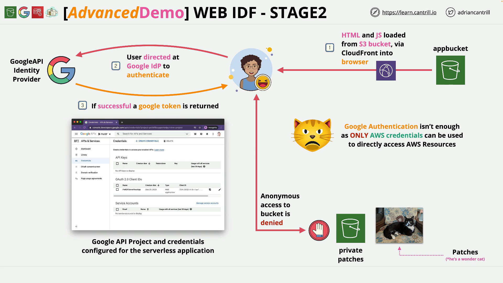

# Implementing Web Identity Federation (WEBIDF) - PART2

## Series Context and Technologies

You are building a serverless browser app that:

- Hosts a static front‑end on **Amazon S3** (fronted by **CloudFront**).
- Uses **Google** as an **IdP** for sign‑in.
- Uses **Cognito Identity Pools** + **IAM roles** to exchange the **Google token** for **temporary AWS credentials**.
- Loads private images from a locked‑down S3 bucket using **pre‑signed URLs**.

## What You Do in Stage 2

- Create a **Google API Project** for the app.
- Configure the **OAuth Consent Screen**.
- Create an **OAuth 2.0 Client ID** of type **Web application**.
- Register your **CloudFront distribution domain** as an **Authorized JavaScript origin**.
- Record the **Client ID** for use by the app later.

## Prerequisites

- You completed **Stage 1** and have the **CloudFront distribution domain** (your web app URL).
- A **Google account** (Gmail is fine) to access the **Google Cloud Console**.
- Admin access to your **AWS** account; **Region: us‑east‑1**.

## Step‑by‑Step Tasks

### 1) Create a Google API Project

1. Open the **Google Cloud Console** and sign in with your Google account.
2. From the project selector, click **New Project**.
3. Enter a recognizable **Project name** (e.g., `pet-idf`).
   Google will assign a unique **Project ID** automatically.
4. Click **Create** and switch to the new project once it’s ready.

### 2) Configure the OAuth Consent Screen

1. In the left menu, open **APIs & Services → OAuth consent screen**.
2. Choose the appropriate **User Type** (for this demo, external is typical).
3. Provide basic app details (App name, support email, developer contact).
   For this demo, you can keep it minimal.
4. Click **Save and continue** through scopes and test users (no additional changes needed for the demo).
5. On the summary page, click **Back to Dashboard**.

### 3) Create OAuth Client Credentials (Web Application)

1. Go to **APIs & Services → Credentials**.
2. Click **Create credentials → OAuth client ID**.
3. **Application type:** choose **Web application**.
4. **Name:** use something descriptive, e.g., `pet-idf-serverless-app`.

### 4) Add the Authorized JavaScript Origin (CloudFront domain)

- In the OAuth client configuration, under **Authorized JavaScript origins**, click **Add URI** and enter your **CloudFront domain** from Stage 1, for example:

  - `https://dxxxxxxxxxxxx.cloudfront.net`
    This tells Google that your app’s browser code is allowed to invoke Google’s OAuth endpoints from that origin.

- Click **Create**.

### 5) Capture the Client ID (you won’t use the Client Secret)

- After creation, Google shows:

  - **Client ID** → **record this**; the app will use it later.
  - **Client Secret** → **not used** in this demo; you can ignore it.

## Why This Stage Matters

- You’ve enabled the app to **authenticate users via Google** and obtain a **Google token** (proof of identity).
- That token is **not** an AWS credential. In **Stage 3**, you’ll configure **Cognito Identity Pools** to **trust Google** and **exchange** that token for **temporary AWS credentials** so the app can access AWS (e.g., request pre‑signed URLs to the private S3 bucket).

## Validation / Checklist

- [ ] A **Google API Project** exists for your app.
- [ ] The **OAuth Consent Screen** is configured and saved.
- [ ] An **OAuth 2.0 Client ID** of type **Web application** is created.
- [ ] Your **CloudFront domain** is present under **Authorized JavaScript origins**.
- [ ] You **copied the Client ID** for later use in the app configuration.

## Common Pitfalls and Tips

- **Wrong origin:** The **Authorized JavaScript origin** must exactly match your **CloudFront** domain (scheme + host, no trailing slash). If it’s wrong, sign‑in popups or redirects will fail.
- **Using the website endpoint instead of CloudFront:** Use the **CloudFront** domain you noted in Stage 1, not the S3 website URL, to ensure HTTPS and correct origin matching.
- **Client Secret misuse:** For browser‑only OAuth flows, the **Client Secret is not used**—don’t embed secrets in front‑end code.
- **Consent screen not saved:** If you skip saving the consent screen, creating credentials may fail or OAuth prompts will look incomplete.

## Demo Links

- **1-Click Deployment (CloudFormation, `us-east-1`)**  
  [Launch Stack](https://console.aws.amazon.com/cloudformation/home?region=us-east-1#/stacks/quickcreate?templateURL=https://learn-cantrill-labs.s3.amazonaws.com/aws-cognito-web-identity-federation/WEBIDF.yaml&stackName=WEBIDF)

- **Stage 1 Instructions**  
  [Instructions](https://github.com/acantril/learn-cantrill-io-labs/blob/master/aws-cognito-web-identity-federation/02_LABINSTRUCTIONS/STAGE1%20-%20Provision%20and%20Discuss%20Architecture.md)  
  **Stage 1 Diagram** – [View PDF](https://github.com/acantril/learn-cantrill-io-labs/blob/master/aws-cognito-web-identity-federation/02_LABINSTRUCTIONS/ARCHITECTURE-STAGE1.pdf)

- **Stage 2 Instructions**  
  [Instructions](https://github.com/acantril/learn-cantrill-io-labs/blob/master/aws-cognito-web-identity-federation/02_LABINSTRUCTIONS/STAGE2%20-%20Create%20Google%20APIProject%20and%20Client%20ID.md)

- **Stage 3 Instructions**  
  [Instructions](https://github.com/acantril/learn-cantril-io-labs/blob/master/aws-cognito-web-identity-federation/02_LABINSTRUCTIONS/STAGE3%20-%20Create%20Cognito%20Identity%20Pool.md)  
  **Stage 3 Diagram** – [View PDF](https://github.com/acantril/learn-cantrill-io-labs/blob/master/aws-cognito-web-identity-federation/02_LABINSTRUCTIONS/ARCHITECTURE-STAGE3.pdf)

- **Stage 4 Instructions**  
  [Instructions](https://github.com/acantril/learn-cantrill-io-labs/blob/master/aws-cognito-web-identity-federation/02_LABINSTRUCTIONS/STAGE4%20-%20Update%20App%20Bucket%20and%20Test%20Application.md)  
  **Stage 4 Diagram** – [View PDF](https://github.com/acantril/learn-cantrill-io-labs/blob/master/aws-cognito-web-identity-federation/02_LABINSTRUCTIONS/ARCHITECTURE-STAGE4.pdf)

- **Stage 5 Instructions (Cleanup)**  
  [Instructions](https://github.com/acantril/learn-cantrill-io-labs/blob/master/aws-cognito-web-identity-federation/02_LABINSTRUCTIONS/STAGE5%20-%20Cleanup.md)

## No Code in This Stage

The transcript does not include code snippets. If you share your `index.html` or `script.js` from the app bucket, I can annotate them **line by line** with comments and add a plain‑English explanation beneath each snippet.

## Quick Recap

- You created a **Google API Project**, configured the **OAuth Consent Screen**, and generated a **Web application OAuth Client ID**.
- You added your **CloudFront domain** as an **Authorized JavaScript origin** so the browser app can initiate Google sign‑in.
- You recorded the **Client ID**.
- Next, in **Stage 3**, you’ll set up a **Cognito Identity Pool** to **trust Google** and **exchange** the Google token for **temporary AWS credentials** used by the app.
