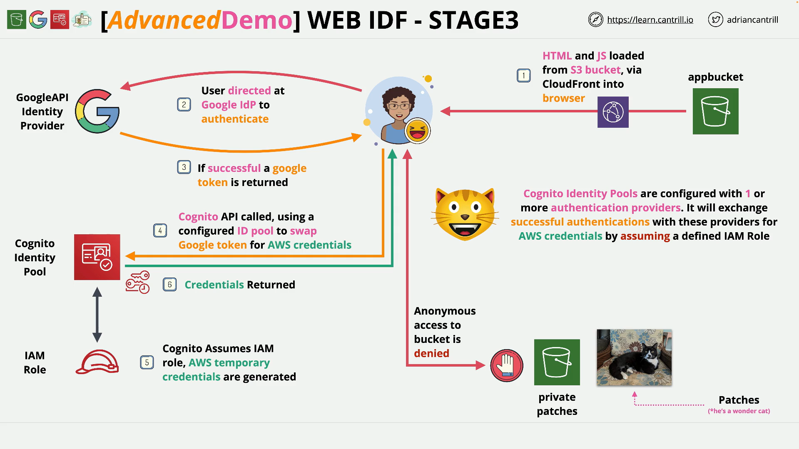

# Implementing Web Identity Federation (WEBIDF) - PART3

## Series Context

You are building a serverless browser app that:

- Hosts its front‑end on **S3** (fronted by **CloudFront**).
- Uses **Google** as an **Identity Provider (IdP)** for user sign‑in.
- Uses a **Cognito Identity Pool** to exchange the **Google token** for **temporary AWS credentials** tied to an **IAM role**.
- Uses those temporary credentials to fetch images from a **private S3 bucket** via **pre‑signed URLs**.

## Stage 3 Objective

Create a **Cognito Identity Pool** that **trusts Google**. After a user signs in at Google, the app presents the Google token to the Identity Pool, which **assumes an IAM role** and returns **temporary AWS credentials** to the browser.

## How It Works (Chain of Trust)

1. **User** authenticates with **Google** → receives a **Google token**.
2. **Browser app** sends that token to **Cognito Identity Pool** configured to **trust Google**.
3. **Identity Pool** **assumes an IAM role** (for authenticated identities) and returns **temporary credentials**.
4. **Browser app** uses those credentials to request **pre‑signed URLs** and load images from the **private S3 bucket**.

## Step‑by‑Step: Create and Wire the Identity Pool

### 1) Open Cognito and Create an Identity Pool

- In the AWS Console, open **Amazon Cognito** and go to **Identity pools**.
- Click **Create identity pool** and use a recognizable name, e.g. `pet-idf-id-pool`.

### 2) Choose Access Mode: Authenticated Only

- You can enable **guest (unauthenticated)** access for open, low‑risk use cases, but in this demo you select **Authenticated access** only.
- This ensures **only signed‑in** users (Google in this case) can obtain AWS credentials.

### 3) Add Google as the Auth Provider

- In **Authentication providers**, enable **Google**.
- You’ll wire in the **Google Client ID** (created in Stage 2) a bit later.

### 4) Create the Authenticated Role

- During pool setup, Cognito creates an **IAM role** for authenticated identities (name is typically based on the pool name).
- This role is what **Identity Pool** will **assume** to generate temporary credentials for users who present a valid Google token.

### 5) Enter the Google Client ID

- Paste the **Client ID** from Stage 2 (the one ending with `apps.googleusercontent.com`) into the **Google provider** configuration.
- Keep **Role settings** as **Use default authenticated role** for this demo.

### 6) Name and Create the Identity Pool

- Confirm the pool name (e.g., `pet-idf-id-pool`) and finish creation.

### 7) Capture the Identity Pool ID

- Open the created Identity Pool and **copy the Identity Pool ID** (you’ll need it later in the app configuration).

### 8) Expand IAM Permissions for S3 Access

- Go to **IAM → Roles** and open the **authenticated role** created for your pool.
- **Trust relationship** should show **`cognito-identity.amazonaws.com`** as the service that may assume this role, with a **condition** that limits assumption to **your** Identity Pool (this is how Cognito enforces the chain of trust).
- On **Permissions**, **attach** the managed policy created in Stage 1 for the private images bucket, e.g. **`PrivatePatchesPermissions`** (grants `s3:ListBucket` and `s3:GetObject` on the private bucket).
- Result: When the role is assumed via your Identity Pool, the browser will receive **temporary credentials** that can **list** and **get** objects from the **private images bucket**.

## What to Record for Stage 4

- **Identity Pool ID** (from the Cognito console).
- **Name/ARN of the authenticated role** associated with the pool.
- Confirm **PrivatePatchesPermissions** is **attached** to that role.

## Validation / What You Should See

- A **Cognito Identity Pool** exists with **Google** configured as an authentication provider.
- An **IAM role** for authenticated identities was created automatically.
- The role’s **trust policy** allows **Cognito Identity** to assume it (and restricts to **your** pool).
- The role now has the **PrivatePatchesPermissions** policy attached.

## Common Pitfalls and Fixes

- **Wrong Client ID**: Ensure you pasted the **exact** Google **Client ID** from Stage 2 (not the secret).
- **No S3 access**: If the app later gets `AccessDenied`, verify the **authenticated role** has **PrivatePatchesPermissions** attached and the **private bucket name/ARNs** match.
- **Wrong pool/region**: Identity Pools are **regional**; ensure the app points to the **same region** where you created the pool.
- **Trust conditions**: If you edited the role trust, make sure the **`aud`** condition references **your** Identity Pool and `amr` includes **`authenticated`** for this flow.

## Demo Links

- **1-Click Deployment (CloudFormation, `us-east-1`)**  
  [Launch Stack](https://console.aws.amazon.com/cloudformation/home?region=us-east-1#/stacks/quickcreate?templateURL=https://learn-cantrill-labs.s3.amazonaws.com/aws-cognito-web-identity-federation/WEBIDF.yaml&stackName=WEBIDF)

- **Stage 1 Instructions**  
  [Instructions](https://github.com/acantril/learn-cantrill-io-labs/blob/master/aws-cognito-web-identity-federation/02_LABINSTRUCTIONS/STAGE1%20-%20Provision%20and%20Discuss%20Architecture.md)  
  **Stage 1 Diagram** – [View PDF](https://github.com/acantril/learn-cantrill-io-labs/blob/master/aws-cognito-web-identity-federation/02_LABINSTRUCTIONS/ARCHITECTURE-STAGE1.pdf)

- **Stage 2 Instructions**  
  [Instructions](https://github.com/acantril/learn-cantrill-io-labs/blob/master/aws-cognito-web-identity-federation/02_LABINSTRUCTIONS/STAGE2%20-%20Create%20Google%20APIProject%20and%20Client%20ID.md)

- **Stage 3 Instructions**  
  [Instructions](https://github.com/acantril/learn-cantril-io-labs/blob/master/aws-cognito-web-identity-federation/02_LABINSTRUCTIONS/STAGE3%20-%20Create%20Cognito%20Identity%20Pool.md)  
  **Stage 3 Diagram** – [View PDF](https://github.com/acantril/learn-cantrill-io-labs/blob/master/aws-cognito-web-identity-federation/02_LABINSTRUCTIONS/ARCHITECTURE-STAGE3.pdf)

- **Stage 4 Instructions**  
  [Instructions](https://github.com/acantril/learn-cantrill-io-labs/blob/master/aws-cognito-web-identity-federation/02_LABINSTRUCTIONS/STAGE4%20-%20Update%20App%20Bucket%20and%20Test%20Application.md)  
  **Stage 4 Diagram** – [View PDF](https://github.com/acantril/learn-cantrill-io-labs/blob/master/aws-cognito-web-identity-federation/02_LABINSTRUCTIONS/ARCHITECTURE-STAGE4.pdf)

- **Stage 5 Instructions (Cleanup)**  
  [Instructions](https://github.com/acantril/learn-cantrill-io-labs/blob/master/aws-cognito-web-identity-federation/02_LABINSTRUCTIONS/STAGE5%20-%20Cleanup.md)

## No Code in This Source

The transcript for Stage 3 doesn’t include code. If you share:

- The **IAM role trust policy** (JSON) or
- The app’s **JavaScript** that calls Cognito and S3

…I’ll annotate it **line by line** with inline comments and add a plain‑English explanation beneath each snippet.

## Quick Recap

- You created a **Cognito Identity Pool** configured to **trust Google** and to issue **temporary AWS credentials** for **authenticated** users.
- Cognito **assumes an IAM role** on behalf of the user; you **attached** a policy so those credentials can read from the **private S3 bucket**.
- You noted the **Identity Pool ID** and confirmed the **authenticated role** and its permissions.
- Next (Stage 4), you’ll **update the app** to use the **Google Client ID** and **Identity Pool ID**, then test sign‑in and image loading via **pre‑signed URLs**.
