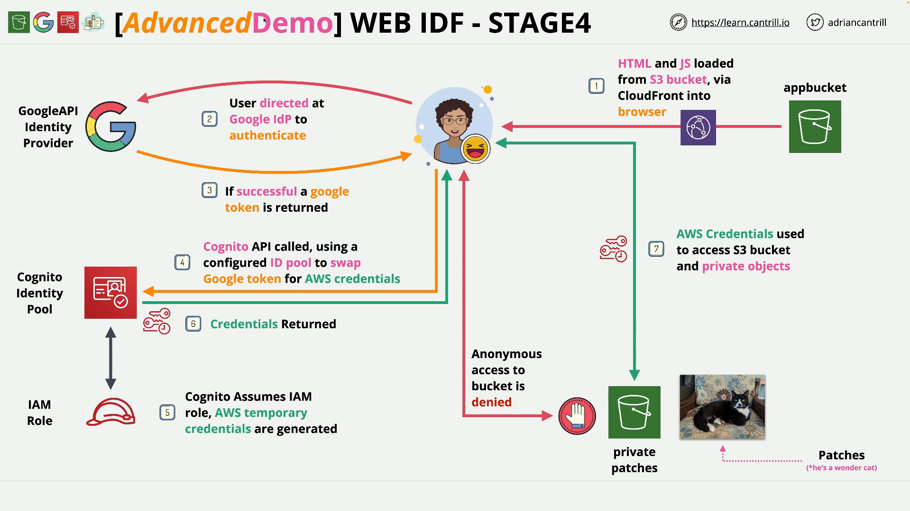

# Implementing Web Identity Federation (WEBIDF) - PART4

## What the app does



1. Static front‑end hosted on **S3**, served via **CloudFront**.
2. User signs in with **Google** in the browser.
3. Browser presents the **Google ID token** to a **Cognito Identity Pool** that trusts Google.
4. Cognito **assumes an IAM role** and returns **temporary AWS credentials**.
5. Browser uses those creds to list objects in a **private S3 bucket** and renders images using **pre‑signed URLs**.

## Inputs to have ready

- **CloudFront domain** (from Stage 1), e.g. `https://dxxxxxxxx.cloudfront.net`
- **Google OAuth 2.0 Client ID** (from Stage 2), ends with `apps.googleusercontent.com`
- **Cognito Identity Pool ID** (from Stage 3), e.g. `us-east-1:xxxxxxxx-xxxx-xxxx-xxxx-xxxxxxxxxxxx`
- **Private images bucket name** (from Stage 1), e.g. `webidf-patchesprivatebucket-<suffix>`

## What you edit and upload

- Edit **`index.html`**: set `data-client_id` to your **Google Client ID**.
- Edit **`scripts.js`**: set `IdentityPoolId` and `Bucket` placeholders.
- Upload both files back to **your app bucket**, then load the site via **CloudFront**.

## Original files (drop‑in)

### `index.html` (as provided)

```html
<!DOCTYPE html>
<html lang="en">
  <head>
    <title>PetIDF Demo</title>
    <meta name="author" content="acantril" />
    <meta name="google-signin-scope" content="profile email" />
    <meta name="referrer" content="strict-origin-when-cross-origin" />
    <script src="https://sdk.amazonaws.com/js/aws-sdk-2.2.19.min.js"></script>
    <script src="scripts.js"></script>
    <script src="https://accounts.google.com/gsi/client" async defer></script>
  </head>
  <body>
    <div id="g_id_onload" data-client_id="REPLACE_ME_GOOGLE_APP_CLIENT_ID" data-context="signin" data-ux_mode="popup" data-callback="onSignIn" data-auto_prompt="false"></div>

    <div class="g_id_signin" data-type="standard"></div>
    <p />
    <div id="viewer"></div>
    <div id="output"></div>
  </body>
</html>
```

### `scripts.js` (as provided)

```javascript
function onSignIn(googleToken) {
  // Google have OK'd the sign-in
  // pass the token into our web app
  credentialExchange(googleToken);
}

function credentialExchange(googleToken) {
  // Create a decoded version of the token so we can print things out
  console.log("Creating decoded token...");
  const googleTokenDecoded = parseJwt(googleToken.credential);

  // Output some details onto the browser console to show the token working
  console.log("ID: " + googleTokenDecoded.sub);
  console.log("Full Name: " + googleTokenDecoded.name);
  console.log("Email: " + googleTokenDecoded.email);

  if (googleTokenDecoded["sub"]) {
    // We can't access anything in AWS with a google token...
    // ... so we need to exchange it using Cognito for AWS credentials
    console.log("Exchanging Google Token for AWS credentials...");
    AWS.config.region = "us-east-1";
    AWS.config.credentials = new AWS.CognitoIdentityCredentials({
      IdentityPoolId: "REPLACE_ME_COGNITO_IDENTITY_POOL_ID", // MAKE SURE YOU REPLACE THIS
      Logins: {
        "accounts.google.com": googleToken.credential,
      },
    });

    // Now lets obtain the credentials we just swapped
    AWS.config.credentials.get(function (err) {
      if (!err) {
        console.log("Exchanged to Cognito Identity Id: " + AWS.config.credentials.identityId);
        // if we are here, things are working as they should...
        // ... now lets call a function to access images, generate signed URL's and display
        accessImages();
      } else {
        // if we are here, bad things have happened, so we should error.
        document.getElementById("output").innerHTML = "<b>YOU ARE NOT AUTHORISED TO QUERY AWS!</b>";
        console.log("ERROR: " + err);
      }
    });
  } else {
    console.log("User not logged in!");
  }
}

function accessImages() {
  // Using the temp AWS Credentials, lets connect to S3
  console.log("Creating Session to S3...");
  var s3 = new AWS.S3();
  var params = {
    Bucket: "REPLACE_ME_NAME_OF_PATCHES_PRIVATE_BUCKET", // MAKE SURE YOU REPLACE THIS
  };

  // If we are here, things are going well, lets list all of the objects in the bucket
  s3.listObjects(params, function (err, data) {
    console.log("Listing objects in patchesprivate bucket...");
    if (err) {
      document.getElementById("output").innerHTML = "<b>YOU ARE NOT AUTHORISED TO QUERY AWS!</b>";
      console.log(err, err.stack);
    } else {
      console.log("AWS response:");
      console.log(data);
      var href = this.request.httpRequest.endpoint.href;
      var bucketUrl = href + data.Name + "/";

      // for all of the images in the bucket, we need to generate a signedURL for the object
      var photos = data.Contents.map(function (photo) {
        var photoKey = photo.Key;

        console.log("Generating signedURL for : " + photoKey);
        var url = s3.getSignedUrl("getObject", {
          Bucket: data.Name,
          Key: photoKey,
        });

        var photoUrl = bucketUrl + encodeURIComponent(photoKey);
        return getHtml([
          "<span>",
          "<div>",
          "<br/>",
          '<a href="' + url + '" target="_blank"></a>',
          "</div>",
          "<div>",
          "<span>",
          "</span>",
          "</div>",
          "</span>",
        ]);
      });

      // let's take those signedURL's, create a HTML page, and display it in the web browser
      var htmlTemplate = ["<div>", getHtml(photos), "</div>"];
      console.log("Creating and returning html...");
      document.getElementById("viewer").innerHTML = getHtml(htmlTemplate);
    }
  });
}

// A utility function to create HTML.
function getHtml(template) {
  return template.join("\n");
}

// A utility function to decode the google token
function parseJwt(token) {
  var base64Url = token.split(".")[1];
  var base64 = base64Url.replace("-", "+").replace("_", "/");
  var plain_token = JSON.parse(window.atob(base64));
  return plain_token;
}
```

## Annotated files (line‑by‑line comments)

> The following versions include **inline comments**. Use them for learning; do not upload the commented versions to production.

### `index.html` with comments

```html
<!DOCTYPE html>
<!-- HTML5 document -->
<html lang="en">
  <head>
    <title>PetIDF Demo</title>
    <meta name="author" content="acantril" />
    <!-- Request profile + email scopes from Google -->
    <meta name="google-signin-scope" content="profile email" />
    <!-- Safer referrer handling for OAuth redirects -->
    <meta name="referrer" content="strict-origin-when-cross-origin" />
    <!-- AWS SDK for JavaScript v2 (browser build) -->
    <script src="https://sdk.amazonaws.com/js/aws-sdk-2.2.19.min.js"></script>
    <!-- Your application logic -->
    <script src="scripts.js"></script>
    <!-- Google Identity Services (GSI) client library -->
    <script src="https://accounts.google.com/gsi/client" async defer></script>
  </head>
  <body>
    <!-- GSI bootstrap element. The data-* attributes configure Google Sign-In. -->
    <div id="g_id_onload" data-client_id="REPLACE_ME_GOOGLE_APP_CLIENT_ID" <!-- Your Google OAuth Client id -->
      data-context="signin"
      <!-- Context hint for GSI -->
      data-ux_mode="popup"
      <!-- Use popup flow -->
      data-callback="onSignIn"
      <!-- JS callback when sign-in completes -->
      data-auto_prompt="false">
      <!-- Disable auto prompt -->
    </div>

    <!-- The visible Google Sign-In button -->
    <div class="g_id_signin" data-type="standard"></div>

    <!-- Where images will be rendered -->
    <p />
    <div id="viewer"></div>

    <!-- Where error/status text may appear -->
    <div id="output"></div>
  </body>
</html>
```

### `scripts.js` with comments

```javascript
function onSignIn(googleToken) {
  // Called by GSI after a successful Google sign-in.
  // googleToken.credential contains the Google ID token (JWT).
  credentialExchange(googleToken);
}

function credentialExchange(googleToken) {
  // Decode the Google ID token so we can inspect/log claims for demo purposes
  console.log("Creating decoded token...");
  const googleTokenDecoded = parseJwt(googleToken.credential);

  // Log some useful fields from the token
  console.log("ID: " + googleTokenDecoded.sub); // Subject (unique user ID at Google)
  console.log("Full Name: " + googleTokenDecoded.name);
  console.log("Email: " + googleTokenDecoded.email);

  if (googleTokenDecoded["sub"]) {
    // We cannot call AWS APIs with a Google token directly.
    // Exchange it via Cognito Identity to obtain temporary AWS credentials.
    console.log("Exchanging Google Token for AWS credentials...");

    // Set the AWS region where your Identity Pool exists
    AWS.config.region = "us-east-1";

    // Configure Cognito Identity credentials
    AWS.config.credentials = new AWS.CognitoIdentityCredentials({
      IdentityPoolId: "REPLACE_ME_COGNITO_IDENTITY_POOL_ID", // Your Identity Pool ID
      Logins: {
        // 'Logins' maps provider identifier to the raw Google ID token
        // For Google provider in Cognito Identity, use 'accounts.google.com'
        "accounts.google.com": googleToken.credential,
      },
    });

    // Explicitly fetch credentials now
    AWS.config.credentials.get(function (err) {
      if (!err) {
        console.log("Exchanged to Cognito Identity Id: " + AWS.config.credentials.identityId);
        // Now that we have AWS creds, list and display images from S3
        accessImages();
      } else {
        // If the exchange failed, show an error to the user and log details
        document.getElementById("output").innerHTML = "<b>YOU ARE NOT AUTHORISED TO QUERY AWS!</b>";
        console.log("ERROR: " + err);
      }
    });
  } else {
    console.log("User not logged in!");
  }
}

function accessImages() {
  // Use the temporary AWS credentials to construct an S3 client
  console.log("Creating Session to S3...");
  var s3 = new AWS.S3();

  // Target the private bucket that contains the images
  var params = {
    Bucket: "REPLACE_ME_NAME_OF_PATCHES_PRIVATE_BUCKET", // Your private bucket name
  };

  // List all objects in the bucket
  s3.listObjects(params, function (err, data) {
    console.log("Listing objects in patchesprivate bucket...");
    if (err) {
      document.getElementById("output").innerHTML = "<b>YOU ARE NOT AUTHORISED TO QUERY AWS!</b>";
      console.log(err, err.stack);
    } else {
      console.log("AWS response:");
      console.log(data);

      // Build a base bucket URL from the S3 endpoint (informational)
      var href = this.request.httpRequest.endpoint.href;
      var bucketUrl = href + data.Name + "/";

      // For each object, generate a pre-signed GET URL and wrap it in img HTML
      var photos = data.Contents.map(function (photo) {
        var photoKey = photo.Key;

        console.log("Generating signedURL for : " + photoKey);
        var url = s3.getSignedUrl("getObject", {
          Bucket: data.Name,
          Key: photoKey,
        });

        // Not used in the final markup; kept to illustrate name encoding
        var photoUrl = bucketUrl + encodeURIComponent(photoKey);

        // Return an HTML fragment containing a clickable thumbnail
        return getHtml([
          "<span>",
          "<div>",
          "<br/>",
          '<a href="' + url + '" target="_blank"></a>',
          "</div>",
          "<div>",
          "<span>",
          "</span>",
          "</div>",
          "</span>",
        ]);
      });

      // Join all fragments into a single HTML blob and inject into the page
      var htmlTemplate = ["<div>", getHtml(photos), "</div>"];
      console.log("Creating and returning html...");
      document.getElementById("viewer").innerHTML = getHtml(htmlTemplate);
    }
  });
}

// Utility: join an array of strings with newlines
function getHtml(template) {
  return template.join("\n");
}

// Utility: decode a JWT (base64url) payload without verification (demo only)
function parseJwt(token) {
  var base64Url = token.split(".")[1]; // Extract payload
  var base64 = base64Url.replace("-", "+").replace("_", "/"); // Base64URL -> Base64
  var plain_token = JSON.parse(window.atob(base64)); // Decode and parse JSON
  return plain_token;
}
```

## Plain‑English explanations

### `index.html` explained

- Loads three scripts:

  1. **AWS SDK v2** (browser build) so we can call Cognito Identity and S3.
  2. Your **`scripts.js`** which contains the app logic.
  3. Google’s **GSI** client to handle Sign‑In.

- The `#g_id_onload` element tells GSI how to behave:

  - `data-client_id`: set to **your Google Client ID**.
  - `data-ux_mode="popup"`: use a popup instead of full‑page redirect.
  - `data-callback="onSignIn"`: call your JS function on success.

- The `div.g_id_signin` renders the **Google Sign‑In button**.
- Two placeholders on the page:

  - `#viewer`: where image thumbnails will be injected.
  - `#output`: where error messages appear if auth fails.

### `scripts.js` explained

- `onSignIn(googleToken)`: called by GSI with a token object. It passes the token along for exchange.
- `credentialExchange(googleToken)`:

  - Decodes and logs fields from the **Google ID token** (demo UX).
  - Creates `AWS.CognitoIdentityCredentials` with:

    - Your **Identity Pool ID**, and
    - A **Logins** map that associates the Google provider key `'accounts.google.com'` with the **raw Google ID token**.

  - Calls `.get(...)` to fetch **temporary AWS credentials**.
  - On success, calls `accessImages()`.

- `accessImages()`:

  - Creates an **S3 client** using the temporary credentials.
  - Calls `listObjects` on your **private images bucket**.
  - For each key, generates a **pre‑signed GET URL** via `getSignedUrl('getObject', ...)`.
  - Injects `` thumbnails into the page.

- `parseJwt(token)`: **non‑validating** decoder for the JWT payload, used for demo logging only.

## IAM policies used by the flow (kept from earlier stage)

### 1) “Standard role” permissions policy

```jsonc
{
  "Version": "2012-10-17",
  "Statement": [
    {
      "Effect": "Allow",
      "Action": ["cognito-identity:GetCredentialsForIdentity"],
      "Resource": ["*"]
    }
  ]
}
```

**What it means:** permits the **Cognito Identity** API call to exchange an identity for AWS credentials. It does **not** grant S3 access by itself.

### 2) “Standard trusted entities” (role trust policy)

```jsonc
{
  "Version": "2012-10-17",
  "Statement": [
    {
      "Effect": "Allow",
      "Principal": { "Federated": "cognito-identity.amazonaws.com" },
      "Action": "sts:AssumeRoleWithWebIdentity",
      "Condition": {
        "StringEquals": {
          "cognito-identity.amazonaws.com:aud": "us-east-1:c9bfaf90-fb0f-40d3-86e6-e2d2f6489494"
        },
        "ForAnyValue:StringLike": {
          "cognito-identity.amazonaws.com:amr": "authenticated"
        }
      }
    }
  ]
}
```

**What it means:** allows **your** Cognito Identity Pool to assume this role **only** for **authenticated** identities.

### 3) `PrivatePatchesPermissions` managed policy

```jsonc
{
  "Version": "2012-10-17",
  "Statement": [
    {
      "Action": ["s3:ListBucket", "s3:GetObject"],
      "Resource": ["arn:aws:s3:::webidf-patchesprivatebucket-g4zqmbduq0ho", "arn:aws:s3:::webidf-patchesprivatebucket-g4zqmbduq0ho/*"],
      "Effect": "Allow",
      "Sid": "ReadFromLCBucket"
    }
  ]
}
```

**What it means:** grants the **minimum S3 read** the browser needs to list and fetch images from the private bucket.

### 4) The modified role (effective outcome)

- Start with the Identity Pool’s **authenticated role** that has the standard trust and minimal inline policy.
- **Attach** `PrivatePatchesPermissions` to it.
- Result: when the browser’s identity is exchanged, the temporary credentials include **S3 List/Get** on the private bucket.

## End‑to‑end test steps

1. Upload edited **`index.html`** and **`scripts.js`** to the **app bucket**.
2. Open the **CloudFront** domain in a new tab.
3. Open the **browser console** (DevTools) to watch logs.
4. Click **Sign in with Google** and complete auth.
5. Observe logs: token decoded → token exchange → Cognito identity ID → S3 list → pre‑signed URLs.
6. Verify that **three images** from the private bucket render. Clicking one opens the **pre‑signed URL** in a new tab.

## Validation checklist

- [ ] `index.html`: `data-client_id` set to your **Google Client ID**.
- [ ] `scripts.js`: `IdentityPoolId` set to your **Cognito Identity Pool ID**.
- [ ] `scripts.js`: `Bucket` set to your **private images bucket** name.
- [ ] IAM role for the Identity Pool has **`PrivatePatchesPermissions`** attached.
- [ ] App loads via **CloudFront** and images render after Google sign‑in.

## Troubleshooting tips

- **Google popup blocked**: allow popups for your CloudFront domain.
- **Sign‑in succeeds but exchange fails**: confirm the **Identity Pool ID** and **region** match, and that the Identity Pool trusts **Google** with the correct **Client ID**.
- **AccessDenied on S3**: verify the **authenticated role** has `PrivatePatchesPermissions` attached and the bucket names/ARNs match exactly.
- **Nothing changes after edit**: hard‑refresh or create a **CloudFront invalidation** for `/index.html` and `/scripts.js`.
- **Mixed origins**: ensure your **Google Authorized JavaScript origin** is your **CloudFront domain**, not the S3 website URL.

## Security notes

- Do **not** embed any **client secret** in the front‑end; the Google flow here is public‑client only.
- Keep IAM policies **least‑privilege**. Only grant `s3:ListBucket` and `s3:GetObject` on the specific bucket.
- Consider revoking public access to the app bucket in production by using a **CloudFront OAC/OAI** and disabling public bucket policies.

## Demo Links

- **1-Click Deployment (CloudFormation, `us-east-1`)**  
  [Launch Stack](https://console.aws.amazon.com/cloudformation/home?region=us-east-1#/stacks/quickcreate?templateURL=https://learn-cantrill-labs.s3.amazonaws.com/aws-cognito-web-identity-federation/WEBIDF.yaml&stackName=WEBIDF)

- **Stage 1 Instructions**  
  [Instructions](https://github.com/acantril/learn-cantrill-io-labs/blob/master/aws-cognito-web-identity-federation/02_LABINSTRUCTIONS/STAGE1%20-%20Provision%20and%20Discuss%20Architecture.md)  
  **Stage 1 Diagram** – [View PDF](https://github.com/acantril/learn-cantrill-io-labs/blob/master/aws-cognito-web-identity-federation/02_LABINSTRUCTIONS/ARCHITECTURE-STAGE1.pdf)

- **Stage 2 Instructions**  
  [Instructions](https://github.com/acantril/learn-cantrill-io-labs/blob/master/aws-cognito-web-identity-federation/02_LABINSTRUCTIONS/STAGE2%20-%20Create%20Google%20APIProject%20and%20Client%20ID.md)

- **Stage 3 Instructions**  
  [Instructions](https://github.com/acantril/learn-cantril-io-labs/blob/master/aws-cognito-web-identity-federation/02_LABINSTRUCTIONS/STAGE3%20-%20Create%20Cognito%20Identity%20Pool.md)  
  **Stage 3 Diagram** – [View PDF](https://github.com/acantril/learn-cantrill-io-labs/blob/master/aws-cognito-web-identity-federation/02_LABINSTRUCTIONS/ARCHITECTURE-STAGE3.pdf)

- **Stage 4 Instructions**  
  [Instructions](https://github.com/acantril/learn-cantrill-io-labs/blob/master/aws-cognito-web-identity-federation/02_LABINSTRUCTIONS/STAGE4%20-%20Update%20App%20Bucket%20and%20Test%20Application.md)  
  **Stage 4 Diagram** – [View PDF](https://github.com/acantril/learn-cantrill-io-labs/blob/master/aws-cognito-web-identity-federation/02_LABINSTRUCTIONS/ARCHITECTURE-STAGE4.pdf)

- **Stage 5 Instructions (Cleanup)**  
  [Instructions](https://github.com/acantril/learn-cantrill-io-labs/blob/master/aws-cognito-web-identity-federation/02_LABINSTRUCTIONS/STAGE5%20-%20Cleanup.md)
