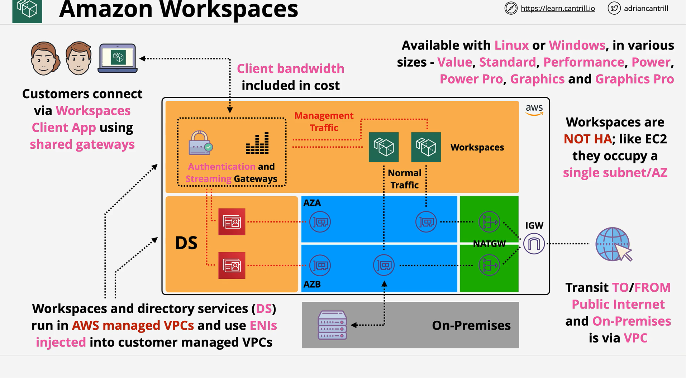

# Amazon WorkSpaces

## What WorkSpaces Is

- **Managed virtual desktops** (Windows or Linux) delivered from AWS.
- Similar purpose to Citrix/RDS, but **hosted and operated by AWS**.
- Provides a **consistent, stateful desktop** you can reconnect to from anywhere (office/home) with the same running apps and state.

## Primary Use Cases

- Secure, centrally managed desktops for **remote/hybrid work**.
- Rapidly provisioning desktops for **contractors, temporary staff, labs, training**.
- Controlled access to **VPC or on-premises resources** without exposing a local network.

## Identity and Directory Integration

WorkSpaces **requires** AWS Directory Service to authenticate users:

- **Simple AD**: lowest cost, good for PoC or isolated deployments.
- **AD Connector**: proxy to **your on-prem AD**; no directory hosted in AWS.
- **AWS Managed Microsoft AD**: fully managed AD in AWS when you need **native AD** features.

WorkSpaces relies on the directory for:

- User authentication.
- Windows file sharing and application authentication (via domain).

## Networking Model

- Each WorkSpace **injects a network interface** into your **customer-managed VPC**.
- **All non-management traffic** (to VPC resources, internet, or on-prem) flows through your VPC:

  - **NAT Gateway/IGW**: internet egress as usual.
  - **Site-to-Site VPN/Direct Connect**: on-prem access via normal hybrid constructs.

- **Authentication and streaming gateways** live in an **AWS-managed VPC** and handle:

  - Client connections (bandwidth for the **display stream is included** in the service).
  - Auth interactions with Directory Service.

- Result: you manage **VPC routing, security groups, NACLs** like any other workload.

## Storage and Encryption

- Each WorkSpace has:

  - **System volume** and **User volume** (EBS under the hood).

- **At-rest encryption** supported via **AWS KMS** (customer-managed keys optional).

## Bundles and Sizing

WorkSpaces desktops come in multiple bundles to match performance needs:

- **Value, Standard, Performance, Power, PowerPro, Graphics, GraphicsPro**
  Higher tiers provide more CPU/RAM; Graphics tiers add **GPU** for graphics workloads.

## Billing Options

- **Monthly**: fixed price per month for always-on usage.
- **Hourly**: lower base price plus per-hour usage; WorkSpace can **auto-stop** when idle to save costs.
  Note: there is a **minimum monthly infrastructure charge** for hourly mode; great savings if not used 24×7.

## Access and Bandwidth

- Users connect via **WorkSpaces client** on desktop/laptop.
- **Display protocol bandwidth** is **included** with WorkSpaces.
- **All other traffic** (e.g., to S3, EC2, internet, on-prem) follows **standard VPC data transfer** pricing.

## Availability and Resilience

- A WorkSpace runs on a **single host in one AZ**; **not inherently highly available**.
- You can **spread users across multiple AZs** to reduce blast radius, but an AZ outage **impacts** WorkSpaces in that AZ.
- Recovery exists, but remember for the exam: **WorkSpaces are not HA by default**.

## How the Pieces Fit Together

1. **Client** connects to **AWS streaming/auth gateways** (AWS-managed VPC).
2. Gateways authenticate via **Directory Service**.
3. The **WorkSpace instance** communicates with your **VPC** via an injected **ENI** for application/data access.
4. Your **VPC** provides internet egress and hybrid connectivity as needed.

## Exam Pointers (SAP-C02)

- **Directory Service dependency** is key: pick **Simple AD**, **AD Connector**, or **Managed Microsoft AD** based on scenario.
- **Billing mode selection**: hourly vs monthly—identify where **auto-stop** saves money.
- **Networking**: understand **which traffic is included** (display stream) and which follows **standard VPC data transfer**.
- **Availability**: single-AZ nature; mitigation via **multi-AZ distribution**.
- **Windows integrations**: access to **FSx for Windows File Server**, EC2-hosted services in VPC, and on-prem via VPN/DX.

## Quick Design Checklist

- Choose directory option:

  - PoC/isolated → **Simple AD**
  - Use on-prem AD accounts/groups → **AD Connector**
  - Need full AD features in AWS → **Managed Microsoft AD**

- Plan VPC subnets, security groups, routing, and egress.
- Decide **bundle** and **billing** mode per user profile.
- Enable **EBS/KMS encryption** if required by policy.
- For resilience, **distribute users across AZs**.
- Confirm **FSx/EC2** access and any **hybrid** connectivity paths.
