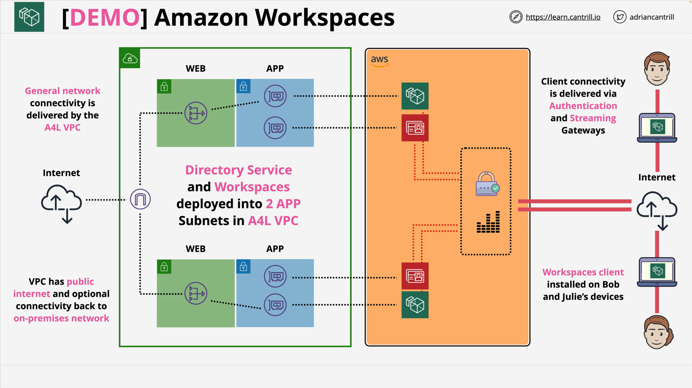

# Using workspaces with an AWS Directory Service - PART1



## What You’re Building

- A **three-AZ VPC** with clearly separated tiers:

  - **WEB** (public) subnets with Internet Gateway and IPv6
  - **APP** (private) subnets
  - **DB** (private) subnets
  - **Reserved** private subnets (spare capacity/future use)

- **NAT Gateways** in each WEB subnet for egress from private subnets
- Route tables and associations per subnet class
- A **default instance Security Group**
- Small helper **Lambda** and IAM role to ensure IPv6 is enabled on selected subnets
- **Exports** so other stacks (e.g., Directory Service, WorkSpaces) can reference subnet and VPC IDs

## Why This Matters (Exam and Real-World)

- **WorkSpaces needs a directory** (Simple AD, AD Connector, or AWS Managed Microsoft AD). In this lab you’ll use **Simple AD**, placed logically into the **APP** subnets.
- **WorkSpaces and Directory Service** run in AWS-managed VPCs but **inject ENIs** into your VPC subnets—hence the precise subnet layout is critical.
- **NAT Gateways** allow private subnets to reach the internet for updates and service endpoints.
- **IPv6** is enabled end-to-end; routes to `::/0` go via the IGW for the WEB tier.
- **Not HA per desktop**: individual WorkSpaces are AZ-local. Resilience comes from distributing users across AZs.

## Step-By-Step (what you did in the lesson)

1. Launch the **one-click CloudFormation** stack (N. Virginia).
2. Wait for **CREATE_COMPLETE**.
3. Open **WorkSpaces**, choose **Advanced setup** (to control every step).
4. Create **Simple AD**:

   - Size: **Small**
   - Org name and DNS name (internal only), NetBIOS short name
   - Strong **Administrator** password

5. Place directory ENIs into **APP-A** and **APP-B** subnets in **A4L VPC**.
6. Wait until directory status is **Active** (can take up to \~30 minutes).

# CloudFormation Template (Annotated)

Below is a compact, line-by-line annotated walkthrough of each **unique pattern** in the template. Where the template repeats the same pattern for AZs **A/B/C** (e.g., subnets and associations), the first instance is annotated in detail and the rest follow the same structure. After this annotated section, you’ll find a prose explanation that covers everything end-to-end.

> Note: The inline Lambda uses `is` for string comparison in Python (`if event['RequestType'] is 'Delete'`). In production, you should use `==`. It often works due to string interning but is not guaranteed.

```yaml
AWSTemplateFormatVersion: 2010-09-09        # Template format version
Description:  Animals4Life Full VPC Template v3 - DB, APP and WEB Tiers + NATGW's  # Human-readable summary

Metadata:
  LICENSE: Apache License Version 2.0        # License metadata (non-functional)

Resources:                                   # All provisioned resources begin here

  VPC:
    Type: AWS::EC2::VPC
    Properties:
      CidrBlock: 10.16.0.0/16               # /16 address space for the VPC
      EnableDnsSupport: true                 # Needed for DNS resolution
      EnableDnsHostnames: true               # Needed for hostnames (esp. for endpoints/instances)
      Tags:
        - Key: Name
          Value: a4l-vpc                    # Name tag for easy identification

  IPv6CidrBlock:
    Type: AWS::EC2::VPCCidrBlock
    Properties:
      VpcId: !Ref VPC
      AmazonProvidedIpv6CidrBlock: true     # Assign an AWS-provided /56 IPv6 CIDR to the VPC

  InternetGateway:
    Type: 'AWS::EC2::InternetGateway'
    Properties:
      Tags:
      - Key: Name
        Value: A4L-vpc1-igw                 # IGW for IPv4/IPv6 public routing

  InternetGatewayAttachment:
    Type: 'AWS::EC2::VPCGatewayAttachment'
    Properties:
      VpcId: !Ref VPC
      InternetGatewayId: !Ref InternetGateway  # Attaches the IGW to the VPC

  RouteTableWeb:
    Type: 'AWS::EC2::RouteTable'
    Properties:
      VpcId: !Ref VPC
      Tags:
      - Key: Name
        Value: A4L-vpc1-rt-web              # Public (WEB) route table

  RouteTableWebDefaultIPv4:
    Type: 'AWS::EC2::Route'
    DependsOn: InternetGatewayAttachment    # Ensure IGW is attached first
    Properties:
      RouteTableId: Ref: RouteTableWeb
      DestinationCidrBlock: '0.0.0.0/0'     # Default IPv4 route
      GatewayId: Ref: InternetGateway       # Send to IGW

  RouteTableWebDefaultIPv6:
    Type: 'AWS::EC2::Route'
    DependsOn: InternetGatewayAttachment
    Properties:
      RouteTableId: Ref: RouteTableWeb
      DestinationIpv6CidrBlock: '::/0'      # Default IPv6 route
      GatewayId: Ref: InternetGateway

  # Associate WEB subnets A/B/C with the WEB route table (public):
  RouteTableAssociationWebA:
    Type: 'AWS::EC2::SubnetRouteTableAssociation'
    Properties:
      SubnetId: !Ref SubnetWEBA
      RouteTableId: Ref: RouteTableWeb

  RouteTableAssociationWebB:
    Type: 'AWS::EC2::SubnetRouteTableAssociation'
    Properties:
      SubnetId: !Ref SubnetWEBB
      RouteTableId: Ref: RouteTableWeb

  RouteTableAssociationWebC:
    Type: 'AWS::EC2::SubnetRouteTableAssociation'
    Properties:
      SubnetId: !Ref SubnetWEBC
      RouteTableId: Ref: RouteTableWeb

  # Example: Reserved subnet in AZ A (pattern repeats for B/C with different CIDRs and IPv6 /64):
  SubnetReservedA:
    Type: AWS::EC2::Subnet
    DependsOn: IPv6CidrBlock                # Ensure VPC IPv6 block exists
    Properties:
      VpcId: !Ref VPC
      AvailabilityZone: !Select [ 0, !GetAZs '' ]     # AZ A
      CidrBlock: 10.16.0.0/20                         # IPv4 CIDR for Reserved-A
      AssignIpv6AddressOnCreation: true               # Auto-assign IPv6 to ENIs in subnet
      Ipv6CidrBlock:                                  # Derive a /64 from VPC /56
        Fn::Sub:
          - "${VpcPart}${SubnetPart}"
          - SubnetPart: '00::/64'                     # Chosen /64 slice for Reserved-A
            VpcPart: !Select [ 0, !Split [ '00::/56', !Select [ 0, !GetAtt VPC.Ipv6CidrBlocks ]]]
      Tags:
        - Key: Name
          Value: sn-reserved-A

  # DB subnet in AZ A (pattern repeats for B/C):
  SubnetDBA:
    Type: AWS::EC2::Subnet
    DependsOn: IPv6CidrBlock
    Properties:
      VpcId: !Ref VPC
      AvailabilityZone: !Select [ 0, !GetAZs '' ]
      CidrBlock: 10.16.16.0/20
      AssignIpv6AddressOnCreation: true
      Ipv6CidrBlock:
        Fn::Sub:
          - "${VpcPart}${SubnetPart}"
          - SubnetPart: '01::/64'
            VpcPart: !Select [ 0, !Split [ '00::/56', !Select [ 0, !GetAtt VPC.Ipv6CidrBlocks ]]]
      Tags:
        - Key: Name
          Value: sn-db-A

  # APP subnet in AZ A (pattern repeats for B/C). WorkSpaces directory ENIs will go here.
  SubnetAPPA:
    Type: AWS::EC2::Subnet
    DependsOn: IPv6CidrBlock
    Properties:
      VpcId: !Ref VPC
      AvailabilityZone: !Select [ 0, !GetAZs '' ]
      CidrBlock: 10.16.32.0/20
      AssignIpv6AddressOnCreation: true
      Ipv6CidrBlock:
        Fn::Sub:
          - "${VpcPart}${SubnetPart}"
          - SubnetPart: '02::/64'
            VpcPart: !Select [ 0, !Split [ '00::/56', !Select [ 0, !GetAtt VPC.Ipv6CidrBlocks ]]]
      Tags:
        - Key: Name
          Value: sn-app-A

  # WEB subnet in AZ A (public). MapPublicIpOnLaunch true, plus IPv6 /64.
  SubnetWEBA:
    Type: AWS::EC2::Subnet
    DependsOn: IPv6CidrBlock
    Properties:
      VpcId: !Ref VPC
      AvailabilityZone: !Select [ 0, !GetAZs '' ]
      CidrBlock: 10.16.48.0/20
      MapPublicIpOnLaunch: true                # Auto-assign public IPv4 for instances launched here
      Ipv6CidrBlock:
        Fn::Sub:
          - "${VpcPart}${SubnetPart}"
          - SubnetPart: '03::/64'
            VpcPart: !Select [ 0, !Split [ '00::/56', !Select [ 0, !GetAtt VPC.Ipv6CidrBlocks ]]]
      Tags:
        - Key: Name
          Value: sn-web-A

  # Helper custom resources to force AssignIpv6AddressOnCreation on WEB subnets (idempotent):
  IPv6WorkaroundSubnetWEBA:
    Type: Custom::SubnetModify
    Properties:
      ServiceToken: !GetAtt IPv6WorkaroundLambda.Arn  # Calls Lambda below
      SubnetId: !Ref SubnetWEBA

  IPv6WorkaroundSubnetWEBB:
    Type: Custom::SubnetModify
    Properties:
      ServiceToken: !GetAtt IPv6WorkaroundLambda.Arn
      SubnetId: !Ref SubnetWEBB

  IPv6WorkaroundSubnetWEBC:
    Type: Custom::SubnetModify
    Properties:
      ServiceToken: !GetAtt IPv6WorkaroundLambda.Arn
      SubnetId: !Ref SubnetWEBC

  IPv6WorkaroundRole:
    Type: AWS::IAM::Role
    Properties:
      AssumeRolePolicyDocument:                # Trust policy so Lambda can assume this role
        Version: '2012-10-17'
        Statement:
        - Effect: Allow
          Principal:
            Service:
            - lambda.amazonaws.com
          Action:
          - sts:AssumeRole
      Path: "/"
      Policies:
        - PolicyName: !Sub "ipv6-fix-logs-${AWS::StackName}"
          PolicyDocument:
            Version: '2012-10-17'
            Statement:
            - Effect: Allow
              Action:
              - logs:CreateLogGroup
              - logs:CreateLogStream
              - logs:PutLogEvents
              Resource: arn:aws:logs:*:*:*     # Basic CloudWatch Logs permissions
        - PolicyName: !Sub "ipv6-fix-modify-${AWS::StackName}"
          PolicyDocument:
            Version: '2012-10-17'
            Statement:
            - Effect: Allow
              Action:
              - ec2:ModifySubnetAttribute       # Needed to set AssignIpv6AddressOnCreation
              Resource: "*"                     # Subnet-level API requires wildcard in many regions

  IPv6WorkaroundLambda:
    Type: AWS::Lambda::Function
    Properties:
      Handler: "index.lambda_handler"
      Code:
        ZipFile:
          Fn::Sub: |
            import cfnresponse
            import boto3

            def lambda_handler(event, context):
                if event['RequestType'] is 'Delete':
                  cfnresponse.send(event, context, cfnresponse.SUCCESS)
                  return

                responseValue = event['ResourceProperties']['SubnetId']
                ec2 = boto3.client('ec2', region_name='${AWS::Region}')
                ec2.modify_subnet_attribute(AssignIpv6AddressOnCreation={
                                                'Value': True
                                              },
                                              SubnetId=responseValue)
                responseData = {}
                responseData['SubnetId'] = responseValue
                cfnresponse.send(event, context, cfnresponse.SUCCESS, responseData, "CustomResourcePhysicalID")
      Runtime: python3.9
      Role: !GetAtt IPv6WorkaroundRole.Arn
      Timeout: 30

  DefaultInstanceSecurityGroup:
    Type: 'AWS::EC2::SecurityGroup'
    Properties:
      VpcId: !Ref VPC
      GroupDescription: Enable SSH access via port 22 IPv4 & v6
      SecurityGroupIngress:
        - Description: 'Allow SSH IPv4 IN'
          IpProtocol: tcp
          FromPort: '22'
          ToPort: '22'
          CidrIp: '0.0.0.0/0'                # SSH open to world (lab convenience; tighten in prod)
        - Description: 'Allow HTTP IPv4 IN'
          IpProtocol: tcp
          FromPort: '80'
          ToPort: '80'
          CidrIp: '0.0.0.0/0'                # HTTP open to world (for quick testing)
        - Description: 'Allow SSH IPv6 IN'
          IpProtocol: tcp
          FromPort: '22'
          ToPort: '22'
          CidrIpv6: ::/0                     # SSH over IPv6

  DefaultInstanceSecurityGroupSelfReferenceRule:
    Type: "AWS::EC2::SecurityGroupIngress"
    Properties:
      GroupId: !Ref DefaultInstanceSecurityGroup
      IpProtocol: 'tcp'
      FromPort: '0'
      ToPort: '65535'
      SourceSecurityGroupId: !Ref DefaultInstanceSecurityGroup  # Allow intra-SG traffic

  # Elastic IPs for each NAT Gateway (A/B/C):
  EIPA:
    Type: 'AWS::EC2::EIP'
    Properties:
      Domain: vpc

  EIPB:
    Type: 'AWS::EC2::EIP'
    Properties:
      Domain: vpc

  EIPC:
    Type: 'AWS::EC2::EIP'
    Properties:
      Domain: vpc

  # NAT Gateways in each WEB subnet:
  NatGatewayA:
    Type: 'AWS::EC2::NatGateway'
    Properties:
      AllocationId: !GetAtt EIPA.AllocationId
      SubnetId: !Ref SubnetWEBA               # Place NAT in public WEB-A

  NatGatewayB:
    Type: 'AWS::EC2::NatGateway'
    Properties:
      AllocationId: !GetAtt EIPB.AllocationId
      SubnetId: !Ref SubnetWEBB

  NatGatewayC:
    Type: 'AWS::EC2::NatGateway'
    Properties:
      AllocationId: !GetAtt EIPC.AllocationId
      SubnetId: !Ref SubnetWEBC

  # Private route tables per AZ (A/B/C), each default route to its local NAT:
  RouteTablePrivateA:
    Type: 'AWS::EC2::RouteTable'
    Properties:
      VpcId: !Ref VPC
      Tags:
      - Key: Name
        Value: A4L-vpc1-rt-privateA

  RouteNatGWA:
    Type: 'AWS::EC2::Route'
    Properties:
      RouteTableId: !Ref RouteTablePrivateA
      DestinationCidrBlock: '0.0.0.0/0'
      NatGatewayId: !Ref NatGatewayA          # IPv4 default via NAT-A

  # Associate private subnets with their private RT per AZ (A shown; B/C repeat):
  RouteTableAssociationReservedA:
    Type: 'AWS::EC2::SubnetRouteTableAssociation'
    Properties:
      SubnetId: !Ref SubnetReservedA
      RouteTableId: !Ref RouteTablePrivateA

  RouteTableAssociationAppA:
    Type: 'AWS::EC2::SubnetRouteTableAssociation'
    Properties:
      SubnetId: !Ref SubnetAPPA
      RouteTableId: !Ref RouteTablePrivateA

  RouteTableAssociationDBA:
    Type: 'AWS::EC2::SubnetRouteTableAssociation'
    Properties:
      SubnetId: !Ref SubnetDBA
      RouteTableId: !Ref RouteTablePrivateA
```

> The template then repeats the same patterns for **AZ B** and **AZ C**:
>
> - Create the `SubnetReservedB/C`, `SubnetDBB/C`, `SubnetAPPB/C`, `SubnetWEBB/C`
> - Create `RouteTablePrivateB/C` and default routes via `NatGatewayB/C`
> - Associate each private subnet in that AZ with its private route table
> - Add IPv6 workaround custom resources for `WEBB/WEBC`

### Inline Lambda: line-by-line explanation

```python
import cfnresponse               # Helper to send success/failure back to CloudFormation
import boto3                     # AWS SDK for Python

def lambda_handler(event, context):
    if event['RequestType'] is 'Delete':           # In production use '==' not 'is'
      cfnresponse.send(event, context, cfnresponse.SUCCESS)
      return

    responseValue = event['ResourceProperties']['SubnetId']   # Subnet passed in by custom resource
    ec2 = boto3.client('ec2', region_name='${AWS::Region}')   # EC2 client in template’s region

    # Ensure the subnet auto-assigns IPv6 addresses to ENIs/instances by default
    ec2.modify_subnet_attribute(
        AssignIpv6AddressOnCreation={'Value': True},
        SubnetId=responseValue
    )

    responseData = {'SubnetId': responseValue}     # Echo back which subnet was modified
    cfnresponse.send(event, context, cfnresponse.SUCCESS, responseData, "CustomResourcePhysicalID")
```

**What it does:** For each targeted WEB subnet, it sets the **AssignIpv6AddressOnCreation** flag so instances launched there automatically receive IPv6 addresses. On stack delete, it simply returns success (no cleanup necessary).

# Prose Walkthrough of All Resources

- **VPC and IPv6**
  Creates `a4l-vpc` with IPv4 `/16` and attaches an AWS-provided IPv6 `/56`. DNS support/hostnames are enabled for endpoint resolution and name-based services.

- **Internet Gateway and WEB Route Table**
  An IGW enables public ingress/egress. The WEB route table points `0.0.0.0/0` and `::/0` to the IGW, then is associated to all **WEB** subnets (A/B/C). These subnets also set `MapPublicIpOnLaunch: true`.

- **Subnet Strategy (A/B/C)**
  Each AZ receives four subnets (Reserved, DB, APP, WEB), each with a distinct `/20` IPv4 slice and a `/64` from the VPC IPv6 `/56`.

  - **Reserved**: spare capacity for future needs.
  - **DB**: private subnets for data tier.
  - **APP**: private subnets where directory ENIs and application servers would live.
  - **WEB**: public subnets that host the NAT Gateways and any public-facing resources if needed.

- **IPv6 Workaround Custom Resource**
  A small Lambda—backed by an IAM role—sets `AssignIpv6AddressOnCreation=True` on each **WEB** subnet, guaranteeing any future instance/ENI launched will get IPv6 automatically. CloudWatch Logs permissions are included for diagnostics; `ec2:ModifySubnetAttribute` allows the actual change.

- **Security Group**
  A default SG that allows inbound SSH (IPv4 and IPv6) and HTTP (IPv4) from anywhere and all TCP traffic from itself (intra-SG). This is **lab-friendly** but should be tightened in production.

- **NAT Gateways per AZ and Private Route Tables**
  Each WEB subnet hosts a **NAT Gateway** with a dedicated **Elastic IP**. Each AZ has its own **private route table** with `0.0.0.0/0` routed to the corresponding NAT, then all private subnets (Reserved, APP, DB) in that AZ are associated to that table. This keeps traffic **AZ-local** and avoids cross-AZ NAT data charges.

- **Outputs (Exports)**
  The stack exports the VPC ID, the IDs of all subnets, and the default instance SG. Subsequent stacks—like Directory Service or WorkSpaces—can `ImportValue` these to avoid hardcoding.

# How This Connects to the WorkSpaces Lab

1. **You deploy this VPC stack** to create the network foundation.
2. **Create Simple AD** and place it in **APP-A** and **APP-B**. Directory nodes will surface into your VPC via ENIs in those subnets.
3. **Provision WorkSpaces** later; each desktop injects an ENI into your VPC.

   - WorkSpaces control/streaming uses AWS-managed endpoints; your ENIs in APP/WEB/DB subnets handle normal data flows.

4. **NAT Gateways** provide egress for private subnets; **IGW** serves WEB subnets and any public-facing needs.
5. With **Exports**, future templates can reference **A4L VPC** and **subnets** without manual wiring.

## High-Level Architecture You Build

- **A4L VPC** (customer-managed): public and private subnets, NAT for egress.
- **AWS Directory Service (Simple AD)**: directory nodes run in an **AWS-managed VPC** but inject **ENIs** into your selected **application subnets** in the A4L VPC for domain/auth traffic.
- **Amazon WorkSpaces** (next part): each desktop later injects its own ENI into your VPC to reach apps, internet (via NAT), and on-prem via VPN/DX as configured.

## Prerequisites

- Logged in as the **IAM Admin** of the **management account**.
- **Region: us-east-1 (N. Virginia)**.
- One-click CloudFormation link provided by the course (quick create).

## Step-By-Step Lab Summary

### 1) Provision the A4L VPC via CloudFormation

- Open the **Quick Create** link, tick the capabilities acknowledgement, and **Create stack**.
- Wait until the stack shows **CREATE_COMPLETE** (can take \~15 minutes).
- What you get:

  - VPC with **public/private subnets**.
  - **Route tables** wired to **NAT Gateways** so private subnets can reach the internet.
  - Naming is course-conventioned (you’ll select these later).

### 2) Open Amazon WorkSpaces and Choose Advanced Setup

- Navigate to **WorkSpaces** and select **Advanced setup** (not Quick setup) to see and control every step.

### 3) Pick Directory Type (Identity Backend)

- Options:

  - **Simple AD** (Samba-based, lowest cost; great for labs/PoCs; lacks some advanced native AD features).
  - **AD Connector** (proxy to **your existing on-prem AD**; nothing hosted in AWS).
  - **AWS Managed Microsoft AD** (full native AD in AWS; extra cost).

- **Choose Simple AD** for the lab.

### 4) Configure the Directory

- **Size**: pick **Small** (≈ up to 2,000 objects; Large supports ≈ 20,000).
- **Organization name**: e.g., `Animals for Life` (must be unique within the service; if collision, tweak the value).
- **Directory DNS name**: internal-only, e.g., `directory.animalsforlife.org` (follows your org naming; does not need to exist publicly).
- **NetBIOS name**: short alias, e.g., `A4L`.
- **Directory admin password**: set a **strong** password for the `Administrator` user and store it securely.

### 5) Place the Directory in the Right Subnets

- **VPC**: choose the **A4L VPC** (not the default VPC).
- **Subnets**: choose the **Application A** and **Application B** subnets (often labeled like `sn-app-a` and `sn-app-b`).
- Why this matters:

  - Directory Service deploys nodes and **injects ENIs** into the subnets you pick; WorkSpaces and Windows workloads will reach the directory over those ENIs.
  - With NAT in place, the directory can reach service endpoints as needed.

### 6) Create the Directory and Wait

- Review and **Create directory**.
- Status will show **Creating → Active** (can take **up to \~30 minutes**).
- You’ll proceed once it reads **Active** (ignore “Registered” for now).

## What’s Happening Behind the Scenes

- **Directory Service** runs its managed instances in an AWS-managed VPC and connects to your VPC via injected **ENIs** in the subnets you chose.
- Your **NAT Gateways** provide internet egress from private subnets; later, **WorkSpaces** ENIs will use the same VPC routing to reach the internet, AWS services, and on-prem resources.

## Validation Checklist

- CloudFormation stack is **CREATE_COMPLETE**.
- In **Directory Service**, your **Simple AD** shows **Active**.
- Directory is associated with the **A4L VPC** and **app subnets** you selected.

## Troubleshooting Tips

- **Org/DNS/NetBIOS conflicts**: if you get a uniqueness error, slightly change the **Organization name** and/or **Directory DNS name** and retry.
- **Wrong VPC/subnets**: ensure you selected the **A4L VPC** and the **Application** subnets (not default/public only).
- **Directory stuck creating**: verify the NAT subnets and route tables are correct (managed service must reach AWS endpoints).

## Cost and Security Notes

- **Simple AD** incurs directory charges; this lab keeps scope minimal.
- **NAT Gateway** has hourly and data processing costs.
- Keep the **Administrator password** secure; this is the domain admin for your lab directory.

## Exam-Ready Takeaways (SAP-C02)

- **WorkSpaces requires a directory** (Simple AD, AD Connector, or Managed Microsoft AD).
- **WorkSpaces and Directory Service** use **injected ENIs** into your VPC; streaming/auth gateways live in **AWS-managed VPCs**.
- **NAT** enables private subnets’ internet access; streaming bandwidth to clients is part of WorkSpaces service, but **other traffic** follows normal VPC billing.
- **Not inherently HA**: single-AZ dependency per WorkSpace; mitigate by **spreading users across AZs**.

# Quick Risks and Best Practices

- **Open SG rules** are for lab speed. Restrict to **admin CIDR** in production.
- **NAT cost**: three NAT Gateways minimize AZ cross-traffic but triple the hourly cost; acceptable here for pattern fidelity.
- **IPv6**: ensure security groups include IPv6 rules if you intend to use IPv6 for client access.
- **AZ spread**: the design spreads tiers across A/B/C for availability. WorkSpaces are still per-AZ; distribute users accordingly.
