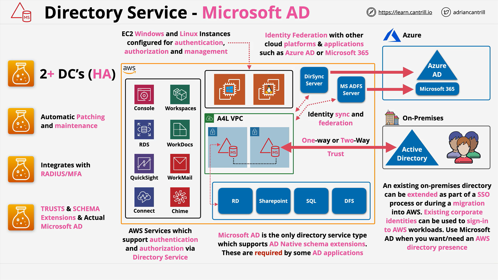

# AWS Directory Service for Microsoft Active Directory (AWS Managed Microsoft AD)

## Overview

This summary distills the LearnCantrill.io SAP-C02 material on **AWS Directory Service for Microsoft Active Directory (AWS Managed Microsoft AD)**. It clarifies what the service is, how it works, when to choose it over **AD Connector** or **Simple AD**, and the exam-relevant trade-offs and pitfalls.

## Key Concepts

- **AWS Managed Microsoft AD** runs **native Microsoft Active Directory (AD)** as a **managed service** in AWS. It is not an emulator.
- Deployed across **at least two Availability Zones (AZs)** with domain controllers (DCs) in each for high availability.
- Managed operations (patching, monitoring, replication, snapshots, maintenance windows) are handled by AWS.
- Supports **Group Policy**, **Single Sign-On**, **schema extensions**, and AD-aware applications (e.g., **SharePoint**, **SQL Server**, **DFS**).
- Supports **one-way and two-way forest/domain trusts** with on-premises AD.
- Supports **RADIUS-based Multi-Factor Authentication (MFA)** by integrating with existing RADIUS infrastructure.
- Can operate **independently of on-premises connectivity** (contrasted with AD Connector).

## Architectures

### Placement and Networking

- AWS hosts DCs in an **AWS-managed VPC**; **ENIs are injected** into **two subnets** that you choose in your **customer-managed VPC**.
- All AD-aware AWS services and workloads in your VPC can use these ENIs to authenticate/authorize against the directory.

### Hybrid with On-Premises AD

- Configure **trusts** (one-way or two-way) between AWS Managed Microsoft AD and your on-premises forest.
- If the WAN link fails, **AWS Managed Microsoft AD continues operating** in AWS (local auth/authorization still works).
- For identity federation with Microsoft ecosystems (e.g., **ADFS**, Azure/Entra integrations), a **full native AD** (as provided here) is required.

## Services and Integrations

Common AWS services that can integrate with AWS Managed Microsoft AD for authentication/authorization:

- **Amazon WorkSpaces**, **WorkDocs**, **WorkMail**, **Amazon Connect**
- **Amazon RDS** for SQL Server (Windows auth), **Amazon EC2** (domain-join, GPOs)
- **Amazon QuickSight** (enterprise identity scenarios)

Windows-centric stacks (e.g., **DFS**, **SharePoint**, **SQL Server**) need a **native AD** and often **schema extensions**, which this service supports.

## Trade-offs and Selection Guidance

### When to Choose AWS Managed Microsoft AD

- You need **native AD features** (GPOs, schema extensions).
- You need **trusts** with on-premises AD.
- You require **resilience independent of on-prem** network connectivity.
- You plan **long-term hybrid** or **AWS-centric** Windows workloads requiring AD.

### When to Choose AD Connector

- You **do not want directory data in AWS**; you want to **proxy** authentication to your **existing on-prem AD**.
- You can tolerate **dependency on on-prem connectivity** (if the link fails, authentication fails).

### When to Choose Simple AD

- **Small, isolated labs/POCs** that do not need native AD features or schema extensions.
- Note: Simple AD is **Samba-based**, not a native Microsoft AD. Compatibility is limited.

## Comparison Table

| Capability / Mode                 | AWS Managed Microsoft AD                               | AD Connector                                 | Simple AD                       |
| --------------------------------- | ------------------------------------------------------ | -------------------------------------------- | ------------------------------- |
| Directory data lives in AWS       | Yes (managed DCs)                                      | No (forwards to on-prem AD)                  | Yes (Samba-based)               |
| Native Microsoft AD               | Yes                                                    | Uses on-prem native AD (proxy)               | No (Samba)                      |
| Trusts with on-prem AD            | **Yes** (one-way and two-way)                          | Not applicable (no AWS-side AD to trust)     | Typically not                   |
| Works if on-prem link is down     | **Yes** (continues operating in AWS)                   | **No** (depends on on-prem connectivity)     | Yes (but limited compatibility) |
| Schema extensions / AD-aware apps | **Yes**                                                | N/A (hosted on-prem side)                    | No (limited)                    |
| RADIUS MFA integration            | **Yes**                                                | **Yes**                                      | Not emphasized                  |
| Typical use                       | Enterprise/hybrid, Windows workloads, trusts, GPO, MFA | Reuse on-prem AD without syncing data to AWS | Small labs/POCs                 |

## Pitfalls and Operational Notes

- **Do not confuse modes**: Only **AWS Managed Microsoft AD** supports **trusts** and **schema extensions** in AWS.
- **AD Connector dependency**: Loses auth if the **WAN link** to on-prem is down.
- **Subnet selection**: You must pick **two subnets** (different AZs) for ENIs; ensure **routing/DNS** allows workloads to reach DCs.
- **Scaling/editions**: Choose the edition sized for your object/user count; plan for growth.
- **MFA wording**: “RADIUS-based MFA” hints at **Managed Microsoft AD** or **AD Connector**. Understand context.

## Common Exam Traps

- **Trust requirement ⇒ Managed Microsoft AD** (not AD Connector or Simple AD).
- **Schema extensions / DFS / SharePoint / SQL Server domain features ⇒ Managed Microsoft AD**.
- **“No directory data in AWS” ⇒ AD Connector**.
- **Resilience during WAN outage ⇒ Managed Microsoft AD** (AD Connector fails).
- **GPO management in AWS ⇒ Managed Microsoft AD** (native AD toolchain).
- **Simple AD** mentioned with enterprise Windows workloads ⇒ **likely incorrect**.

## Key Terms & Definitions

- **AWS Managed Microsoft AD**: Fully managed, **native** Microsoft Active Directory hosted by AWS.
- **AD Connector**: Directory proxy that forwards auth requests from AWS to **on-premises AD**.
- **Simple AD**: Lightweight **Samba-based** directory provided by AWS; not native AD.
- **Trust (AD)**: Relationship allowing users in one domain/forest to access resources in another.
- **RADIUS MFA**: Multi-Factor Authentication using **Remote Authentication Dial-In User Service** backends.
- **GPO (Group Policy Object)**: AD mechanism to apply configuration/policy to users/computers.
