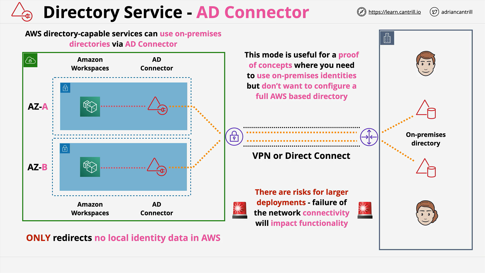

# AWS Directory Service — AD Connector

## Overview

AD Connector is an **AWS Directory Service** mode that exposes **directory endpoints inside your VPC** but **forwards all authentication/authorization** to an existing **on-premises Microsoft Active Directory (AD)**. It stores **no directory data in AWS**. Use it to enable directory-aware AWS services (e.g., **Amazon WorkSpaces**, **Amazon WorkDocs**, **Amazon WorkMail**) to authenticate against your **existing on-prem AD** with minimal AWS-side directory administration.

## Concepts

- **Proxy, not a directory**: AD Connector is a **relay**. It does not host domain controllers, objects, or Group Policy. It forwards LDAP/Kerberos to **on-prem AD**.
- **VPC endpoints**: AWS deploys **Elastic Network Interfaces (ENIs)** for the connector into **two subnets across different Availability Zones (AZs)**.
- **Sizes**: **Small** and **Large** connector sizes determine the compute capacity (i.e., throughput). You can deploy **multiple connectors** to scale.
- **No caching**: Authentication/authorization requires **live connectivity** to on-prem AD. If the link is down, authentication fails.
- **Private connectivity**: Requires **AWS Direct Connect** or **Site-to-Site VPN** from the VPC to on-prem AD.
- **Minimal footprint**: No AD data in AWS (useful for **legal/compliance** constraints preventing directory replication into AWS).

## Architectures

### Typical Deployment

1. **Networking**

   - Two private subnets (different AZs) in your **Amazon VPC**.
   - **Direct Connect** or **Site-to-Site VPN** to on-prem network.

2. **AD Connector**

   - Provisioned into those two subnets (creates ENIs).
   - Configured with **on-prem AD server IPs** and a **service account** to bind/query AD.

3. **AWS Services**

   - AWS services (e.g., **Amazon WorkSpaces**) point to the **AD Connector** as their directory endpoint.
   - Connector forwards auth/authorization to **on-prem AD** over private connectivity.

### Data Flow (high level)

- AWS service → AD Connector in VPC → over VPN/DX → On-prem AD (authZ/authN decision) → response back via Connector → AWS service.

## Services

AD Connector commonly fronts these AWS services so they can authenticate to on-prem AD:

- **Amazon WorkSpaces**
- **Amazon WorkDocs**
- **Amazon WorkMail**
- Other directory-aware integrations that can use Directory Service endpoints.

> Note: For services/features needing **native AD capabilities** (e.g., Group Policy application in AWS, AD schema extensions, trusts), use **AWS Directory Service for Microsoft Active Directory (AWS Managed Microsoft AD)** instead.

## Trade-offs

### Strengths

- **No AD data in AWS** (meets data sovereignty/compliance needs).
- **Fast enablement** for **POCs** and **small deployments** without standing up domain controllers in AWS.
- **Low admin overhead** in AWS (no AD patching/backups/GPO management in the cloud).

### Limitations

- **Connectivity dependency**: If **VPN/DX link** is down, authentication fails (no local cache).
- **Throughput limits**: Size affects performance; may require **multiple connectors** for scale.
- **No native AD in AWS**: No GPOs, no schema extensions, no trusts from the AWS side (because there is no AWS-hosted AD).

### When to Choose

- You must **avoid directory data in AWS**.
- You want **rapid AWS service enablement** using your **existing on-prem AD**.
- You can ensure **highly available network connectivity** between AWS and on-prem.

### When Not to Choose

- You need **continued auth** during WAN outages → use **AWS Managed Microsoft AD**.
- You need **trusts**, **schema extensions**, or **native AD features in AWS** → use **AWS Managed Microsoft AD**.
- You need a **self-contained cloud directory** for large/critical workloads → use **AWS Managed Microsoft AD**.

## Pitfalls

- **Single connection risk**: Using a single VPN/DX is a **single point of failure**; deploy **redundant links** and plan routing/HA.
- **Sizing overlooked**: Under-sized connectors can throttle auth throughput; **load test** and scale horizontally.
- **DNS/routing misconfigurations**: Ensure VPC/subnets, security groups, network ACLs, and DNS resolution allow traffic to on-prem AD.
- **Assuming caching**: There is **no local authentication** if the WAN is down; do not design as if credentials are cached in AWS.

## Comparison Table

| Criterion                             | AD Connector                                       | AWS Managed Microsoft AD                                 | Simple AD                  |
| ------------------------------------- | -------------------------------------------------- | -------------------------------------------------------- | -------------------------- |
| Directory data in AWS                 | **No** (proxy only)                                | **Yes** (native AD hosted by AWS)                        | Yes (Samba-based)          |
| Works if on-prem link is down         | **No**                                             | **Yes**                                                  | Yes                        |
| Needs VPN/DX                          | **Yes**                                            | Recommended for hybrid, not required for local AWS auth  | No                         |
| Trusts (one-/two-way)                 | N/A (no AWS-side AD)                               | **Yes**                                                  | Typically not              |
| Native AD features (GPO, schema ext.) | **No**                                             | **Yes**                                                  | No (limited compatibility) |
| Typical use                           | POCs, small AWS footprints, compliance constraints | Enterprise/hybrid, Windows workloads, advanced scenarios | Small labs/POCs            |

## Common Exam Traps

- **“No directory data in AWS” ⇒ AD Connector**, not Managed Microsoft AD.
- **“Must keep working if WAN to on-prem fails” ⇒ Managed Microsoft AD**, not AD Connector.
- **“Need trusts or schema extensions/GPOs” ⇒ Managed Microsoft AD**, not AD Connector.
- **“Quick POC with on-prem identities” ⇒ AD Connector**.
- **Single VPN mentioned without redundancy + AD Connector** ⇒ call out **availability risk**.

## Key Terms & Definitions

- **AD Connector**: An AWS Directory Service **proxy** that forwards directory requests from AWS to on-prem AD.
- **AWS Managed Microsoft AD**: Fully managed **native Microsoft Active Directory** hosted by AWS.
- **Simple AD**: Lightweight **Samba-based** directory (limited compatibility).
- **ENI (Elastic Network Interface)**: A virtual network interface in a VPC subnet.
- **AWS Direct Connect (DX)**: Dedicated private network connection from on-prem to AWS.
- **Site-to-Site VPN**: IPSec VPN tunnel from on-prem network to AWS VPC.
