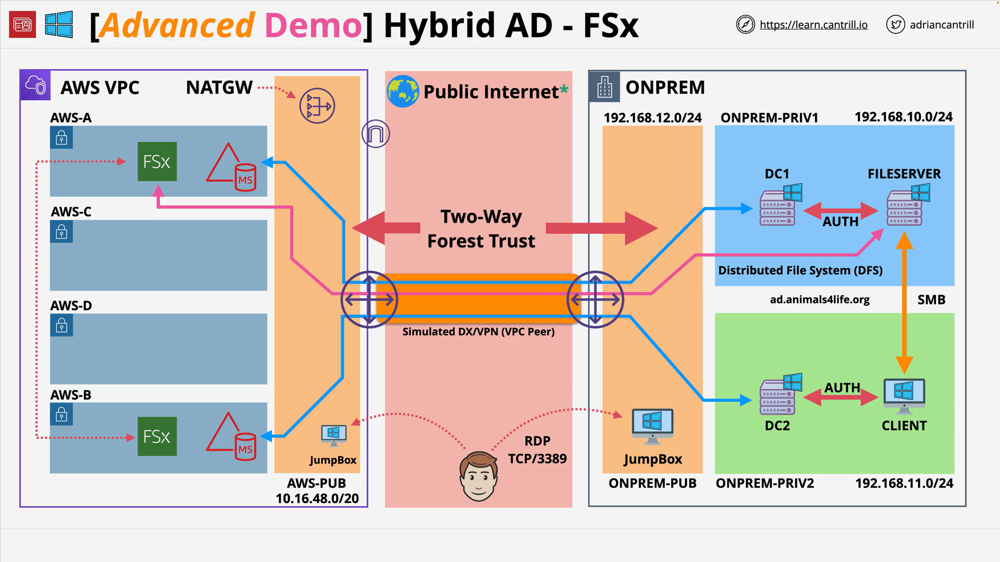

# Implementing a hybrid directory solution in AWS - PART5

## Overview

This stage adds a managed Windows file service using **Amazon FSx for Windows File Server** (FSx) into an existing hybrid Active Directory (AD) setup. With the two-way forest trust already in place between on-premises AD (`ad.animalsforlife.org`) and **AWS Managed Microsoft AD** (`aws.animalsforlife.org`), you will:

- Provision a **multi-AZ, SSD** FSx file system in the AWS VPC and join it to AWS Managed Microsoft AD.
- Validate cross-domain access (from the on-prem Client via DFS and UNC paths).
- Configure **Distributed File System (DFS) Namespaces** to abstract file server endpoints.
- Perform a simple data migration and **cutover** by disabling the on-premises folder target, leaving FSx as the active backend.

**References**

- Instructions and architecture diagrams: [https://github.com/acantril/learn-cantrill-io-labs/tree/master/aws-hybrid-activedirectory/02_LABINSTRUCTIONS](https://github.com/acantril/learn-cantrill-io-labs/tree/master/aws-hybrid-activedirectory/02_LABINSTRUCTIONS)
- One-Click Deployment (HYBRIDDIR): [https://console.aws.amazon.com/cloudformation/home?region=us-east-1#/stacks/quickcreate?templateURL=https://learn-cantrill-labs.s3.amazonaws.com/aws-hybrid-activedirectory/01_HYBRIDDIR.yaml&stackName=HYBRIDDIR](https://console.aws.amazon.com/cloudformation/home?region=us-east-1#/stacks/quickcreate?templateURL=https://learn-cantrill-labs.s3.amazonaws.com/aws-hybrid-activedirectory/01_HYBRIDDIR.yaml&stackName=HYBRIDDIR)

## Concepts

- **Amazon FSx for Windows File Server (FSx)**: Managed SMB file service integrated with AD (supports AWS Managed Microsoft AD or self-managed AD). Multi-AZ provides high availability.
- **DFS (Distributed File System) Namespaces**: A logical path (e.g., `\\domain\private\A4L files`) that redirects users to one of multiple **folder targets** (backing shares).
- **Cutover via DFS**: Point user mappings at a DFS namespace, copy data to FSx, then **disable** the on-prem folder target to complete migration with minimal user disruption.
- **Trust-enabled access**: The existing **two-way forest trust** allows on-prem AD users to access the FSx share joined to AWS Managed Microsoft AD.

## Architectures

### Before

- On-premises Windows file server share: `\\fileserver\A4L files`
- AWS Managed Microsoft AD with trust to on-prem AD
- On-prem Client and jump box access established

### After

- **FSx (multi-AZ, SSD)** joined to `aws.animalsforlife.org`
- UNC path for FSx share (from FSx console): `\\<fsx-dns>\share`
- **DFS namespace** hosted in on-prem AD DNS:
  `\\ad.animalsforlife.org\private\A4L files` → folder targets:

  - `\\fileserver\A4L files` (on-prem)
  - `\\<fsx-dns>\share` (AWS)

### Flow

1. Client browses `\\ad.animalsforlife.org\private\A4L files`.
2. DFS directs user to the closest or enabled target (on-prem or FSx).
3. During migration, copy data to FSx; then **disable** on-prem target.

## Services

- **Amazon FSx for Windows File Server**: Managed SMB, AD-joined, Windows-compatible features.
- **AWS Managed Microsoft AD**: Target directory for FSx domain join.
- **Amazon EC2 (Windows)**: Jump boxes and the on-prem Client (simulated).
- **Windows Server DFS**: Namespace management and (optionally) DFS Replication for staged migrations.

## Procedure (Step-by-Step)

1. **Create FSx for Windows File Server**

   - Console → **FSx** → **Create file system** → **Amazon FSx for Windows File Server**.
   - Name: `A4L files`.
   - Deployment type: **Multi-AZ**.
   - Storage type: **SSD**; capacity: **32 GiB** (minimum for the demo).
   - Networking: Select the **AWS VPC**, security group `*instance-sg*`, subnets `AWS-Private-A` and `AWS-Private-B`.
   - Windows authentication: **AWS Managed Microsoft AD** → select `aws.animalsforlife.org`.
   - Create and wait until **Available**.

2. **Validate access from on-prem**

   - From the on-prem Client, open Explorer → `\\<fsx-dns>\share` to confirm access (enabled by the forest trust and delegated admin membership established in Stage 4).

3. **Create DFS Namespace and folder targets (on-prem)**

   - DFS Management → **New Namespace**:

     - Host: `DC1`.
     - Name: `private`.
     - Domain-based namespace: `\\ad.animalsforlife.org\private`.

   - In `private`, **New Folder**: `A4L files`.
   - **Add Folder Targets**:

     - On-prem: `\\fileserver\A4L files`.
     - AWS: `\\<fsx-dns>\share`.

   - Skip DFS Replication creation (demo uses manual copy).

4. **Migrate data and cut over**

   - Copy data from `\\fileserver\A4L files` → `\\<fsx-dns>\share`.
   - In DFS Management, **disable** the on-prem folder target for `A4L files`.
     Result: Namespace now directs users only to FSx.

## Trade-offs

- **Multi-AZ vs. cost**: Multi-AZ improves availability but increases cost; suitable for production shares.
- **Manual copy vs. DFS Replication**: Manual copy is simple for small datasets; DFS Replication is preferred for large, staged cutovers.
- **AWS Managed Microsoft AD vs. self-managed AD integration**: FSx supports both. Using AWS Managed Microsoft AD reduces admin overhead; self-managed AD offers tighter control but more maintenance.

## Pitfalls

- **Wrong directory selection** during FSx creation (must join FSx to the intended directory).
- **Skipping DFS namespace**: Direct UNC cutover forces user remapping. A namespace allows a seamless switch by toggling folder targets.
- **Not validating cross-domain access**: Ensure trust and group membership (from Stage 4) before attempting FSx access from on-prem.
- **Forgetting to disable the old target**: Users may still hit the on-prem server; explicitly disable it to finalize cutover.

## Comparison Table — On-prem File Server vs. Amazon FSx for Windows

| Dimension   | On-prem Windows File Server | Amazon FSx for Windows File Server                                 |
| ----------- | --------------------------- | ------------------------------------------------------------------ |
| Ownership   | Customer-managed            | AWS-managed                                                        |
| HA          | Customer-built clustering   | **Multi-AZ** option built-in                                       |
| AuthZ/AuthN | AD (on-prem)                | AD (AWS Managed Microsoft AD or self-managed AD)                   |
| Scaling     | Hardware/VM constrained     | Elastic capacity choices; managed backups/snapshots                |
| Migration   | Manual/DFS-R                | DFS namespace + DFS-R/manual copy; easy cutover via folder targets |

## Key Terms & Definitions

- **FSx for Windows File Server (FSx)**: Managed SMB file shares, AD-integrated, Windows-compatible features.
- **DFS Namespace**: Logical path to one or more **folder targets** (backing shares).
- **Folder Target**: The actual share behind a DFS folder (e.g., `\\fileserver\A4L files`, `\\<fsx-dns>\share`).
- **Two-way Forest Trust**: Bidirectional trust allowing cross-forest authentication and authorization.

## Common Exam Traps

- **Assuming AD Connector suffices for trust**: Forest trusts and domain joins for managed services (like FSx) rely on **AWS Managed Microsoft AD** or self-managed AD; AD Connector is a proxy, not a directory.
- **Overlooking DFS for cutover**: DFS namespaces enable seamless endpoint changes; without them, migrations disrupt user mappings.
- **Ignoring availability mode**: **Multi-AZ** is the high-availability choice for FSx; Single-AZ is not equivalent for resilience.

## References

- [https://github.com/acantril/learn-cantrill-io-labs/tree/master/aws-hybrid-activedirectory/02_LABINSTRUCTIONS](https://github.com/acantril/learn-cantrill-io-labs/tree/master/aws-hybrid-activedirectory/02_LABINSTRUCTIONS)
- [https://console.aws.amazon.com/cloudformation/home?region=us-east-1#/stacks/quickcreate?templateURL=https://learn-cantrill-labs.s3.amazonaws.com/aws-hybrid-activedirectory/01_HYBRIDDIR.yaml&stackName=HYBRIDDIR](https://console.aws.amazon.com/cloudformation/home?region=us-east-1#/stacks/quickcreate?templateURL=https://learn-cantrill-labs.s3.amazonaws.com/aws-hybrid-activedirectory/01_HYBRIDDIR.yaml&stackName=HYBRIDDIR)
