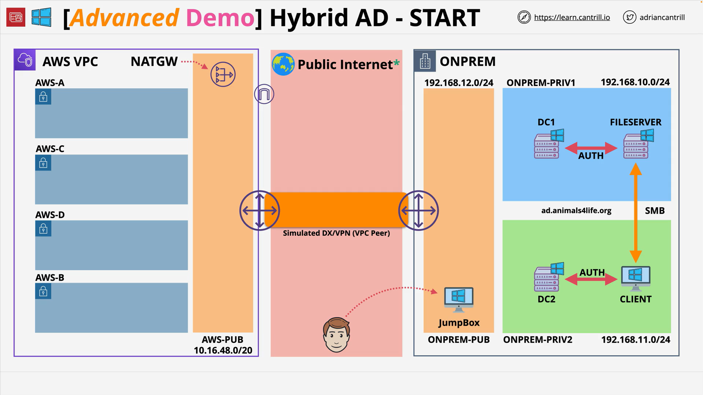

# Implementing a hybrid directory solution in AWS - PART1

## Overview

This advanced demo walks through building a **hybrid identity lab** that simulates an on-premises Microsoft Active Directory (AD) environment and connects it to AWS. You provision a full lab via **CloudFormation** (nested stacks), then use **AWS Directory Service (managed AD)**, **Amazon FSx for Windows File Server (FSx)**, and **Amazon WorkSpaces** to mimic a real migration from on-premises file/VDI services to AWS. The “on-premises” side is simulated with Windows Server VMs in a separate VPC, connected to the AWS side via **VPC peering** (standing in for Direct Connect/VPN in production).

Time/cost: Expect ~60 minutes for automated provisioning and 1–2 hours of hands-on steps. Resources are **outside the free tier**.

## Concepts

- **Hybrid Identity (Simulated):** Two environments:

  - **On-premises (simulated)** VPC with Windows Server domain controllers, a file server, and a client VM.
  - **AWS side** with subnets across multiple Availability Zones (AZs) to host managed directory/file/desktop services.

- **AWS Directory Service (Managed Microsoft AD):** Fully managed native AD domain controllers hosted by AWS, placed in two subnets (multi-AZ) in your VPC. Used by AWS services for authentication/authorization.
- **Amazon FSx for Windows File Server:** Managed SMB file shares backed by Windows file services and integrated with AD.
- **Amazon WorkSpaces:** Managed Desktop-as-a-Service that integrates with a directory for user auth.
- **Connectivity Model:** Real deployments use **AWS Direct Connect** with **Site-to-Site VPN** as backup. The lab uses **VPC peering** to simulate this link for simplicity.
- **Nested Stacks:** The one-click template launches a parent CloudFormation stack that orchestrates multiple child stacks to build “on-prem” and AWS infrastructure in sequence.

## Architectures

### High-Level Layout

- **Simulated On-Prem VPC**

  - 2× Windows domain controllers (AD `ad.animalsforlife.org`)
  - 1× Windows file server
  - 1× Windows client (represents a VDI/Remote Desktop Services seat)

- **AWS Side VPC**

  - Public subnet and four private subnets across **four AZs**
  - Directory Service (managed AD), FSx, and WorkSpaces as target managed services

- **Inter-VPC Connectivity**

  - **VPC peering** between the two VPCs (lab stand-in for DX/VPN)

### Component Roles

| Component                      | Purpose                              | Notes                                            |
| ------------------------------ | ------------------------------------ | ------------------------------------------------ |
| Simulated AD DCs               | Authentication/authorization         | Native Windows AD domain `ad.animalsforlife.org` |
| File server                    | SMB shares (source for migration)    | Windows Server                                   |
| Client VM                      | User desktop to test auth/fileshares | Windows Server (simulated desktop)               |
| Directory Service (Managed AD) | AWS-hosted AD for services           | Multi-AZ, managed patching/backups               |
| FSx for Windows File Server    | Managed SMB storage                  | AD-joined, NTFS ACLs, SMB semantics              |
| WorkSpaces                     | Managed VDI                          | Auth against directory                           |

## Services

- **AWS Directory Service for Microsoft Active Directory (Managed Microsoft AD):** Provides native AD inside VPC for AWS services.
- **Amazon FSx for Windows File Server:** AD-integrated SMB file storage for Windows workloads.
- **Amazon WorkSpaces:** Virtual desktops that rely on directory integration.
- **Amazon VPC:** Networking foundation for simulated on-prem and AWS sides; uses **VPC peering** in the lab.
- **AWS CloudFormation (nested stacks):** One-click provisioning of all resources.

## Step-by-Step (Setup Stage)

1. **Prerequisites**

   - AWS account with **administrator** permissions in **us-east-1 (N. Virginia)**.
   - Accept that resources incur **non-free-tier charges**.

2. **Create an EC2 Key Pair**

   - Console: **EC2 → Network & Security → Key Pairs → Create key pair**.
   - Name it **`A4L`** (Animals for Life).
   - **PEM** for macOS/Linux/Windows OpenSSH; **PPK** for PuTTY on Windows.
   - Download and store the private key securely.

3. **Launch the One-Click CloudFormation**

   - Open the **HYBRIDDIR** quick create link (see References).
   - Provide parameters:

     - **DomainAdminPassword**: Strong password for the domain admin (use a password manager).
     - **KeyPairName**: Select **`A4L`** (required).

   - Acknowledge capabilities and **Create stack**.

4. **Wait for Provisioning**

   - The parent stack creates **nested stacks** for:

     - Simulated on-prem VPC
     - On-prem directory
     - On-prem compute
     - AWS-side infrastructure

   - Wait until **all stacks** show **CREATE_COMPLETE** (≈ 60 min ± 20).

5. **Proceed to Hands-On Tasks**

   - Connect via a jump box in the simulated on-prem VPC.
   - Follow the lab instructions to integrate **Directory Service**, **FSx**, and **WorkSpaces** as you simulate migration steps.

## Trade-offs

- **Why managed services?**

  - Offloads patching/operations (Managed AD, FSx, WorkSpaces).
  - Faster time-to-value for Windows workloads and identity-bound services.

- **Why VPC peering in the lab?**

  - Simpler to provision. In production, prefer **Direct Connect** with **VPN** backup for deterministic bandwidth and durability.

- **Nested stacks**

  - Clear separation of concerns and easier teardown.
  - Longer initial provisioning time due to dependency ordering.

## Pitfalls

- **Forgetting the key pair:** If **KeyPairName** is not supplied, the stack will fail to create instances.
- **Weak/invalid domain admin password:** Can break AD initialization steps.
- **Assuming free-tier:** This demo uses services that incur **charges**; set budgets/alerts.
- **Treating VPC peering as production hybrid connectivity:** Real hybrid uses **DX/VPN**; peering in the lab is a simulation only.
- **IAM/region mismatches:** Ensure **us-east-1** is selected for the lab templates and resources.

## Key Terms & Definitions

- **AWS Directory Service for Microsoft Active Directory (Managed Microsoft AD):** Fully managed native AD with multi-AZ domain controllers in your VPC.
- **Amazon FSx for Windows File Server:** Managed Windows file server with SMB, NTFS ACLs, AD integration.
- **Amazon WorkSpaces:** Managed persistent virtual desktops (Windows/Linux) integrated with a directory.
- **VPC Peering:** Non-transitive, point-to-point routing link between VPCs.
- **Direct Connect (DX):** Private, dedicated network link from on-prem to AWS.
- **Site-to-Site VPN:** IPSec tunnel from on-prem network to AWS VPC.

## Common Exam Traps

- **“Must use existing on-prem identities, minimal AWS directory footprint”** → Consider **AD Connector** (proxy) for POCs, or **Managed Microsoft AD** if you need native AD in AWS and to operate during WAN outages.
- **“Need native AD features (GPOs, trusts, schema extensions)”** → **Managed Microsoft AD**, not Simple AD/AD Connector.
- **“Hybrid connectivity”** → In production, expect **DX + VPN**; VPC peering is not a hybrid WAN solution.
- **“Windows SMB file shares, AD-joined”** → **FSx for Windows File Server** integrates cleanly with Managed AD.

## References

- Instructions and Architecture diagrams:
  [https://github.com/acantril/learn-cantrill-io-labs/tree/master/aws-hybrid-activedirectory/02_LABINSTRUCTIONS](https://github.com/acantril/learn-cantrill-io-labs/tree/master/aws-hybrid-activedirectory/02_LABINSTRUCTIONS)
- One-Click Deployment HYBRIDDIR:
  [https://console.aws.amazon.com/cloudformation/home?region=us-east-1#/stacks/quickcreate?templateURL=https://learn-cantrill-labs.s3.amazonaws.com/aws-hybrid-activedirectory/01_HYBRIDDIR.yaml&stackName=HYBRIDDIR](https://console.aws.amazon.com/cloudformation/home?region=us-east-1#/stacks/quickcreate?templateURL=https://learn-cantrill-labs.s3.amazonaws.com/aws-hybrid-activedirectory/01_HYBRIDDIR.yaml&stackName=HYBRIDDIR)

### Updated Information (as of 2025-09-29)

- **Terminology/Service names unified:** Used **“AWS Directory Service for Microsoft Active Directory (Managed Microsoft AD)”** and **“Amazon FSx for Windows File Server”** consistently, reflecting current AWS naming.
- **Console path confirmation:** **EC2 → Network & Security → Key Pairs** remains the correct path for creating key pairs in the current console experience.
- **Hybrid connectivity guidance:** Clarified that **VPC peering** in the lab is a simulation; the **current recommended approach** for production hybrid is **AWS Direct Connect** with **Site-to-Site VPN** failover.
