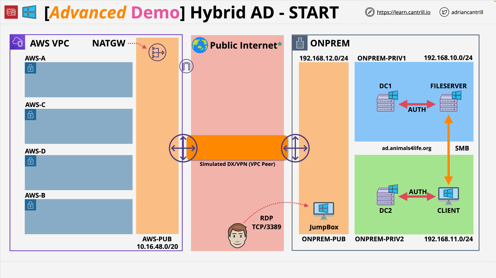

# Implementing a hybrid directory solution in AWS - PART2

## Overview

This stage validates the environment created by the one-click CloudFormation stack and establishes access to the **simulated on-premises** network via a Windows **jump box**. From the jump box you connect to a **Client** VM (joined to the on-premises Active Directory domain), verify the **file server** share, and confirm **Active Directory** objects. This prepares you for later stages where you deploy **AWS Directory Service for Microsoft Active Directory** in AWS and configure trust.

**What you should have now (CREATE_COMPLETE):**

- 1 parent CloudFormation stack plus 4 nested stacks:
  on-prem VPC, AWS VPC, on-prem self-managed AD, on-prem compute.

**What you will do in this stage:**

- Obtain the jump box **Public IPv4 DNS**.
- Decrypt the Windows **Administrator** password using your **A4L** key pair.
- RDP from your workstation to the **jump box**, then RDP from the jump box to the **Client** VM with **domain credentials**.
- Verify the **file share** and **AD** objects.

**References**

- Instructions and Architecture diagrams:
  [https://github.com/acantril/learn-cantrill-io-labs/tree/master/aws-hybrid-activedirectory/02_LABINSTRUCTIONS](https://github.com/acantril/learn-cantrill-io-labs/tree/master/aws-hybrid-activedirectory/02_LABINSTRUCTIONS)
- One-Click Deployment (HYBRIDDIR):
  [https://console.aws.amazon.com/cloudformation/home?region=us-east-1#/stacks/quickcreate?templateURL=https://learn-cantrill-labs.s3.amazonaws.com/aws-hybrid-activedirectory/01_HYBRIDDIR.yaml&stackName=HYBRIDDIR](https://console.aws.amazon.com/cloudformation/home?region=us-east-1#/stacks/quickcreate?templateURL=https://learn-cantrill-labs.s3.amazonaws.com/aws-hybrid-activedirectory/01_HYBRIDDIR.yaml&stackName=HYBRIDDIR)

## Concepts

- **Jump box (bastion)**: Publicly reachable Windows EC2 instance used to access private instances in the on-prem VPC.
- **RDP (Remote Desktop Protocol)**: Used to connect to Windows instances (jump box and Client).
- **Key-pair based password decryption**: EC2 console feature to decrypt the Windows **Administrator** password using the private key you created earlier (**A4L**).
- **Simulated on-premises AD**: Two domain controllers (DC1/DC2), a File Server with an SMB share, and a Client VM; all inside the “on-premises” VPC.
- **Verification before migration**: Prove you can authenticate to the domain, reach the file server share, and view AD objects.

## Architectures

### Stage-2 Topology (Simulated On-Prem Focus)

- **On-prem VPC**

  - **Jump box** (publicly accessible; RDP entry point)
  - **DC1/DC2** (Windows AD domain `ad.animalsforlife.org`)
  - **File Server** (SMB share `\\fileserver\A4L files`)
  - **Client** (domain-joined; used to simulate an on-prem virtual desktop)

- **AWS VPC**

  - Provisioned but not yet used in this stage.

- **Connectivity**

  - Jump box exposes a **Public IPv4 DNS** for first-hop access.
  - Internal connections (jump box → Client/File Server/DCs) use **private IPs**.

## Services

- **AWS CloudFormation**: Deployed the environment using nested stacks.
- **Amazon EC2**: Hosts the jump box and on-prem Windows servers.
- **Windows Server / Active Directory**: On-prem domain services and tools (AD Users and Computers).
- **RDP clients**:

  - Windows: built-in Remote Desktop Connection.
  - macOS: Microsoft Remote Desktop app.
  - Linux: common RDP clients (varies by distro).

## Step-by-Step

1. **Confirm stack creation**

   - In the CloudFormation console, verify 1 parent + 4 nested stacks are **CREATE_COMPLETE**:

     - On-prem VPC, AWS VPC, On-prem AD, On-prem Compute.

2. **Locate the jump box**

   - EC2 console → **Instances** → select **jump box**.
   - Note the **Public IPv4 DNS** (this is the host you RDP to from your workstation).

3. **Decrypt the Windows password (jump box)**

   - With the jump box selected: **Connect → RDP client → Get password**.
   - **Upload Private Key File**: select your **A4L** `.pem` (or `.ppk`) file.
   - Click **Decrypt Password**; copy the **Administrator** password.

4. **RDP to the jump box (from your workstation)**

   - Use the **Public IPv4 DNS** and credentials:

     - Username: `Administrator`
     - Password: (decrypted in step 3)

5. **Gather private IPs of on-prem servers**

   - In EC2 **Instances**, note the **private IPs** for **DC1**, **DC2**, **File Server**, and **Client** for easy reference.

6. **RDP from jump box → Client VM (domain auth)**

   - On the jump box, open **Remote Desktop Connection**.
   - Enter the **Client** private IP.
   - Credentials (UPN format):

     - Username: `admin@ad.animalsforlife.org`
     - Password: the **domain admin password** used during stack launch.

7. **Verify file server share and create a test file**

   - From the Client, open Windows Explorer.
   - Go to `\\fileserver\A4L files`.
   - Create a text file (e.g., `what animals are the best.txt`) and save content.

8. **Verify Active Directory objects**

   - On the Client, open **Active Directory Users and Computers**.
   - Confirm:

     - Domain: `ad.animalsforlife.org`
     - Users: `admin`
     - Computers: `client`, `fileserver`
     - Domain Controllers: `DC1`, `DC2`

9. **Ready for next stage**

   - You can now proceed to deploy **AWS Directory Service for Microsoft Active Directory** in the AWS VPC and later configure trust.

## Trade-offs

- **Jump box vs. direct access**: A jump box simplifies access but is another credentialed endpoint to protect. Direct VPN/DX access removes the public hop but adds network prerequisites.
- **Admin account for speed vs. least privilege**: Using the domain admin simplifies the demo; production follows least privilege and role separation.
- **Key management**: Storing the private key locally is convenient; ensure proper handling and rotation in real environments.

## Pitfalls

- **Wrong credential form**: Use the **UPN format** (`admin@ad.animalsforlife.org`) when authenticating to the Client.
- **Missing key pair**: You must use the exact key pair created earlier to decrypt the jump box Administrator password.
- **Copying the wrong address**: Use **Public IPv4 DNS** for the first RDP hop (jump box), then **private IPs** inside the VPC.
- **Client app mismatch**: Ensure you have a suitable RDP client installed on macOS or Linux before attempting connections.

## Key Terms & Definitions

- **Jump box (bastion)**: A publicly reachable host used as the first hop into private networks.
- **UPN (User Principal Name)**: Username format `user@domain`, recommended for AD logon.
- **Active Directory Users and Computers (ADUC)**: MMC snap-in to manage AD objects.
- **Nested stack**: A CloudFormation stack launched by another stack, used to modularize deployments.

## Common Exam Traps

- **Assuming direct access**: In labs, a jump box is common. In production, access usually flows over **VPN/Direct Connect** and does not expose RDP publicly.
- **Confusing identity scopes**: On-prem self-managed AD (this stage) vs. **AWS Directory Service for Microsoft AD** (next stage). They are separate directories until trust is configured.

## References

- [https://github.com/acantril/learn-cantrill-io-labs/tree/master/aws-hybrid-activedirectory/02_LABINSTRUCTIONS](https://github.com/acantril/learn-cantrill-io-labs/tree/master/aws-hybrid-activedirectory/02_LABINSTRUCTIONS)
- [https://console.aws.amazon.com/cloudformation/home?region=us-east-1#/stacks/quickcreate?templateURL=https://learn-cantrill-labs.s3.amazonaws.com/aws-hybrid-activedirectory/01_HYBRIDDIR.yaml&stackName=HYBRIDDIR](https://console.aws.amazon.com/cloudformation/home?region=us-east-1#/stacks/quickcreate?templateURL=https://learn-cantrill-labs.s3.amazonaws.com/aws-hybrid-activedirectory/01_HYBRIDDIR.yaml&stackName=HYBRIDDIR)

### Updated Information

- Corrected credential example to **UPN format** `admin@ad.animalsforlife.org` (the transcript showed “admin.at.”).
- Standardized OS naming to **macOS** and clarified using **Public IPv4 DNS** for the jump box, then **private IPs** internally.
- Corrected UI wording to **Decrypt Password** (instead of “Becrypt Password”) in the EC2 console flow.
