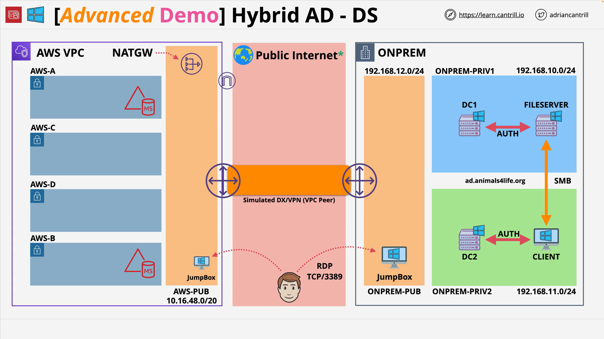

# Implementing a hybrid directory solution in AWS - PART3

## Overview

This stage provisions a managed **AWS Directory Service for Microsoft Active Directory (AWS Managed Microsoft AD)** in the AWS VPC and launches an **AWS-side jump box** (Windows EC2 instance) that is **domain-joined** to this directory. You then install the **Active Directory administration tools** on the jump box to manage the AWS directory. This prepares the environment for configuring a **two-way trust** with the on-premises directory in the next stage.

**Stage outcomes**

- A managed Microsoft AD directory deployed in two subnets (multi-AZ) in the AWS VPC.
- An AWS jump box (Windows) joined to the AWS directory.
- AD administrative tools installed on the AWS jump box; connectivity and management verified.

**References**

- Instructions and architecture diagrams:
  [https://github.com/acantril/learn-cantrill-io-labs/tree/master/aws-hybrid-activedirectory/02_LABINSTRUCTIONS](https://github.com/acantril/learn-cantrill-io-labs/tree/master/aws-hybrid-activedirectory/02_LABINSTRUCTIONS)
- One-Click Deployment (HYBRIDDIR):
  [https://console.aws.amazon.com/cloudformation/home?region=us-east-1#/stacks/quickcreate?templateURL=https://learn-cantrill-labs.s3.amazonaws.com/aws-hybrid-activedirectory/01_HYBRIDDIR.yaml&stackName=HYBRIDDIR](https://console.aws.amazon.com/cloudformation/home?region=us-east-1#/stacks/quickcreate?templateURL=https://learn-cantrill-labs.s3.amazonaws.com/aws-hybrid-activedirectory/01_HYBRIDDIR.yaml&stackName=HYBRIDDIR)

## Concepts

- **AWS Directory Service for Microsoft AD (AWS Managed Microsoft AD)**: A fully managed, native Microsoft Active Directory running in your AWS account/VPC; supports trusts with on-prem AD.
- **Domain separation**: The AWS directory and on-prem directory remain distinct (different **DNS** and **NetBIOS** names) until a trust is configured.
- **High availability (HA)**: The managed directory injects endpoints into **two subnets in different Availability Zones**.
- **AWS jump box (AWS-side)**: A Windows instance in the AWS VPC, domain-joined to the AWS directory and used to administer it.
- **RSAT/AD tools**: Remote Server Administration Tools (e.g., AD Users and Computers) installed on the jump box to manage the AWS directory.

## Architectures

### Components in this stage

| Component                            | Placement                                    | Purpose                                      | Notes                                                         |
| ------------------------------------ | -------------------------------------------- | -------------------------------------------- | ------------------------------------------------------------- |
| AWS Managed Microsoft AD             | AWS VPC (two private subnets, different AZs) | Directory for AWS workloads and future trust | Choose **Standard** or **Enterprise** (course uses Standard). |
| AWS Jump Box (Windows)               | AWS VPC (public subnet)                      | Administrative workstation for AWS directory | Auto-join to AWS directory at launch.                         |
| On-prem Directory (from prior stage) | On-prem VPC                                  | Separate self-managed AD                     | Trust configured in the next stage.                           |

### Network placement

- **Directory**: Select the **AWS VPC** and two **private** subnets (AZ-A and AZ-B).
- **Jump box**: Place in the **AWS public subnet** with a **public IP** for RDP access from your workstation.

## Services

- **AWS Directory Service for Microsoft AD**: Managed AD with multi-AZ deployment and trust support.
- **Amazon EC2**: Hosts the AWS jump box; supports **domain join** during instance launch.
- **Active Directory Admin Tools (RSAT)** on Windows: ADUC and related consoles used to manage the AWS directory.

## Step-by-Step

1. **Create the AWS directory**

   - Directory Service → **Set up directory** → **AWS Directory Service for Microsoft Active Directory**.
   - Edition: **Standard** (per lab).
   - DNS name (AWS side): e.g., `aws.animalsforlife.org`.
   - NetBIOS name (AWS side): e.g., `A4LAWS` (≤15 chars).
   - **Admin password**: set and retain (lab uses the same as on-prem for simplicity).
   - VPC: select the **AWS VPC** created by the stack.
   - Subnets: **AWS-private-A** and **AWS-private-B** (two AZs).
   - Create and wait until **Active** (can take ~30 minutes).

2. **Launch the AWS jump box (Windows)**

   - EC2 → **Launch instance**:

     - Name: `jumpbox-aws`.
     - AMI: **Microsoft Windows Server Base** (latest available).
     - Instance type: `t3.medium`.
     - Key pair: `A4L` (created earlier in the course).
     - **Network settings**:

       - VPC: **AWS VPC**.
       - Subnet: **AWS-public** (assign public IP = **Enable**).
       - Security group: the one for AWS VPC instances (per stack naming).

     - **Advanced details**:

       - **IAM instance profile**: the profile provided by the stack (per lab naming).
       - **Directory (domain join)**: select the **AWS Managed Microsoft AD** created above.

   - Launch and wait for **running** with **2/2 checks passed**.

3. **RDP to the AWS jump box**

   - Use the instance **Public IPv4 DNS**.
   - Credentials: **domain** account for the AWS directory, e.g.
     `admin@aws.animalsforlife.org` and the admin password you set for the AWS directory.

4. **Install AD admin tools on the jump box**

   - Open **Windows PowerShell** as **Administrator**.
   - Run the **RSAT/AD tools** installation command as provided in the course instructions (see Reference).
     Wait for completion and **restart** the instance.
   - After restart, open **Active Directory Users and Computers** and confirm you can manage `aws.animalsforlife.org`.

## Trade-offs

- **Managed AD vs. AD Connector**: Managed AD stores directory data in AWS and supports trusts; AD Connector does not store data and requires constant on-prem connectivity (no trusts hosted in AWS).
- **Single vs. multiple admin workstations**: A single AWS jump box simplifies labs; production typically employs least-privilege, hardened admin hosts, and just-in-time access.
- **Public RDP to jump box vs. private access**: Public access is simple for labs; production prefers VPN/Direct Connect, SSM Session Manager, or bastion hardening.

## Pitfalls

- **Naming collisions**: The AWS directory must use a **different DNS and NetBIOS** name than the on-prem directory.
- **Subnet selection**: Failing to place the directory in **two distinct AZ subnets** undermines HA.
- **Domain-join omission**: Not selecting the **Directory (domain join)** option during EC2 launch leads to local-only accounts and failed AD tool usage.
- **Credential scope confusion**: Use `admin@aws.animalsforlife.org` for the AWS jump box (AWS directory), not the on-prem domain.

## Key Terms & Definitions

- **AWS Managed Microsoft AD**: AWS-managed, native Microsoft Active Directory in your VPC.
- **NetBIOS name**: Legacy short name for an AD domain (≤15 characters).
- **Domain join at launch**: EC2 integration that automatically joins a Windows instance to a selected directory.
- **RSAT**: Remote Server Administration Tools, including ADUC and related consoles.

## Common Exam Traps

- **Choosing Simple AD or AD Connector when a trust is required**: Trusts require **AWS Managed Microsoft AD**.
- **Overlooking multi-AZ placement**: Managed AD deploys across two subnets for HA—expect this in scenario questions.
- **Mixing domain credentials**: AWS jump box authentication must use the **AWS directory** UPN, not the on-prem UPN.

## References

- [https://github.com/acantril/learn-cantrill-io-labs/tree/master/aws-hybrid-activedirectory/02_LABINSTRUCTIONS](https://github.com/acantril/learn-cantrill-io-labs/tree/master/aws-hybrid-activedirectory/02_LABINSTRUCTIONS)
- [https://console.aws.amazon.com/cloudformation/home?region=us-east-1#/stacks/quickcreate?templateURL=https://learn-cantrill-labs.s3.amazonaws.com/aws-hybrid-activedirectory/01_HYBRIDDIR.yaml&stackName=HYBRIDDIR](https://console.aws.amazon.com/cloudformation/home?region=us-east-1#/stacks/quickcreate?templateURL=https://learn-cantrill-labs.s3.amazonaws.com/aws-hybrid-activedirectory/01_HYBRIDDIR.yaml&stackName=HYBRIDDIR)

### Updated Information

- Standardized the product name to **AWS Directory Service for Microsoft Active Directory (AWS Managed Microsoft AD)**.
- Corrected domain naming typos to use `animalsforlife.org` consistently for clarity in this stage’s examples.
