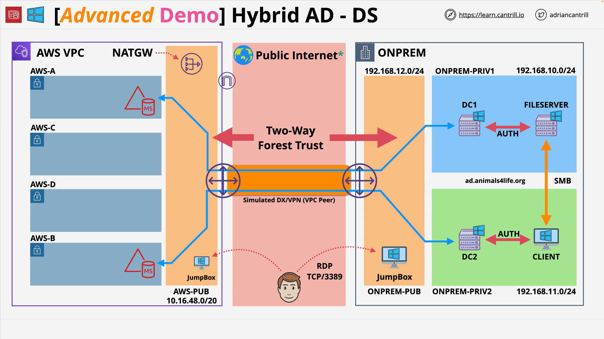

# Implementing a hybrid directory solution in AWS - PART4

## Overview

This stage integrates two independent Microsoft Active Directory (AD) environments—a self-managed on-premises AD (`ad.animalsforlife.org`) and **AWS Directory Service for Microsoft Active Directory** (`aws.animalsforlife.org`)—by preparing both sides and creating a **two-way forest trust**. Preparation includes verifying **Kerberos preauthentication** settings and configuring **conditional DNS forwarders** in both directions. The trust then enables cross-domain authentication and controlled authorization (e.g., using an on-prem admin to manage the AWS AD).

**Outcome**

- Bidirectional name resolution via conditional forwarders.
- AWS Managed Microsoft AD egress allows communication to on-prem DCs.
- Two-way forest trust created and verified.
- On-prem admin added to an AWS AD admin group; sign-in to the AWS jump box validated using on-prem credentials.

**References**

- Instructions and architecture diagrams: [https://github.com/acantril/learn-cantrill-io-labs/tree/master/aws-hybrid-activedirectory/02_LABINSTRUCTIONS](https://github.com/acantril/learn-cantrill-io-labs/tree/master/aws-hybrid-activedirectory/02_LABINSTRUCTIONS)
- One-Click Deployment (HYBRIDDIR): [https://console.aws.amazon.com/cloudformation/home?region=us-east-1#/stacks/quickcreate?templateURL=https://learn-cantrill-labs.s3.amazonaws.com/aws-hybrid-activedirectory/01_HYBRIDDIR.yaml&stackName=HYBRIDDIR](https://console.aws.amazon.com/cloudformation/home?region=us-east-1#/stacks/quickcreate?templateURL=https://learn-cantrill-labs.s3.amazonaws.com/aws-hybrid-activedirectory/01_HYBRIDDIR.yaml&stackName=HYBRIDDIR)

## Concepts

- **Two-way forest trust**: Mutual trust between AD forests; either side can authenticate users for the other, with access governed by authorization.
- **Kerberos preauthentication**: Default AD requirement. Keep **enabled** (checkbox “Do not require Kerberos preauthentication” must be **unchecked**) for the users you test with.
- **Conditional DNS forwarder**: Forwards DNS queries for one domain to specific DNS servers in the other forest; required on **both** sides so each forest can resolve the other’s DCs.
- **AWS Managed Microsoft AD egress**: The directory’s security group must allow outbound traffic to on-prem domain controller (DC) IPs/CIDRs for DNS and trust operations.

## Architectures

### Components used in this stage

| Area         | On-premises                                               | AWS                                                            |
| ------------ | --------------------------------------------------------- | -------------------------------------------------------------- |
| AD           | Self-managed AD (`ad.animalsforlife.org`) with DC1, DC2   | AWS Managed Microsoft AD (`aws.animalsforlife.org`)            |
| DNS          | AD-integrated DNS on DCs                                  | Managed DNS endpoints (two IPs from Directory Service console) |
| Admin Hosts  | Jump box → RDP to **Client** VM                           | Windows **AWS jump box** (domain-joined to AWS AD)             |
| Connectivity | Simulated via VPC peering (represents VPN/Direct Connect) | Security group on directory adjusted for egress to on-prem DCs |

### Trust flow

1. Verify Kerberos preauthentication setting on a representative account in **each** forest.
2. Configure **conditional forwarder** (on-prem → AWS).
3. Adjust **AWS Managed Microsoft AD** security group outbound to permit traffic to on-prem DCs/CIDRs.
4. Create **two-way forest trust** from on-prem AD (Domains and Trusts).
5. Create the reciprocal trust entry in **AWS Directory Service** (includes on-prem DC IPs for conditional forwarding).
6. Verify status is **Verified**; test cross-domain administration.

## Services

- **AWS Directory Service for Microsoft AD**: Managed, native Microsoft AD (multi-AZ) with trust support.
- **Amazon EC2 (Windows)**: Jump boxes for administration and validation.
- **Amazon VPC / Security Groups**: Egress control for the directory to reach on-prem DCs.
- **Windows Server AD tools**: AD Users and Computers (ADUC), DNS Manager, AD Domains and Trusts.

## Procedure (Step-by-Step)

1. **On-prem AD: Kerberos preauthentication**

   - ADUC → Users → `admin` → Properties → **Account** → ensure **Do not require Kerberos preauthentication** is **unchecked**.

2. **On-prem DNS: conditional forwarder to AWS**

   - DNS Manager targeting **DC1** → **Conditional Forwarders** → **New**

     - Domain: `aws.animalsforlife.org`
     - DNS servers: paste the **two AWS Managed Microsoft AD DNS IPs** from the Directory Service console.
     - Store in AD; replicate to **all DNS servers in this domain**.

3. **AWS directory egress**

   - Find the **AWS-created security group** attached to the directory.
   - Outbound rules → add **allow** to the **on-prem DC CIDRs** (lab may use a broader range; tighten in real setups).

4. **AWS AD: Kerberos preauthentication**

   - On the AWS jump box, ADUC → `aws.animalsforlife.org` → `admin` → Properties → **Account** → ensure the Kerberos preauth checkbox is **unchecked**.

5. **On-prem: create trust (first side)**

   - **Active Directory Domains and Trusts** → right-click `ad.animalsforlife.org` → **Properties** → **Trusts** → **New Trust**

     - Trust name: `aws.animalsforlife.org`
     - Type: **Forest trust**
     - Direction: **Two-way**
     - Scope: **Forest-wide authentication**
     - **Trust password**: set and record (used on AWS side)
     - Configure **this domain only** (do not confirm the other side yet).

6. **AWS Directory Service: reciprocal trust**

   - Directory → **Networking and security** → **Add trust relationship**

     - Remote domain: `ad.animalsforlife.org`
     - Direction: **Two-way**
     - Trust password: same as above
     - Conditional forwarder targets: on-prem DC IPs (e.g., `192.168.10.100`, `192.168.11.100`).

   - Wait until trust shows **Verified**.

7. **Cross-domain admin test**

   - In AWS ADUC → **AWS Delegated Groups** → `AWS Delegated Administrators` → **Members** → **Add**

     - **Locations…** → select **on-prem domain** → add `admin` (on-prem).

   - Sign out of the AWS jump box; sign back in as `admin@ad.animalsforlife.org`.
   - Open ADUC for `aws.animalsforlife.org` to confirm admin rights via the on-prem account.

## Trade-offs

- **Managed AD vs. lighter setups**

  - Managed AD supports forest trusts and continues operating if the on-prem link fails.
  - Lighter options (e.g., AD Connector) avoid storing directory data in AWS but depend on always-on connectivity and are not used for this trust scenario.

- **DNS granularity**

  - Conditional forwarders target only the peer domain and are simpler than broader DNS changes.

## Pitfalls

- Missing **conditional forwarders** → trust creation/validation fails due to unresolved DC names.
- Wrong **trust direction/type** → ensure **two-way** and **forest trust** with **forest-wide authentication**.
- Kerberos preauthentication accidentally disabled on test users → authentication anomalies.
- Leaving **over-permissive egress** in place after the lab → tighten to on-prem DC CIDRs and required ports.

## Key Terms & Definitions

- **AWS Managed Microsoft AD**: AWS-managed, native Microsoft AD deployed across two subnets (multi-AZ).
- **Conditional DNS forwarder**: Forwards queries for a specific domain to specified DNS servers.
- **Two-way forest trust**: Mutual trust between two AD forests; each can authenticate the other’s users.
- **Kerberos preauthentication**: Client must preauthenticate before receiving a Kerberos ticket; enabled by default.

## Common Exam Traps

- Selecting **AD Connector** when a **forest trust** is required. Trusts here use **AWS Managed Microsoft AD**.
- Overlooking **bidirectional DNS resolution** prerequisites for trusts.
- Assuming the managed directory can reach on-prem DCs without **egress** adjustments.
- Mixing up sign-in principals: `admin@ad.animalsforlife.org` (on-prem) vs. `admin@aws.animalsforlife.org` (AWS).

## References

- [https://github.com/acantril/learn-cantrill-io-labs/tree/master/aws-hybrid-activedirectory/02_LABINSTRUCTIONS](https://github.com/acantril/learn-cantrill-io-labs/tree/master/aws-hybrid-activedirectory/02_LABINSTRUCTIONS)
- [https://console.aws.amazon.com/cloudformation/home?region=us-east-1#/stacks/quickcreate?templateURL=https://learn-cantrill-labs.s3.amazonaws.com/aws-hybrid-activedirectory/01_HYBRIDDIR.yaml&stackName=HYBRIDDIR](https://console.aws.amazon.com/cloudformation/home?region=us-east-1#/stacks/quickcreate?templateURL=https://learn-cantrill-labs.s3.amazonaws.com/aws-hybrid-activedirectory/01_HYBRIDDIR.yaml&stackName=HYBRIDDIR)

### Updated Information

- Clarified terminology and typos: **Kerberos** (not “curb Ross/curbress”), **conditional forwarder** (not “conditional folder”), **jump box**, unified `animalsforlife.org`.
- Security guidance updated: use **specific on-prem DC CIDRs and required ports** for the AWS Managed Microsoft AD security group **egress**. The lab’s permissive `0.0.0.0/0` setting is for demonstration only and should not be used in production.
