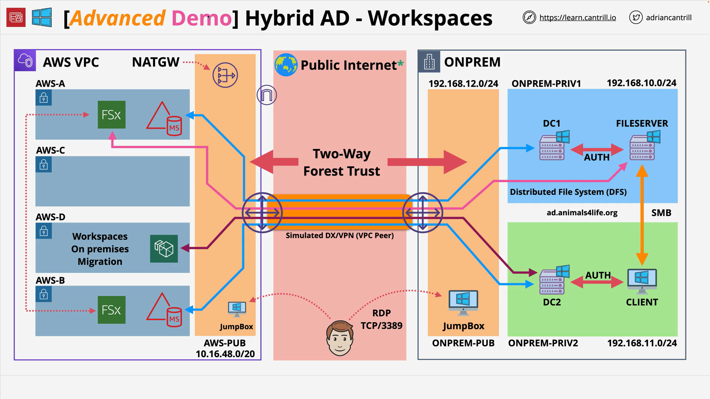

# Implementing a hybrid directory solution in AWS - PART6

## Overview

This stage provisions **Amazon WorkSpaces** (desktop as a service) in AWS and assigns a workspace to an **on-premises Active Directory (AD)** user via the **two-way forest trust** created earlier. You will:

- Register the **AWS Managed Microsoft AD** with WorkSpaces and select eligible **private subnets**.
- Select an **on-premises** user (from the trusted domain) as the workspace principal.
- Choose a **free-tier eligible Standard** Windows bundle and **Auto-Stop** running mode.
- Fix **network access** so the workspace can reach **Amazon FSx for Windows File Server** via DFS paths.
- Sign in to the workspace using **on-premises credentials** (enabled by the forest trust).

**References**

- Instructions and architecture diagrams: [https://github.com/acantril/learn-cantrill-io-labs/tree/master/aws-hybrid-activedirectory/02_LABINSTRUCTIONS](https://github.com/acantril/learn-cantrill-io-labs/tree/master/aws-hybrid-activedirectory/02_LABINSTRUCTIONS)
- One-Click Deployment (HYBRIDDIR): [https://console.aws.amazon.com/cloudformation/home?region=us-east-1#/stacks/quickcreate?templateURL=https://learn-cantrill-labs.s3.amazonaws.com/aws-hybrid-activedirectory/01_HYBRIDDIR.yaml&stackName=HYBRIDDIR](https://console.aws.amazon.com/cloudformation/home?region=us-east-1#/stacks/quickcreate?templateURL=https://learn-cantrill-labs.s3.amazonaws.com/aws-hybrid-activedirectory/01_HYBRIDDIR.yaml&stackName=HYBRIDDIR)

## Concepts

- **Amazon WorkSpaces**: Managed, persistent virtual desktops joined to a directory (AWS Managed Microsoft AD or via AD Connector).
- **Two-way forest trust**: Enables cross-forest authentication/authorization; here, on-prem users can be assigned and sign into AWS-hosted desktops.
- **Directory registration**: WorkSpaces must be explicitly registered against a directory and **two private subnets** (different AZs).
- **Running modes**:

  - _AlwaysOn_: Monthly billing, always available.
  - _Auto-Stop_: Hourly billing with idle timeout; cost-saving for intermittent use.

- **Network access model**: WorkSpaces instances use a **WorkSpaces Members** security group. Other resources (FSx, EC2) commonly use a different SG. **Allowlist SG-to-SG** to enable access.
- **DFS access from WorkSpaces**: DFS namespace path (e.g., `\\ad.animalsforlife.org\private\A4L files`) must be reachable from the workspace through SG and routing.

## Architectures

### Starting State

- On-premises AD: `ad.animalsforlife.org`
- AWS Managed Microsoft AD: `aws.animalsforlife.org`
- Verified **two-way forest trust**
- **FSx for Windows** file share reachable via DFS namespace
- EC2 jump boxes for administration

### Target State

- WorkSpaces registered to **AWS Managed Microsoft AD** using **two private subnets** (different AZs).
- Workspace **assigned to an on-prem AD user** (e.g., `A4L-Admin`).
- **Security groups** updated so the workspace can reach FSx/DFS.

**Access Flow**

1. User launches WorkSpaces client and signs in with **on-prem** credentials (enabled by trust).
2. Workspace (joined to AWS AD) contacts DFS namespace in on-prem AD.
3. DFS redirects to FSx (or other target), provided SG/routing allow it.

## Services

- **Amazon WorkSpaces**: Desktop provisioning, registration to directory, client registration code.
- **AWS Managed Microsoft AD**: Directory for WorkSpaces domain join and registration.
- **On-premises Microsoft AD** (simulated): Trusted domain providing user identities.
- **Amazon FSx for Windows File Server**: SMB file shares accessed via DFS.
- **Amazon VPC Security Groups**: Traffic controls between WorkSpaces and backend resources.
- **Amazon EC2 (Windows)**: Jump boxes and on-prem client (simulated) for admin/testing.

## Procedure (Step-by-Step)

1. **Register AWS Managed Microsoft AD with WorkSpaces**

   - Console → **WorkSpaces** → **Directories** → select `aws.animalsforlife.org` → **Register**.
   - Choose **two private subnets** in different Availability Zones (e.g., `Private A` and `Private C`).

2. **Create or select the user in the on-prem domain**

   - In on-prem AD Users and Computers (simulated client), create `A4L-Admin` with:

     - Valid email address.
     - Appropriate group membership (e.g., Enterprise Admins for the demo).

   - Back in WorkSpaces, under **Trusted domains**, select `ad.animalsforlife.org` and pick the user.

3. **Create the Workspace**

   - Bundle: **Standard**, **Windows**, **free-tier eligible** (latest available).
   - **Running mode**: **Auto-Stop**, idle timeout = **1 hour**.
   - Review and **Create Workspaces**; note the **registration code**.

4. **Install and register the WorkSpaces client**

   - Download the client (platform of choice) from the link on the workspace details page.
   - Enter the **registration code** and wait until the workspace is **Ready**.

5. **Sign in using on-prem AD credentials**

   - Use **NetBIOS** format if preferred: `A4L\A4L-Admin` (or UPN).
   - Verify sign-in and reach the Windows desktop.

6. **Enable access to DFS/FSx from the workspace**

   - Identify the **WorkSpaces Members** security group attached to WorkSpaces.
   - Open the **default instance** security group used by FSx/other resources (named with `AWS VPC` and `instance SG`).
   - **Inbound rule**: Allow **all traffic** **from** the **WorkSpaces Members** SG (source = SG ID).

     > Demo uses broad access for simplicity. In production, scope to required ports/protocols.

   - From the workspace, browse DFS path: `\\ad.animalsforlife.org\private\A4L files`.
     Confirm access to the migrated FSx share.

## Trade-offs

- **AWS Managed AD vs. AD Connector for WorkSpaces**

  - _Managed AD_: Decoupled from on-prem network availability; better for long-term migrations.
  - _AD Connector_: Proxies to on-prem; simpler initially but **fails if the link fails**; not chosen here.

- **Auto-Stop vs. AlwaysOn**

  - _Auto-Stop_: Lower cost for intermittent use; slight startup wait after idle.
  - _AlwaysOn_: Predictable performance/availability; higher monthly cost.

- **Security group scope**

  - _Broad SG-to-SG allow_: Quick for labs; increases lateral reach.
  - _Least privilege_: Restrict to SMB/DFS/DC ports and necessary CIDRs/SGs in production.

## Pitfalls

- **Not registering the directory** with WorkSpaces before creation.
- **Choosing ineligible subnets** (must be private and in different AZs).
- **Selecting the wrong domain** when picking the user (must switch to **Trusted domain** view).
- **Workspace cannot reach FSx/DFS** due to missing SG rules from WorkSpaces SG to backend SG.
- **Using AD Connector in this scenario**: Introduces a hard dependency on on-prem network; breaks if the link is down.

## Tables

### WorkSpaces Directory Options (as used in this stage)

| Option                       | How it works                              | Pros                                         | Cons                                         | Use here          |
| ---------------------------- | ----------------------------------------- | -------------------------------------------- | -------------------------------------------- | ----------------- |
| **AWS Managed Microsoft AD** | AWS-hosted AD, registered with WorkSpaces | Decoupled from on-prem link, supports trusts | Additional managed directory to operate      | **Yes** (primary) |
| **AD Connector**             | Proxy to on-prem AD                       | No directory data in AWS                     | WorkSpaces login fails if on-prem link fails | No (not chosen)   |

### WorkSpaces Running Modes

| Mode          | Billing                | Behavior                                   | When to choose             |
| ------------- | ---------------------- | ------------------------------------------ | -------------------------- |
| **Auto-Stop** | Hourly + small monthly | Stops after idle timeout; starts on access | Intermittent/POC/dev usage |
| **AlwaysOn**  | Monthly                | Always running/ready                       | Steady, continuous use     |

## Key Terms & Definitions

- **AWS Managed Microsoft AD**: Fully managed Microsoft AD by AWS, supports **forest trusts**.
- **AD Connector**: Directory gateway that forwards auth requests to on-prem AD; **no data stored in AWS**.
- **Directory Registration (WorkSpaces)**: Binding a directory to WorkSpaces with **two private subnets**.
- **DFS Namespace**: Logical path mapping to one or more SMB **folder targets** (e.g., FSx).
- **WorkSpaces Members Security Group**: SG automatically used by WorkSpaces instances.
- **NetBIOS Name**: Short domain name used in `DOMAIN\user` logon format (e.g., `A4L\A4L-Admin`).

## Common Exam Traps

- **Picking AD Connector for WorkSpaces when link resilience is required**: If the on-prem link fails, WorkSpaces authentication fails with AD Connector. Use **AWS Managed Microsoft AD + trust**.
- **Forgetting directory registration**: WorkSpaces cannot be created without registering the directory and selecting **two subnets**.
- **Neglecting SG rules**: DFS/SMB access fails if WorkSpaces SG is not allowed into the backend SG.
- **Confusing identity domains**: Assigning a workspace to an on-prem user requires selecting the **trusted** domain in the WorkSpaces UI.
