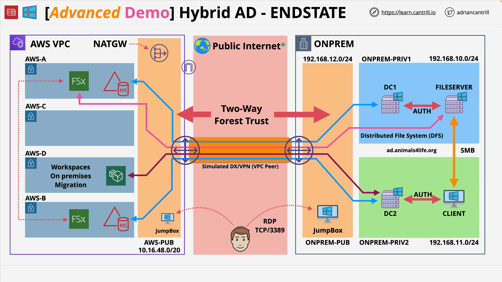

# Implementing a hybrid directory solution in AWS - PART7

## Overview

This stage removes all resources created across the hybrid Active Directory (AD) demo. The sequence matters due to service dependencies: delete **Amazon WorkSpaces** and **Amazon FSx for Windows File Server** first, then **deregister and delete AWS Managed Microsoft AD**, and finally remove the **AWS CloudFormation** parent stack (which clears nested stacks).

## Concepts

- **Dependency-aware teardown**: Some services (WorkSpaces, FSx) depend on the directory; the directory cannot be deleted until dependents are gone.
- **Directory registration vs. existence**: A directory must be **deregistered** from WorkSpaces before the directory itself can be deleted.
- **Security posture reset**: Revert temporary **VPC security group (SG)** changes added during the lab (e.g., broad allow rules for WorkSpaces).
- **Cost control**: Ensure all stacks and managed services are fully deleted to avoid ongoing charges.

## Architectures

### Starting State (end of Stage 6)

- Two AD forests with a two-way forest trust (on-premises and AWS).
- FSx for Windows file share used via DFS namespace.
- WorkSpaces registered to the AWS directory with at least one deployed workspace.
- VPC SGs include a temporary rule allowing WorkSpaces SG to access shared backend resources.

### Target State (after teardown)

- No WorkSpaces, FSx, or AWS Managed Microsoft AD resources present.
- Original SG rules restored (temporary allow removed).
- CloudFormation parent and nested stacks deleted.

## Services

- **Amazon VPC (Security Groups)**: Remove temporary inbound rules.
- **Amazon WorkSpaces**: Delete provisioned workspace(s) and deregister directory.
- **Amazon EC2**: Terminate the AWS jump box instance.
- **Amazon FSx for Windows File Server**: Delete the file system (optionally after a backup in real scenarios).
- **AWS Directory Service (AWS Managed Microsoft AD)**: Delete the directory after deregistration.
- **AWS CloudFormation**: Delete the parent stack to clean up nested infrastructure.

## Procedure (Step-by-Step)

1. **Revert temporary SG access**

   - VPC Console → **Security groups** → select **default A4L AWS security group**.
   - Identify the rule that allows inbound traffic **from** the **WorkSpaces Members** SG.
   - **Edit inbound rules** → **Delete** that rule → **Save rules**.

2. **Delete WorkSpaces**

   - WorkSpaces Console → select the **workspace** → **Delete**.
   - While deletion proceeds, continue with the next steps.

3. **Terminate the AWS jump box**

   - EC2 Console → **Instances** → select **jumpbox-AWS** → **Instance state** → **Terminate** → confirm.

4. **Delete the FSx for Windows file system**

   - FSx Console → select the file system → **Actions** → **Delete file system**.
   - For this lab: **do not** take a final backup (in production, you typically would).
   - Confirm with the **File system ID**.

5. **Wait for WorkSpaces and FSx deletions to complete**

   - Both rely on the directory; the directory cannot be removed until these are gone.

6. **Deregister and delete the directory**

   - WorkSpaces Console → **Directories** → select the AWS directory → **Actions** → **Deregister**.
   - Directory Service Console → select the same directory → **Actions** → **Delete directory** → type the directory name to confirm.

7. **Delete the CloudFormation parent stack**

   - CloudFormation Console → select the **parent (non-nested) stack** → **Delete**.
   - Wait for nested stacks and the parent to finish deleting.

## Trade-offs

- **Speed vs. safety**: Skipping an FSx final backup speeds teardown but risks data loss; in production, **take a backup**.
- **Broad SG allow vs. least privilege**: The lab used an SG-to-SG allow for simplicity; revert to **least privilege** in real environments.
- **Manual deletion vs. stack-driven**: Deleting the stack last prevents stack failures due to dependent resources that CloudFormation does not own (e.g., manually registered directories).

## Pitfalls

- **Trying to delete the directory before dependents are gone** (WorkSpaces and FSx): deletion will fail.
- **Forgetting to deregister the directory from WorkSpaces**: directory delete will be blocked.
- **Leaving temporary SG rules**: unnecessarily broad access persists if not removed.
- **Not waiting for asynchronous deletions**: subsequent steps fail if prior resources are still deleting.
- **Deleting nested stacks first**: can leave orphaned resources; always start with dependents and end with the **parent** stack.

## Tables

### Deletion Order and Rationale

| Order | Resource                                                 | Why first?                         | Blocked by      |
| ----- | -------------------------------------------------------- | ---------------------------------- | --------------- |
| 1     | SG inbound rule (WorkSpaces → backend)                   | Restore security posture early     | Nothing         |
| 2     | WorkSpaces (desktops)                                    | They depend on the directory       | —               |
| 3     | EC2 jump box                                             | Independent cleanup                | —               |
| 4     | FSx for Windows file system                              | Depends on directory for auth/join | —               |
| 5     | Deregister + delete directory (AWS Managed Microsoft AD) | Requires WorkSpaces/FSx to be gone | WorkSpaces, FSx |
| 6     | CloudFormation parent stack                              | Final infrastructure cleanup       | All above       |

## Key Terms & Definitions

- **AWS Managed Microsoft AD**: Fully managed Microsoft AD in AWS; supports trusts with other forests.
- **Directory Registration (WorkSpaces)**: Binding a directory to WorkSpaces and subnets; must be **deregistered** before directory deletion.
- **FSx for Windows File Server**: Managed SMB file servers for Windows workloads; often domain-joined.
- **Security Group (SG)**: Stateful virtual firewall; teardown includes removing temporary lab rules.
- **Parent vs. Nested CloudFormation Stacks**: The parent orchestrates child stacks; delete the **parent** last.

## Common Exam Traps

- **Order of operations**: Attempting to delete **AWS Managed Microsoft AD** while **WorkSpaces** or **FSx** still exist.
- **Missing deregistration**: Forgetting to **deregister** the directory from WorkSpaces.
- **Residual broad SG rules**: Not reverting permissive SG configuration after a test/migration.
- **Assuming CloudFormation cleans everything**: Manually created or externally registered resources may block stack deletion.
