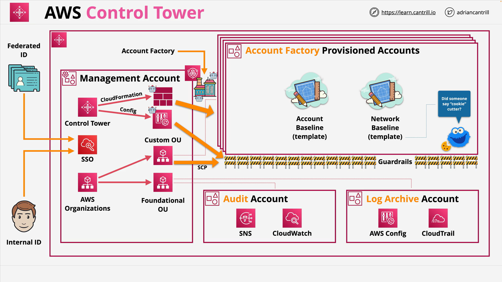

# AWS Control Tower 101

## Overview

AWS Control Tower orchestrates multiple AWS services to **set up and govern multi-account environments** quickly. It layers automation and governance (landing zone, guardrails, account provisioning) on top of services such as **AWS Organizations**, **IAM Identity Center** (formerly AWS Single Sign-On), **AWS CloudFormation**, **AWS Config**, **AWS CloudTrail**, **Amazon CloudWatch**, and **Amazon SNS**.

## Concepts

- **Landing Zone**: The governed multi-account foundation created by Control Tower, including default organizational units (OUs) and baseline accounts.
- **Home Region**: The region where Control Tower is deployed; additional regions can be allowed or denied.
- **Organizational Units (OUs)**:

  - **Security OU (foundational)**: Hosts baseline security/audit accounts.
  - **Sandbox OU (custom)**: Starting point for non-production/testing accounts; you can add more OUs as needed.

- **Baseline Accounts**:

  - **Log Archive**: Central, read-only destination for landing-zone-wide logs (e.g., CloudTrail, AWS Config).
  - **Audit**: Central place for security/audit tooling and notifications.

- **Single Sign-On**: Provided via **IAM Identity Center** for unified access across accounts; supports identity federation.
- **Guardrails**: Governance rules applied across accounts.

  - **Categories**: Mandatory, Strongly Recommended, Elective.
  - **Mechanisms**: Preventive (via Service Control Policies) and Detective (via AWS Config rules).

- **Account Factory**: Automated, standardized account provisioning (via console and Service Catalog), applying baseline configuration and guardrails.
- **Dashboard**: Central view of organizational health, compliance, and operations.

## Architectures

- **Management Account**

  - Runs Control Tower and **AWS Organizations**.
  - Hosts **IAM Identity Center** configuration for SSO/federation.
  - Centralizes logging/monitoring (CloudTrail, AWS Config, CloudWatch, SNS) via the **Log Archive** and **Audit** accounts.

- **OUs and Accounts**

  - **Security OU** contains **Log Archive** and **Audit** accounts created by Control Tower.
  - **Sandbox/Custom OUs** contain workload accounts created by **Account Factory** with consistent, baseline settings.

- **Governance & Automation**

  - **Guardrails** enforced via **SCPs** (preventive) and assessed via **AWS Config rules** (detective).
  - **CloudFormation** stacks are deployed under the hood to set up and keep configurations consistent.
  - **Service Catalog** exposes Account Factory for standardized self-service account requests.

## Services (as orchestrated by Control Tower)

- **AWS Organizations**: Multi-account hierarchy (OUs) and **Service Control Policies (SCPs)**.
- **IAM Identity Center**: SSO across accounts; can federate existing identity sources.
- **AWS CloudFormation**: Deploys and maintains landing-zone resources and baselines.
- **AWS Config**: Compliance checks that implement **detective guardrails**.
- **AWS CloudTrail**: Organization-wide API activity logging to the **Log Archive** account.
- **Amazon CloudWatch** and **Amazon SNS**: Monitoring and notifications (e.g., governance/security events).
- **AWS Service Catalog**: Front end for **Account Factory** provisioning workflows.

## Trade-offs

- **Simplicity vs. Flexibility**: Control Tower accelerates standardized setups; customization beyond the managed patterns may require careful alignment with its automation.
- **Preventive vs. Detective Controls**: Preventive SCPs block actions outright (strong control, less flexibility); detective Config rules allow action but raise findings (more flexibility, requires remediation).
- **Centralization vs. Delegation**: Central logging/auditing improves oversight; Account Factory enables distributed (but standardized) account creation.

## Pitfalls

- **Confusing Guardrail Types**: Preventive (SCP) vs. Detective (Config) have different behaviors and outcomes.
- **Ignoring Guardrail Categories**: Mandatory vs. Strongly Recommended vs. Elective affects enforcement expectations.
- **Under-planning OU Structure**: Poor OU design complicates applying the right guardrails and access patterns.
- **Assuming Organizations Alone Is Equivalent**: Control Tower adds automation, baselines, and governance on top of Organizations.

## Tables

### Guardrail Mechanisms and Examples

| Mechanism  | Implemented With                | Behavior                  | Typical Examples                                                   |
| ---------- | ------------------------------- | ------------------------- | ------------------------------------------------------------------ |
| Preventive | Service Control Policies (SCPs) | Blocks disallowed actions | Region allow/deny, block certain IAM or S3 policy changes          |
| Detective  | AWS Config rules                | Flags non-compliance      | Ensure CloudTrail enabled; identify EC2 instances with public IPv4 |

### Default Accounts and Purpose

| Account         | Purpose                                                                               |
| --------------- | ------------------------------------------------------------------------------------- |
| **Log Archive** | Central, read-only storage for organization-wide logs (e.g., CloudTrail, AWS Config)  |
| **Audit**       | Central account for audit tools, notifications, and monitoring of governance/security |

### Landing Zone Building Blocks

| Component               | Role                                                                |
| ----------------------- | ------------------------------------------------------------------- |
| **Management Account**  | Hosts Control Tower/Organizations and orchestrates the landing zone |
| **Security OU**         | Houses **Log Archive** and **Audit** accounts                       |
| **Custom/Sandbox OU**   | Starting point for workload accounts via Account Factory            |
| **IAM Identity Center** | SSO across accounts, supports federation                            |
| **Guardrails**          | Governance via SCPs (preventive) and Config rules (detective)       |
| **Account Factory**     | Standardized, automated account provisioning (via Service Catalog)  |

## Key Terms & Definitions

- **Landing Zone**: The governed, multi-account foundation created by Control Tower.
- **Home Region**: The deployment region for Control Tower; additional regions can be allowed/denied.
- **Organizational Unit (OU)**: A container of accounts in AWS Organizations for policy/scoping.
- **Service Control Policy (SCP)**: Organization-level preventive policy that restricts allowed API actions.
- **Guardrail**: A governance control applied by Control Tower (preventive or detective).
- **Account Factory**: Control Tower feature for automated, standardized account creation.
- **Log Archive Account**: Centralized, read-only repository for organization logs.
- **Audit Account**: Central account for audit/security monitoring and notifications.
- **IAM Identity Center**: AWS SSO service for unified access and identity federation.

## Common Exam Traps

- **Equating Control Tower with Organizations**: Control Tower **uses** Organizations but adds baselines, guardrails, SSO, and automated account provisioning.
- **Misidentifying Guardrails**: Preventive guardrails use **SCPs** (hard deny); detective guardrails use **AWS Config** (monitor/flag).
- **Overlooking Default Accounts**: Knowing **Log Archive** and **Audit** roles is often tested.
- **Missing SSO/Federation Angle**: IAM Identity Center provides SSO and can federate corporate identities across all enrolled accounts.
